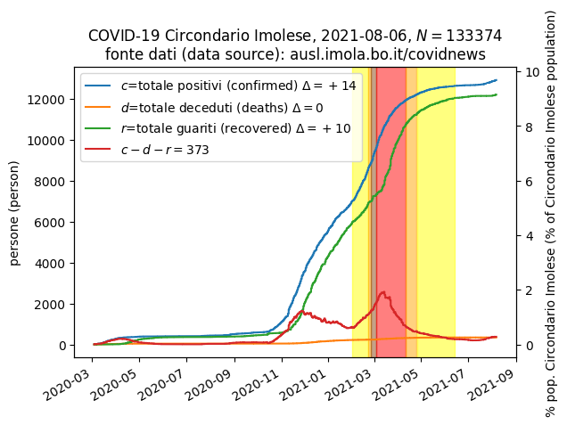
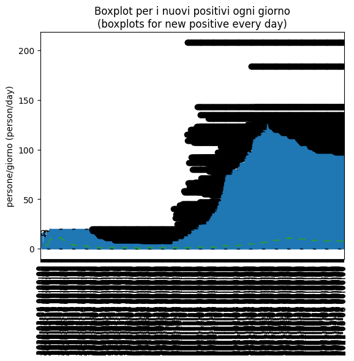

Si assume che il numero di tamponi *N* fatto nella regione Emilia Romagna sia
uniformemente distribuito su tutta la regione e quindi che il numero di 
tamponi fatto nel Circondario Imolese si possa stimare moltiplicando
il numero *N* per la frazione che ha come numeratore la popolazione
del Circondario Imolese (133374 persone) e come denominatore la popolazione
dell'intera regione Emilia Romagna (4469568 persone).

Il seguente grafico si legge cosi`: il 9 Aprile il numero di tamponi
che si stima sia stato fatto nel Circondario Imolese era 100 volte
il numero dei positivi rilevati nello stesso giorno.

Se le curve sono maggior di 1 allora significa che il numero di tamponi
e` superiore al numero di positivi, per esempio 5 Marzo la curva della stima
dei campioni fatti nel Circondario Imolese e` inferiore ad 1 e quindi
indica un caso anomalo in cui i positivi sono maggiori dei tamponi.

I dati sono estratti da 
*Aggiornamenti quotidiani sull'epidemia di covid-19 nel territorio del Circondario Imolese*
https://www.ausl.imola.bo.it/flex/cm/pages/ServeBLOB.php/L/IT/IDPagina/10010

Data are extracted from 
*COVID-19 daily update for the Circondario Imolese area*
https://www.ausl.imola.bo.it/flex/cm/pages/ServeBLOB.php/L/IT/IDPagina/10010