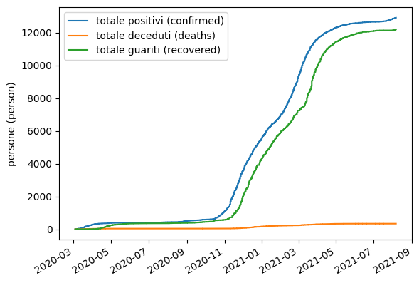
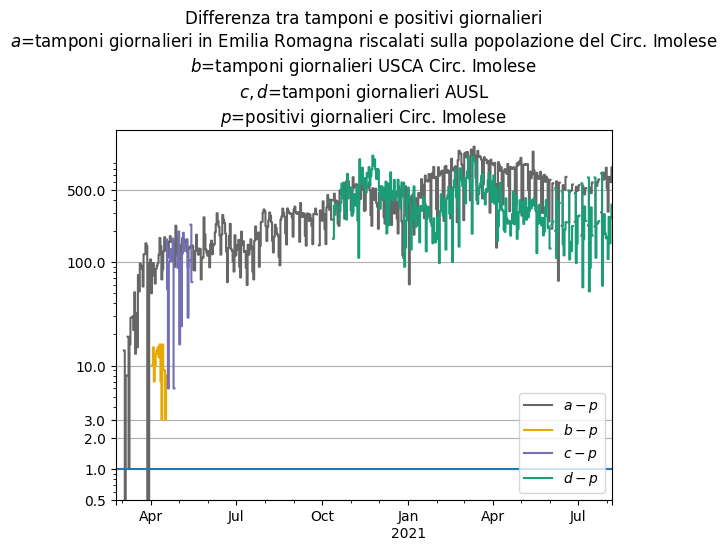

Nel grafico seguente sono presenti tre curve, ogni curva è costruita
come segue: i valori sono normalizzati riscalandoli linearmente 
in modo che il minimo corrisponda a 0 ed il massimo ad 1.

*Tamponi in Emilia Romagna (swabs)* è il numero di tamponi
complessivamente fatti dalla regione Emilia Romagna; questa curva
dovrebbe essere per definizione monotona non decrescente ma non lo è perché
per esempio decresce il 30 marzo.

*Totale positivi (confirmed)* è il numero complessivo di positivi
nel Circondario Imolese; questa curva
dovrebbe essere per definizione monotona non decrescente.

*Tamponi USCA Circ. Imolese* è il numero di tamponi complessivamente
fatti dal Circondario Imolese; questa curva
dovrebbe essere per definizione monotona non decrescente.

Il 28 e 29 marzo il numero dei totali positivi non è aumentato e la 
domanda è: non c'è stato aumento perché il contagio è in regressione
oppure non c'è stato aumento perché non sono stati fatti tamponi?
Dal grafico sembra che la risposta sia la seconda.

I dati sono estratti da 
*Aggiornamenti quotidiani sull'epidemia di covid-19 nel territorio del Circondario Imolese*
https://www.ausl.imola.bo.it/flex/cm/pages/ServeBLOB.php/L/IT/IDPagina/10010

Data are extracted from 
*COVID-19 daily update for the Circondario Imolese area*
https://www.ausl.imola.bo.it/flex/cm/pages/ServeBLOB.php/L/IT/IDPagina/10010