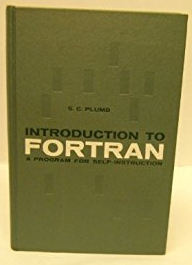

# The FORTRAN book in the **Hidden Figures** (2017) movie

## In Italian libraries
Search results for a book with the keyord **FORTRAN** in the title and the publishing year antecedent the 1962:

[McCracken, Daniel D.. *A guide to Fortran programming* New York, John Wiley, 1961.](http://id.sbn.it/bid/SBL0212971)

[Plumb, Stephen C.. *A program for self-instruction: introduction to Fortran* New York, International Businnes Machines Corporation, 1961.](http://id.sbn.it/bid/UTO1011663)

