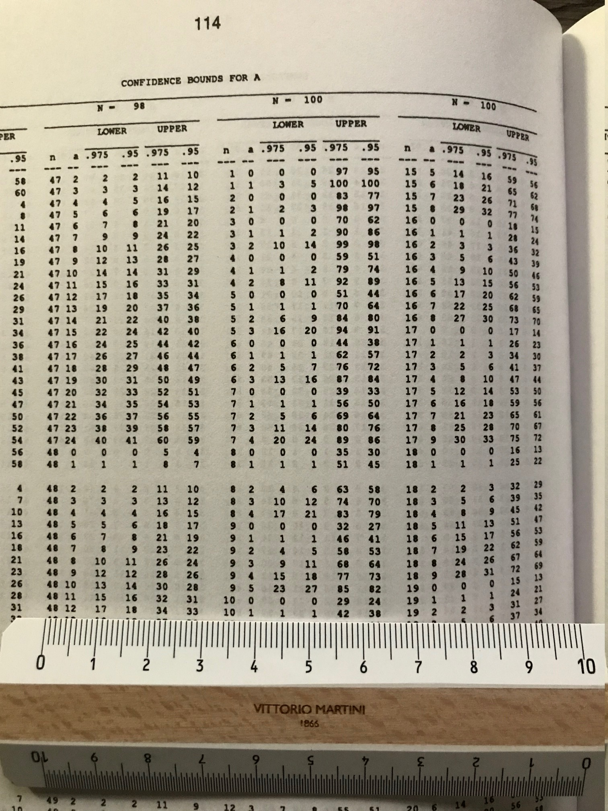

# Exercises in Bayesian statistics

##  Rasmus Bååth's beach party
An [example](rasmus_baath_lake_beach_summer_party.R) inspired by the excellent course [Fundamentals of Bayesian Data Analysis in R](https://www.datacamp.com/courses/fundamentals-of-bayesian-data-analysis-in-r) by Rasmus Bååth.

## Albert Tarantola's Estimation of the Epicentral Coordinates of a Seismic Event

[Problem 7.1](Estimation_of_the_Epicentral_Coordinates_of_a_Seismic_Event.R) in the book TARANTOLA, Albert. [*Inverse problem theory and methods for model parameter estimation*](http://www.ipgp.fr/~tarantola/Files/Professional/Books/InverseProblemTheory.pdf). [Society for Industrial and Applied Mathematics](https://epubs.siam.org/doi/book/10.1137/1.9780898717921), 2005.

The original figure:

The figure made using [Stan](https://mc-stan.org/):

## A bayesian approach to the confidence bounds when sampling from small finite universes
We have a population of N=100 elements, some of the elements have a property of interest.
We take a random sample of n=10 elements from the population and we find a=1 element with 
the property of interest: what can be said about the number of elements in the population
with the property of interest?

[Tommy Wright](https://www.census.gov/research/researchers/profile.php?cv_sub=div&cv_profile=3743)
 wrote in his book
[*Exact Confidence Bounds when Sampling from Small Finite Universes - 
An Easy Reference Based on the Hypergeometric Distribution*](https://www.springer.com/gp/book/9780387975153)

*What is more beautiful than a simple and important
question with a simple and exact answer that is easy
to provide?*

As we can see, the (frequentist) confidence interval at 95% is [1,38]

I have tried [two exercises](proportion_from_a_finite_universe.R) with the Bayesian approach;
in the first I use the knowledge that the likelihood is an hypergeometric random
variable.
In the second I did not use that knowledge but even if I 
ignore the math involving the hypergeometric I am anyway 
able to simulate the data generation process:

