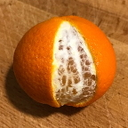
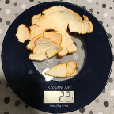
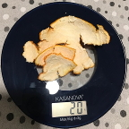

```{r eval=TRUE, echo=FALSE}
setwd('~/projects/alessandro-gentilini.github.io/bayes/statistical_rethinking_2020/')
```

**1**. Suppose the globe tossing data (Chapter 2) had turned out to be 4 water
in 15 tosses. Construct the posterior distribution, using grid approximation.
Use the same flat prior as in the book.

The peel is the land|All the peel         |All the peel minus the ``water'' peel
--------------------|---------------------|-------------------------------------
  ||


I pretend to ignore the fact that in the globe tossing experiment the likelihood 
is a binomial and so I create my own likelihood function on the basis of my 
comprehension of the data generation mechanism (for me code efficiency is not a goal
here).

I assume a simplified world with a fully connected ``slice'' ocean extending 
from the South (geographic) Pole to the North Pole and from the 
zero degree longitude to the $p\cdot2\pi$ longitude where $p$ is the water 
proportion (\texttt{p} in the following code), i.e. $p=1$ means a globe with 
no land at all and $p=0$ means a globe with no water at all (in the above
picture the *Citrus deliciosa* is the globe, the peel is the land, and
$p=\frac{22-20}{22}=$ `r 2/22`); the maximum longitude 
is expressed in radians as $2\pi$.
The tossing is then simulated drawing \texttt{N\_tosses} times a longitude angle 
from a uniform distribution spanning the whole globe and counting how many
times that longitude is in the water; the above is repeated many times
(\texttt{sz} times) in order to get an estimation of the sought probability.
```{r}
my_likelihood <- function(N_tosses,n_water,water_proportion)
{
    stopifnot(water_proportion>=0)
    stopifnot(water_proportion<=1)
    Greenwich_longitude <- 0
    # assuming a fully connected ocean (and a fully connected continent)
    max_water_longitude <- water_proportion*2*pi
    sz <- 10e3
    cnt <- 0
    for (i in 1:sz){
        # throw N_tosses darts to the sphere
        longitudes <- runif(N_tosses,min=Greenwich_longitude,max=2*pi)
        # count the times the darts sink in the water
        darts_sank_in_water <- sum(longitudes <= max_water_longitude)
        # count the time we get exactly the given data
        if(n_water==darts_sank_in_water){
            cnt <- cnt+1
        }
    }
    # return a frequency representing the likelihood probability
    return(cnt/sz)
}
```

Then I define a grid for $p$:

```{r}
pars <- expand.grid(p=seq(from=0,to=1,length.out=20))
```

and I assume a uniform prior for $p$:

```{r}
pars$prior <- dunif(pars$p,0,1)
```

The following are the given data:

```{r}
N_tosses <- 15
n_water <- 4
```

For each node in the grid I compute the likelihood:

```{r}
for (i in 1:nrow(pars)) {
  likelihoods <- my_likelihood(N_tosses,n_water,pars$p[i])
  pars$likelihood[i] <- prod(likelihoods)
}
```

And I compute the (normalized) posterior:

```{r}
pars$unnormalized_posterior <- pars$likelihood * pars$prior
pars$posterior <- pars$unnormalized_posterior/sum(pars$unnormalized_posterior)
```

I have a look at the numbers:

```{r}
print(pars)
```

And finally I plot the posterior:

```{r}
plot(pars$p,pars$posterior,type='b',
xlab='probability of water',
ylab='posterior probability')
```

***

**2**. Start over in **1**, but now use a prior that is zero below $p = 0.5$ 
and a constant above $p = 0.5$. This corresponds to prior information that a majority
of the Earth's surface is water. What difference does the better prior make?

I define this prior as \texttt{step\_prior} and the \texttt{constant} is computed
in order to give $\int_{0}^{1} \texttt{step\_prior}(p) \,dp=1$:

```{r}
step_prior <- function(water_proportion)
{
    stopifnot(water_proportion>=0)
    stopifnot(water_proportion<=1)    
    threshold <- .5
    area <- 1
    constant <- area/threshold
    return(ifelse(water_proportion<threshold,0,constant))
}
```

I the compute the new prior:

```{r}
pars$prior2 <- step_prior(pars$p)
```

There is no need to recompute the likelihood because they do not depend
on the prior and so I only compute the new (normalized) posterior:

```{r}
pars$unnormalized_posterior2 <- pars$likelihood * pars$prior2
pars$posterior2 <- pars$unnormalized_posterior2/sum(pars$unnormalized_posterior2)
```

I have a look at the numbers:

```{r}
print(pars)
```

And finally I plot the new posterior:

```{r}
plot(pars$p,pars$posterior2,type='b',
xlab='probability of water',
ylab='posterior probability')
```

The difference between the previous posterior and the new one is that the first
posterior, assuming a flat probability for $p$, has its peak near
the simplest estimation (given the data) of $\frac{4}{15}=$ `r n_water/N_tosses`
(dotted black vertical line in the following plot) 
and so it is fully dominated by the data while the new
posterior has its peak slightly greater than $p=0.5$ because the given
data is not supporting a probability of water greater than 50%
(dotted red vertical line in the following plot).

```{r}
matplot(pars$p,cbind(pars$posterior,pars$posterior2),
type=c('l'),
#pch=c(1,3),
xlab='probability of water',
ylab='posterior probability')
abline(v=n_water/N_tosses,col='black',lty='dotted')
abline(v=.5,col='red',lty='dotted')
mtext('Comparison of the influence of two different priors')
```

***

**3**. For the posterior distribution from **2**, compute 89% percentile and HPDI
intervals. Compare the widths of these intervals. Which is wider? Why? If
you had only the information in the interval, what might you misunderstand
about the shape of the posterior distribution?

Following the R code snippet 3.11 from the book, I choose a larger number
of nodes in the grid:
```{r}
pars <- expand.grid(p=seq(from=0,to=1,length.out=1000))
pars$prior2 <- step_prior(pars$p)
for (i in 1:nrow(pars)) {
  likelihoods <- my_likelihood(N_tosses,n_water,pars$p[i])
  pars$likelihood[i] <- prod(likelihoods)
}
pars$unnormalized_posterior2 <- pars$likelihood * pars$prior2
pars$posterior2 <- pars$unnormalized_posterior2/sum(pars$unnormalized_posterior2)
```

I redo the plot

```{r}
plot(pars$p,pars$posterior2,type='l',
xlab='probability of water',
ylab='posterior probability')
```

and now I get a jagged plot\ldots I do not know why, maybe \texttt{my\_likelihood}
has some numeric problem (more on this later)? Let's pretend I can ignore the jaggedness and
let's compute the 89% percentile and the HPDI intervals:

```{r}
library(rethinking)
sample_indices <- sample(1:nrow(pars), size=1e4, replace = TRUE, prob=pars$posterior2)
samples <- pars[sample_indices,'p']
percentile_interval <- PI(samples,prob=.89)
percentile_interval
hpdi_interval <- HPDI(samples,prob=.89)
hpdi_interval
```

The width of the percentile interval is `r percentile_interval[2]-percentile_interval[1]`
and the width of the HPD interval is `r hpdi_interval[2]-hpdi_interval[1]` and as I
would have expected the percentile is wider than the HPD; I guess it is that
because when the ditribution is not symmetrical (around the mode) but skewed then
the HPD interval is always narrower than the percentile interval (but that should be
proved as a theorem given the definitions for the percentile and the HPD).

If I had only the information in the interval I might be misleaded into thinking
that the distribution was symmetrical.

And now a little more about the jaggedness, now I will use the exact likelihood:

```{r}
# exact likelihood
my_likelihood <- function(N_tosses,n_water,water_proportion)
{
    stopifnot(water_proportion>=0)
    stopifnot(water_proportion<=1)
    return(dbinom(n_water,N_tosses,prob=water_proportion))
}

# grid
pars <- expand.grid(p=seq(from=0,to=1,length.out=1000))

# step prior
pars$prior3 <- step_prior(pars$p)
for (i in 1:nrow(pars)) {
  likelihoods <- my_likelihood(N_tosses,n_water,pars$p[i])
  pars$likelihood[i] <- prod(likelihoods)
}
pars$unnormalized_posterior3 <- pars$likelihood * pars$prior3
pars$posterior3 <- pars$unnormalized_posterior3/sum(pars$unnormalized_posterior3)

# plot posterior
plot(pars$p,pars$posterior3,type='l',
xlab='probability of water',
ylab='posterior probability')

# intervals
sample_indices <- sample(1:nrow(pars), size=1e4, replace = TRUE, prob=pars$posterior3)
samples <- pars[sample_indices,'p']
percentile_interval <- PI(samples,prob=.89)
percentile_interval
hpdi_interval <- HPDI(samples,prob=.89)
hpdi_interval
```

No jaggedness! And the intervals are almost equal to the ones of before.
That's quite consolatory but it is also a warning about the need of math knowledge.
Is the jaggedness an issue related to the *simulation variance*?
Maybe a larger \texttt{sz} lessen the jaggedness?

