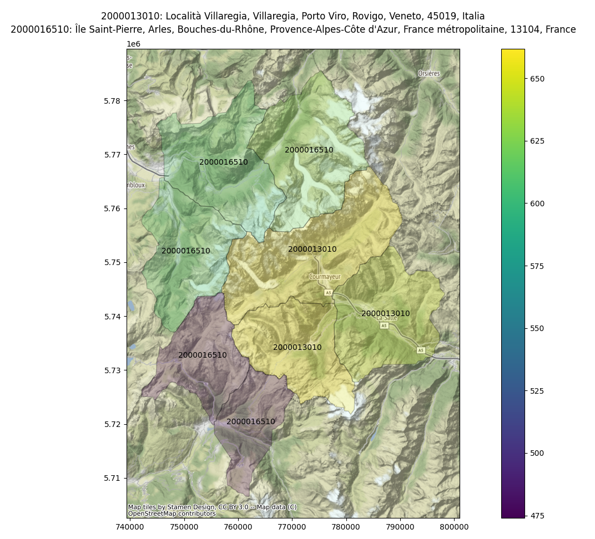

# Watershed of the Monte Bianco
What are the drainage basins in the Monte Bianco area?

Using the data available from [HydroSHEDS](https://www.hydrosheds.org/), the following map shows polygons that depict watershed boundaries and sub-basin delineations; the numeric code (`2000013010` and the others) is the identifier of the most downstream sink, i.e. the outlet of the main river basin.
This field indicates the identifier of the most downstream polygon of the river basin and can be used to identify the entire river basin that a polygon belongs to, including all associated endorheic basins. For each numeric code there is a toponym describing the centroid of the sink.
`2000013010` is associated to the Po delta while `2000016510` is associated with the Rhône mouth.

The colorbar is the distance from polygon outlet to the most downstream sink, i.e. the outlet of the
main river basin along the river network, in kilometers. The most downstream sink
or outlet is that of the larger basin (to which smaller endorheic sub-basins may be
virtually connected), i.e. either the outlet at the ocean, or the final sink of a large
endorheic watershed which forms its own basin.

