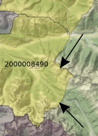

# Watershed and border between Austria and Italy
Does the border between Austria (Sillian) and Italy (San Candido/Innichen) follow the watershed?

According to the data available from [HydroSHEDS](https://www.hydrosheds.org/) the border does not follow the watershed.

The following map shows polygons that depict watershed boundaries and sub-basin delineations; the numeric code (`2000008490` and the others) is the identifier of the most downstream sink, i.e. the outlet of the main river basin.
This field indicates the identifier of the most downstream polygon of the river basin and can be used to identify the entire river basin that a polygon belongs to, including all associated endorheic basins. For each numeric code there is a toponym describing the centroid of the sink.
`2000008490` is associated to the Danube delta while `2000012870` and `2000012980` are associated with the Piave mouth.

The colorbar is the distance from polygon outlet to the most downstream sink, i.e. the outlet of the
main river basin along the river network, in kilometers. The most downstream sink
or outlet is that of the larger basin (to which smaller endorheic sub-basins may be
virtually connected), i.e. either the outlet at the ocean, or the final sink of a large
endorheic watershed which forms its own basin.

So San Candido/Innichen and Sesto/Sexten are in the drainage basin of the Danube river while Dobbiaco/Toblach is in the drainage basin of the Piave river.
The border follows  partially the watershed as can be seen in the following figure:

# References
This is the [Python script](confine.py) to generate the map.

The HydroBASIN data were used; HydroBASIN is part of HydroSHDEDS project described in

Lehner, B., Verdin, K., Jarvis, A. (2008): New global hydrography derived from spaceborne elevation data. Eos, Transactions, AGU, 89(10): 93-94.

The numeric code is the field `MAIN_BAS` in the HydroSHEDS data, the distance is the field `DIST_MAIN`.

The Wikipedia page [Sella di Dobbiaco](https://it.wikipedia.org/wiki/Sella_di_Dobbiaco) has some information about the border.

I learnt about the border from the book *Bel paese brutta gente* by Claus Gatterer.
