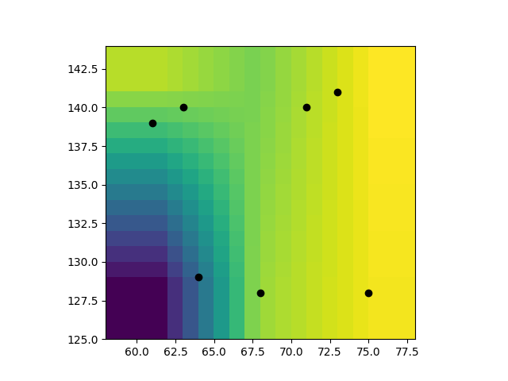
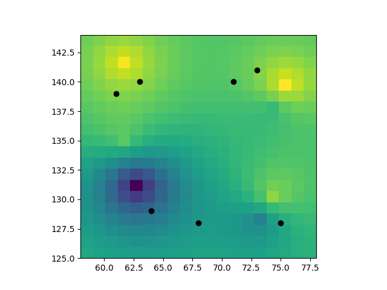

# An example of ordinary Kriging
Section "An Example of Ordinary Kriging" at page 290 of the book ISAAKS, Edward and SRIVASTAVA, Mohan. An Introduction to Applied Geostatistics. Oxford University Press, 1989.

Linear interpolation:

Kriging:

But what about the ``original'' data set?
Appendix A describes how to make the  Walker Lake data set, it seems to me quite convolved and so I downloaded the dataset from [52north](https://52north.org/)'s wiki at [*Well known geostatistical data sets*](https://wiki.52north.org/AI_GEOSTATS/AI_GEOSTATSData)

