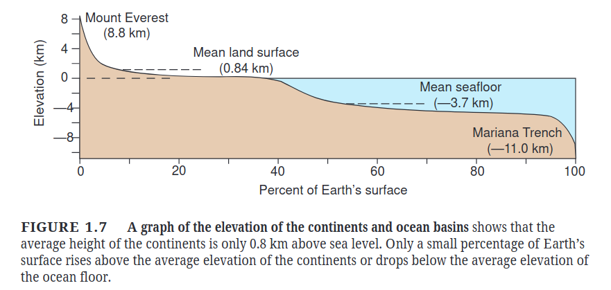
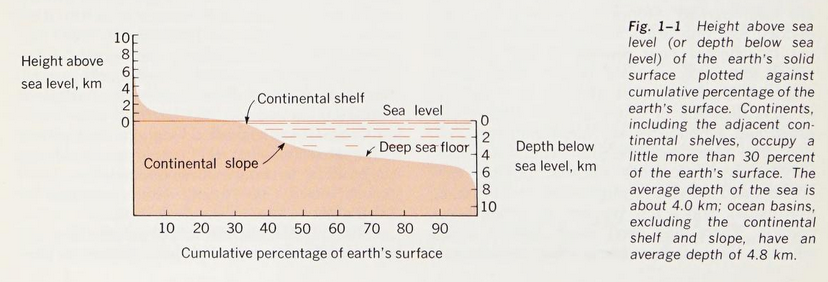
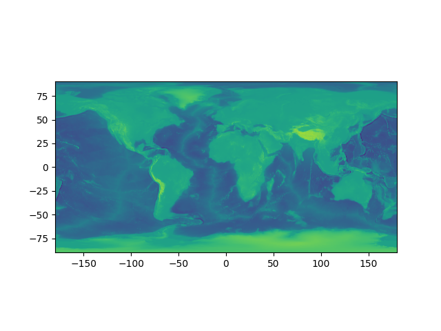
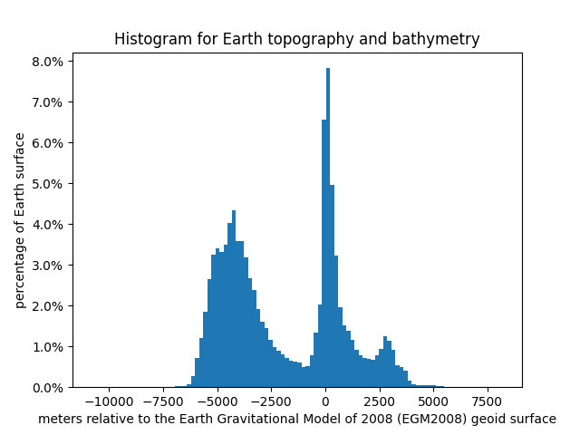
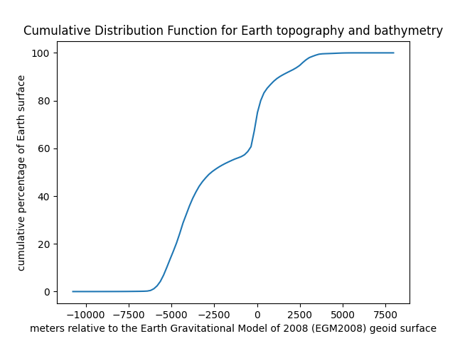
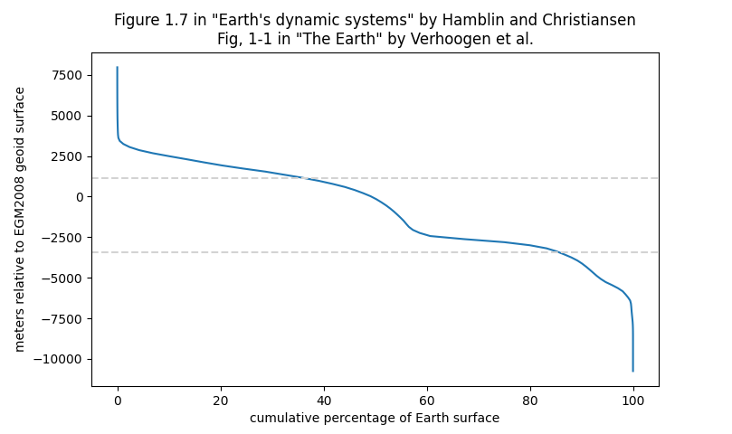

# Earth's altimetry/bathymetry cumulative distribution function

This is Figure 1.7 from the book ["Earth's dynamic systems" by Hamblin and Christiansen](https://earthds.info/):

This is Figure 1-1 from the book ["The Earth" by Verhoogen et al.](https://archive.org/details/earthintroductio0000verh/page/4/mode/2up):

Note that Hamblin and Christiansen for the horizontal axis label use a vague "Percent of Earth's surface" while Verhoogen et al. use a more accurate "Cumulative percentage of earth's surface".

In order to reproduce it we will use the following data 

> NOAA National Centers for Environmental Information. 2022: ETOPO 2022 15 Arc-Second Global Relief Model. NOAA National Centers for Environmental Information. https://doi.org/10.25921/fd45-gt74 . Accessed 2024-08-27.

and we will use the low resolution [(60 arc-second) GeoTIFF image](https://www.ngdc.noaa.gov/mgg/global/relief/ETOPO2022/data/60s/60s_surface_elev_gtif/ETOPO_2022_v1_60s_N90W180_surface.tif).

Here it is the raw data:

According to the [ETOPO22 User Guide](https://www.ngdc.noaa.gov/mgg/global/relief/ETOPO2022/docs/1.2%20ETOPO%202022%20User%20Guide.pdf)

> All tiles are in horizontal WGS84 geographic coordinates (EPSG1:4326) and referenced in meters relative to the Earth Gravitational Model of 2008 (EGM2008) geoid surface (EPSG:3855). 

and

> For most purposes, EGM2008 is an adequate approximation of mean sea level.

First of all we plot the histogram for the Earth altimetry and bathymetry:

Then we plot the classic "cumulative distribution function" for the same data:

And finally we reproduce Figure 1.7 in the book "Earth's dynamic systems" by Hamblin and Christiansen and Fig. 1-1 in the book "The Earth" by Verhoogen et al.

The Python script to reproduce the figure is the following:

    import rasterio
    import rasterio.plot
    import matplotlib.pyplot as plt
    import numpy as np
    from matplotlib.ticker import PercentFormatter

    data = rasterio.open('ETOPO_2022_v1_60s_N90W180_surface.tif')

    rasterio.plot.show(data)

    band1 = data.read(1).flatten()

    # https://stackoverflow.com/a/51477080
    plt.hist(band1,bins=100,weights=np.ones(len(band1))/len(band1))
    plt.title('Histogram for Earth topography and bathymetry')
    plt.xlabel('meters relative to the Earth Gravitational Model of 2008 (EGM2008) geoid surface')
    plt.ylabel('percentage of Earth surface')
    plt.gca().yaxis.set_major_formatter(PercentFormatter(1))
    plt.show()

    # https://stackoverflow.com/a/15419072
    values, base = np.histogram(band1, bins=100)
    cumulative = np.cumsum(values)
    percentage = 100*cumulative/cumulative.max()
    plt.plot(base[:-1], percentage)
    plt.title('Cumulative Distribution Function for Earth topography and bathymetry')
    plt.xlabel('meters relative to the Earth Gravitational Model of 2008 (EGM2008) geoid surface')
    plt.ylabel('cumulative percentage of Earth surface')
    plt.show()

    plt.plot(np.flip(percentage),base[:-1])
    plt.axhline(y=band1[band1>0].mean(), color='lightgray', linestyle='--')
    plt.axhline(y=band1[band1<0].mean(), color='lightgray', linestyle='--')
    plt.title("Figure 1.7 in \"Earth's dynamic systems\" by Hamblin and Christiansen\nFig, 1-1 in \"The Earth\" by Verhoogen et al.")
    plt.ylabel('meters relative to EGM2008 geoid surface')
    plt.xlabel('cumulative percentage of Earth surface')
    plt.show()