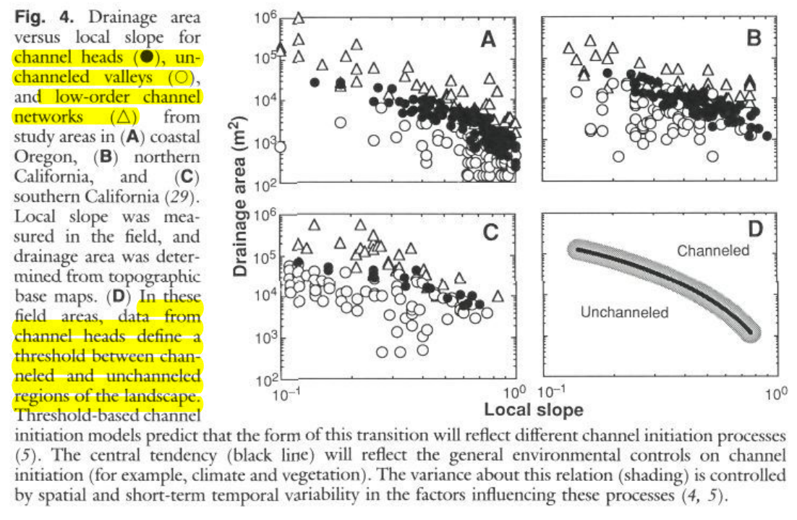

# Libri utili

https://www.sciencedirect.com/referencework/9780080885223/treatise-on-geomorphology si ricavano informazioni dagli abstract

https://archive.org/details/processgeomorpho0004ritt/page/258/mode/2up

https://archive.org/details/theoreticalgeomo0000sche/page/160/mode/2up

“Abstract This work constructs a fracture mechanics framework for conceptualizing mechanical rock breakdown and consequent regolith production and erosion on the surface of Earth and other terrestrial bodies. Here our analysis of fracture mechanics literature explicitly establishes for the first time that all mechanical weathering in most rock types likely progresses by climate-dependent subcritical cracking under virtually all Earth surface and near-surface environmental conditions. We substantiate and quantify this finding through development of physically based subcritical cracking and rock erosion models founded in well-vetted fracture mechanics and mechanical weathering, theory, and observation. The models show that subcritical cracking can culminate in significant rock fracture and erosion under commonly experienced environmental stress magnitudes that are significantly lower than rock critical strength. Our calculations also indicate that climate strongly influences subcritical cracking—and thus rock weathering rates—irrespective of the source of the stress (e.g., freezing, thermal cycling, and unloading). The climate dependence of subcritical cracking rates is due to the chemophysical processes acting to break bonds at crack tips experiencing these low stresses. We find that for any stress or combination of stresses lower than a rock’s critical strength, linear increases in humidity lead to exponential acceleration of subcritical cracking and associated rock erosion. Our modeling also shows that these rates are sensitive to numerous other environment, rock, and mineral properties that are currently not well characterized. We propose that confining pressure from overlying soil or rock may serve to suppress subcritical cracking in near-surface environments. These results are applicable to all weathering processes. Plain Language Summary There is a long-standing question of how climate, particularly water, may influence the physical breakup of rock when it is exposed to the elements. It is typically assumed that the importance of water in rock cracking arises from the role that it plays in processes like freeze-thaw that require water to proceed. Here, we use classical mathematical models combined with a compendium of fracture mechanics theory and data from engineering research to show, for the first time, that water likely influences all types of rock cracking at Earth’s surface whether it “requires” water or not. We also show that cracking proceeds even when only extremely low stresses are applied to the rock (akin to very small pulling forces). These stresses can be due to occurrences as simple and ubiquitous as daily heating and cooling by the sun.” ([Eppes and Keanini, 2017, p. 470](zotero://select/library/items/RXH6TPTW)) ([pdf](zotero://open-pdf/library/items/HGZ4KWCE?page=1))

“Mechanical weathering breaks rock, a process commonly understood to occur when applied stress (force per unit area) exceeds material strength (the stress at which failurebreakage—occurs). If you hit a rock with a hammer and with sufficient force, the rock breaks or shatters. This is critical cracking, a process in which fractures grow so rapidly that the result is catastrophic failure. But consider a fractured outcrop or cliff. No hammer blows have been applied, yet pervasive fractures are present, often with closer spacing near the cliff top. This implies that these fractures form preferentially near the surface. In weathering, the less familiar process of subcritical cracking is important (Eppes and Keanini 2017). In subcritical cracking, rock fractures propagate slowly at low, subcritical stresses. Crack extension rates of m·s−1 to nm·s−1 or lower are considered slow (Lawn 1993) and can occur at applied stresses that are much lower than the critical values at which catastrophic crack growth occurs (Fig. 2). In materials with preexisting flaws, subcritical cracking may occur because the effects of external applied stresses are amplified at the tips of cracks—precisely the location where bonds must be broken. Microscopic cracks, or microcracks, are found in all rocks (Anders et al. 2014). Microcracks are long (on the order of 100 μm or less) relative to their apertures, and are present within grains, between grains, and at grain boundaries. Given the ubiquity of microcracks, rock mechanics focuses more on crack propagation than on crack initiation.” ([Anderson, 2019, p. 248](zotero://select/library/items/9TIGFG3C)) ([pdf](zotero://open-pdf/library/items/PA4YM88G?page=2))

# Testate di canalizzazione

“A channel head is the upstream-most point of concentrated water flow and sediment transport between definable banks with a longitudinally continuous channel downstream. A channel head can be a relatively diffuse feature, the identification of which is subjective, or a very discrete and prominent break in the surface associated with a headcut.” ([Wohl, 2018, p. 649](zotero://select/library/items/X23B7Q4R)) ([pdf](zotero://open-pdf/library/items/L9VRNPY3?page=1))

# Fascia di canalizzazione

“In these field areas, data from channel heads define a threshold between channeled and unchanneled regions of the landscape. Threshold-based channel” ([Montgomery and Dietrich, 1992, p. 4](zotero://select/library/items/UPAQXWR2)) ([pdf](zotero://open-pdf/library/items/LWI8PKPG?page=4)), vedi figura seguente:

Dal [pdf9] si hanno queste definizioni:

_unchanneled regions of the landscape_: topografia non incanalata (versanti, piane alluvionali ecc) 

_channeled regions of the landscape_: i canali incisi (reticolo idrografico).

Intuitivamente se guardo la figura 4D qui sopra quello che vedo è che per alte pendenze locali serve un'area contribuente minore per avere una regione incanalata, mentre se la pendenza è minore allora serve una area contribuente maggiore per avere una regione incanalata; questo a me sembra abbastanza intuitivo.

# _Alluvial fan_

    Flows exiting confined valleys tend to deposit sediment in fan-shaped landforms. Where deposition is wholly or largely by the tractive forces of flowing water, these landforms are called alluvial fans. They are the product of the progressive division of water and sediment downfan, from slopes that may exceed 0.10 to distal slopes that may be below 0.01. Channel depths also tend to decline, from values that approach one to several meters at steep fanheads, to a few decimeters at distal fan margins. The result is a radiating, depositional ramp where confined or unconfined flows transport sediment from source basins to bounding streams, subsiding basins, or stable platforms. Where streams or subsiding basins consume the sediment supply from the source basin, the fan may approach a steady form whose extent and distal slope are set by stream location or subsidence rate. Where boundary conditions do not remove sediment, the fan may prograde out to long distances and low slopes (<0.01). Theoretical and experimental work over the past several decades support the notion that alluvial fan long-profiles become steeper as sediment supply increases or transport capacity decreases, and increasingly concave upward as the rate of bed material deposition decreases downfan. Grainsize distributions of alluvial fans seem to span the range observed in alluvial rivers, with no processes that uniquely identify them, apart from the distributary pattern of deposition. Bed sand cover tends to increase downfan in arid-region fans, with an absence of systematic downfan fining of coarser grain sizes. Surficial mapping and geochronology have demonstrated that fan deposition varies greatly through time, arguably from climate variations that alter hillslope sediment supply. The combination of surficial mapping and hydraulic modeling with high-resolution topography can now produce detailed flood susceptibility maps. The effective use of these maps to protect lives and property, however, depends on answering many of the enduring questions about the mechanics of how water and sediment divide down alluvial fans.

# Bibliografia

Anderson, S. P. Breaking it Down: Mechanical Processes in the Weathering Engine. _Elements_ **15**, 247–252 (2019).

Eppes, M. & Keanini, R. Mechanical weathering and rock erosion by climate‐dependent subcritical cracking. _Reviews of Geophysics_ **55**, 470–508 (2017).

Montgomery, D. R. & Dietrich, W. E. Channel Initiation and the Problem of Landscape Scale. _Science_ **255**, 826–830 (1992).

Wohl, E. The challenges of channel heads. _Earth-Science Reviews_ **185**, 649–664 (2018).

[pdf9] 9 – I Processi Fluviali (Parte 2)

