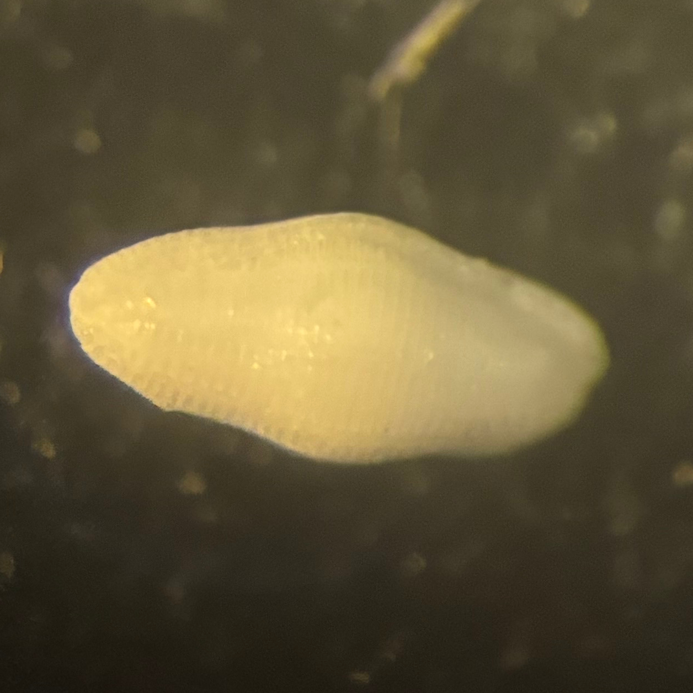
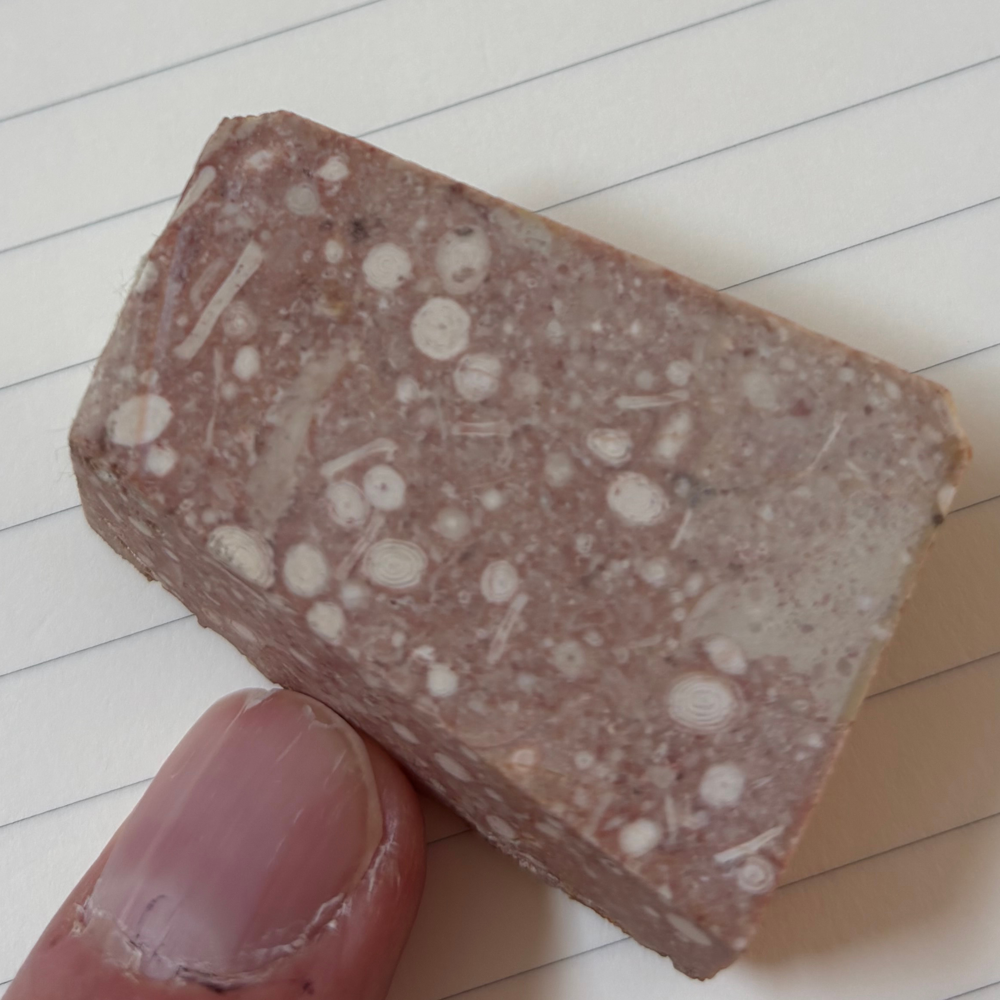

# Specie e categorie superiori

Secondo Allasinaz [Alla p.187] le categorie superiori alla specie sono oggetto di discussione fra gli studiosi: per alcuni sono artificiali  e arbitrarie; per altri sono sì arbitrarie ma possono essere istituite secondo principi evolutivi; per altri sono invece del tutto naturali. 

Fanti in [PDF8] indica queste categorie:

|Nome|Note|
|----|----|
|Phylum|(pl. Phyla)|
|Classe|(-a)|
|Ordine|(-ata o -ida)|
|Famiglia|(-idae)|
|Genere||
|Specie||

# Epoche

<table id="T_4778f">
  <thead>
    <tr>
      <th id="T_4778f_level0_col0" class="col_heading level0 col0" >name</th>
      <th id="T_4778f_level0_col1" class="col_heading level0 col1" >end</th>
      <th id="T_4778f_level0_col2" class="col_heading level0 col2" >begin</th>
      <th id="T_4778f_level0_col3" class="col_heading level0 col3" >timespan</th>
    </tr>
  </thead>
  <tbody>
    <tr>
      <td id="T_4778f_row0_col0" class="data row0 col0" >quaternario</td>
      <td id="T_4778f_row0_col1" class="data row0 col1" >0</td>
      <td id="T_4778f_row0_col2" class="data row0 col2" >2.58</td>
      <td id="T_4778f_row0_col3" class="data row0 col3" >2.58</td>
    </tr>
    <tr>
      <td id="T_4778f_row1_col0" class="data row1 col0" >neogene</td>
      <td id="T_4778f_row1_col1" class="data row1 col1" >2.58</td>
      <td id="T_4778f_row1_col2" class="data row1 col2" >25</td>
      <td id="T_4778f_row1_col3" class="data row1 col3" >22.42</td>
    </tr>
    <tr>
      <td id="T_4778f_row2_col0" class="data row2 col0" >paleogene</td>
      <td id="T_4778f_row2_col1" class="data row2 col1" >25</td>
      <td id="T_4778f_row2_col2" class="data row2 col2" >65</td>
      <td id="T_4778f_row2_col3" class="data row2 col3" >40</td>
    </tr>
    <tr>
      <td id="T_4778f_row3_col0" class="data row3 col0" >cretacico</td>
      <td id="T_4778f_row3_col1" class="data row3 col1" >65</td>
      <td id="T_4778f_row3_col2" class="data row3 col2" >145</td>
      <td id="T_4778f_row3_col3" class="data row3 col3" >80</td>
    </tr>
    <tr>
      <td id="T_4778f_row4_col0" class="data row4 col0" >giurassico</td>
      <td id="T_4778f_row4_col1" class="data row4 col1" >145</td>
      <td id="T_4778f_row4_col2" class="data row4 col2" >200</td>
      <td id="T_4778f_row4_col3" class="data row4 col3" >55</td>
    </tr>
    <tr>
      <td id="T_4778f_row5_col0" class="data row5 col0" >triassico</td>
      <td id="T_4778f_row5_col1" class="data row5 col1" >200</td>
      <td id="T_4778f_row5_col2" class="data row5 col2" >250</td>
      <td id="T_4778f_row5_col3" class="data row5 col3" >50</td>
    </tr>
    <tr>
      <td id="T_4778f_row6_col0" class="data row6 col0" >permiano</td>
      <td id="T_4778f_row6_col1" class="data row6 col1" >250</td>
      <td id="T_4778f_row6_col2" class="data row6 col2" >300</td>
      <td id="T_4778f_row6_col3" class="data row6 col3" >50</td>
    </tr>
    <tr>
      <td id="T_4778f_row7_col0" class="data row7 col0" >carbonifero</td>
      <td id="T_4778f_row7_col1" class="data row7 col1" >300</td>
      <td id="T_4778f_row7_col2" class="data row7 col2" >360</td>
      <td id="T_4778f_row7_col3" class="data row7 col3" >60</td>
    </tr>
    <tr>
      <td id="T_4778f_row8_col0" class="data row8 col0" >devoniano</td>
      <td id="T_4778f_row8_col1" class="data row8 col1" >360</td>
      <td id="T_4778f_row8_col2" class="data row8 col2" >420</td>
      <td id="T_4778f_row8_col3" class="data row8 col3" >60</td>
    </tr>
    <tr>
      <td id="T_4778f_row9_col0" class="data row9 col0" >siluriano</td>
      <td id="T_4778f_row9_col1" class="data row9 col1" >420</td>
      <td id="T_4778f_row9_col2" class="data row9 col2" >445</td>
      <td id="T_4778f_row9_col3" class="data row9 col3" >25</td>
    </tr>
    <tr>
      <td id="T_4778f_row10_col0" class="data row10 col0" >ordoviciano</td>
      <td id="T_4778f_row10_col1" class="data row10 col1" >445</td>
      <td id="T_4778f_row10_col2" class="data row10 col2" >485</td>
      <td id="T_4778f_row10_col3" class="data row10 col3" >40</td>
    </tr>
    <tr>
      <td id="T_4778f_row11_col0" class="data row11 col0" >cambriano</td>
      <td id="T_4778f_row11_col1" class="data row11 col1" >485</td>
      <td id="T_4778f_row11_col2" class="data row11 col2" >540</td>
      <td id="T_4778f_row11_col3" class="data row11 col3" >55</td>
    </tr>
    <tr>
      <td id="T_4778f_row12_col0" class="data row12 col0" >neoproterozoico</td>
      <td id="T_4778f_row12_col1" class="data row12 col1" >540</td>
      <td id="T_4778f_row12_col2" class="data row12 col2" >1000</td>
      <td id="T_4778f_row12_col3" class="data row12 col3" >460</td>
    </tr>
    <tr>
      <td id="T_4778f_row13_col0" class="data row13 col0" >mesoproterozoico</td>
      <td id="T_4778f_row13_col1" class="data row13 col1" >1000</td>
      <td id="T_4778f_row13_col2" class="data row13 col2" >1600</td>
      <td id="T_4778f_row13_col3" class="data row13 col3" >600</td>
    </tr>
    <tr>
      <td id="T_4778f_row14_col0" class="data row14 col0" >paleoproterozoico</td>
      <td id="T_4778f_row14_col1" class="data row14 col1" >1600</td>
      <td id="T_4778f_row14_col2" class="data row14 col2" >2500</td>
      <td id="T_4778f_row14_col3" class="data row14 col3" >900</td>
    </tr>
    <tr>
      <td id="T_4778f_row15_col0" class="data row15 col0" >neoarcheano</td>
      <td id="T_4778f_row15_col1" class="data row15 col1" >2500</td>
      <td id="T_4778f_row15_col2" class="data row15 col2" >2800</td>
      <td id="T_4778f_row15_col3" class="data row15 col3" >300</td>
    </tr>
    <tr>
      <td id="T_4778f_row16_col0" class="data row16 col0" >mesoarcheano</td>
      <td id="T_4778f_row16_col1" class="data row16 col1" >2800</td>
      <td id="T_4778f_row16_col2" class="data row16 col2" >3200</td>
      <td id="T_4778f_row16_col3" class="data row16 col3" >400</td>
    </tr>
    <tr>
      <td id="T_4778f_row17_col0" class="data row17 col0" >paleoarcheano</td>
      <td id="T_4778f_row17_col1" class="data row17 col1" >3200</td>
      <td id="T_4778f_row17_col2" class="data row17 col2" >3600</td>
      <td id="T_4778f_row17_col3" class="data row17 col3" >400</td>
    </tr>
    <tr>
      <td id="T_4778f_row18_col0" class="data row18 col0" >eoarcheano</td>
      <td id="T_4778f_row18_col1" class="data row18 col1" >3600</td>
      <td id="T_4778f_row18_col2" class="data row18 col2" >4030</td>
      <td id="T_4778f_row18_col3" class="data row18 col3" >430</td>
    </tr>
  </tbody>
</table>

# Martedì 4 marzo 2025

## _Fusulina_

## _Alveolina_

## _Nummulite_

# Mercoledì 5 marzo 2025

## _Orbitolites complanatus_

https://www.marinespecies.org/foraminifera/aphia.php?p=taxdetails&id=582373

# Bibliografia

[Alla]  
Andrea Allasinaz, "Paleontologia generale e sistematica degli invertebrati", Genova, 1992, ECIG UNIVERSITAS.

[PDF8]  
Federico Fant, "CLASSIFICARE GLI ORGANISMI VIVENTI E FOSSILI".

[WFM]  
Hayward, B.W.; Le Coze, F.; Vachard, D.; Gross, O. (2025). World Foraminifera Database. Accessed at https://www.marinespecies.org/foraminifera on 2025-03-29. doi:10.14284/305
