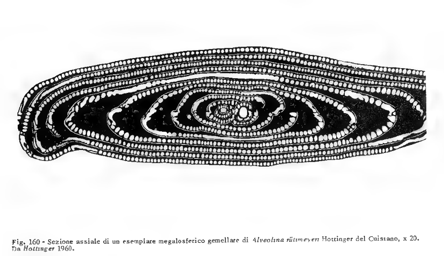
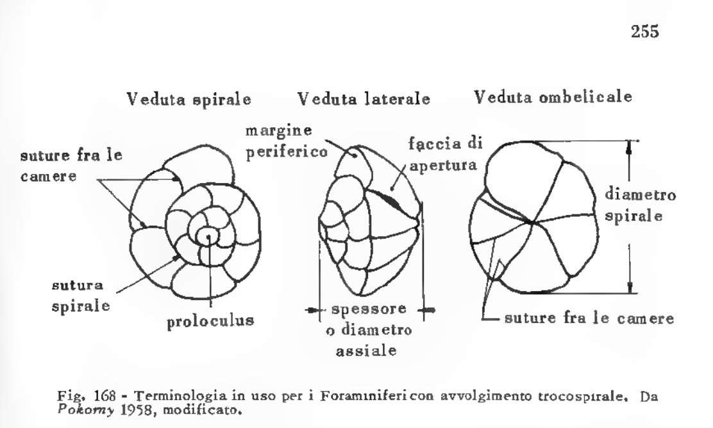
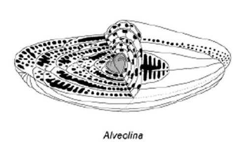
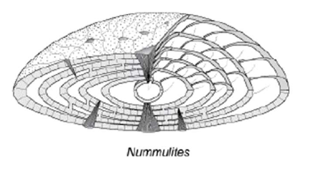
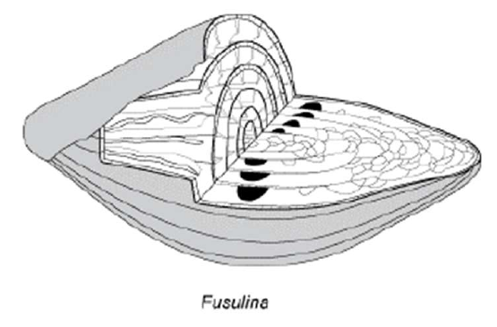
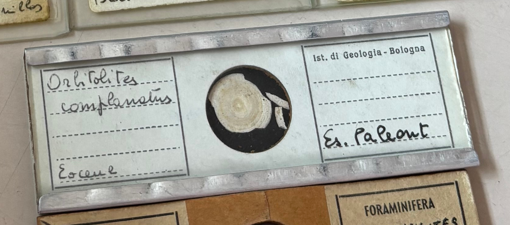
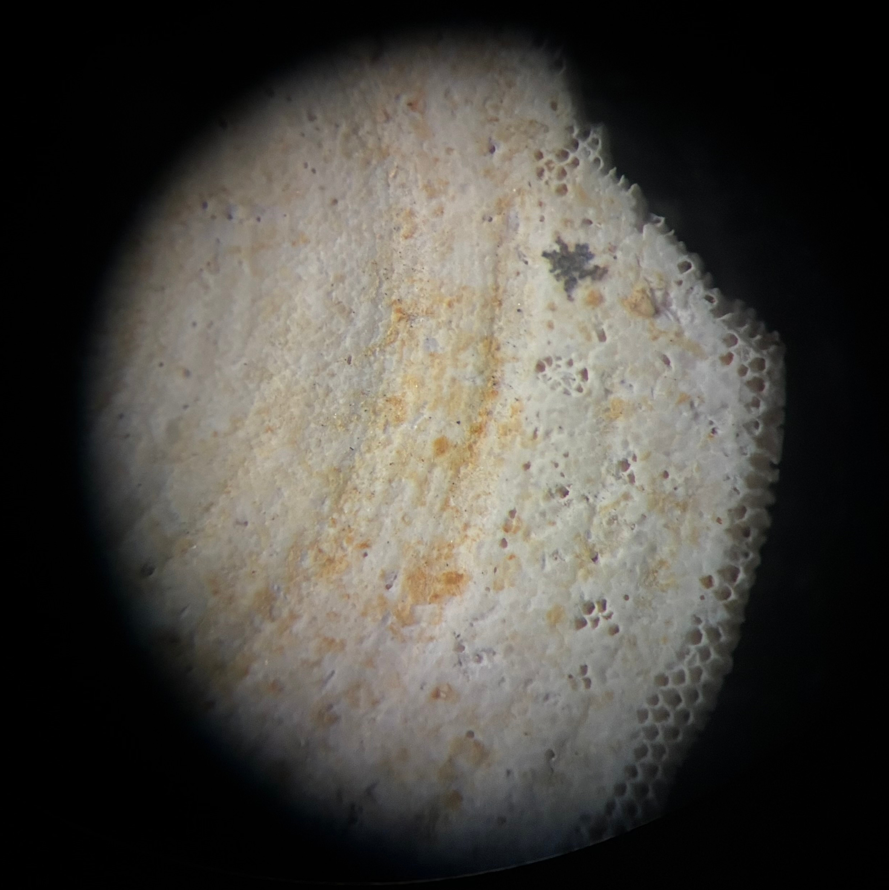
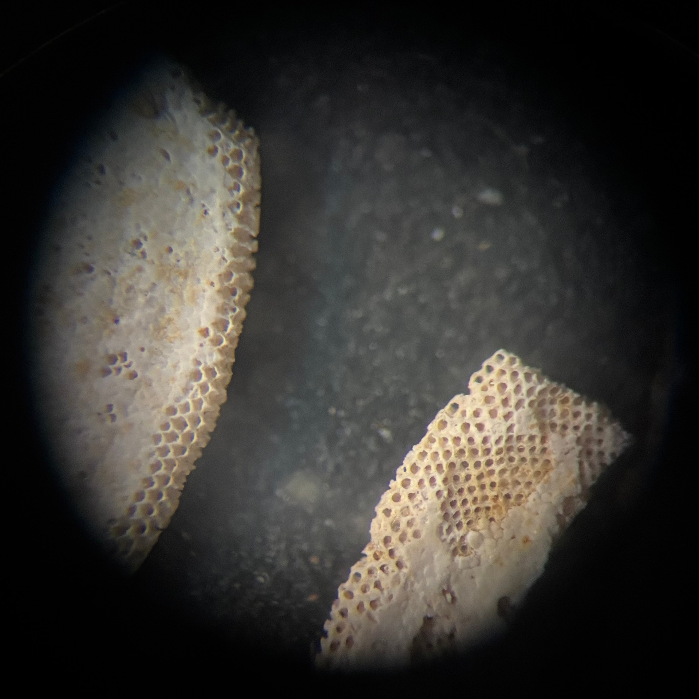
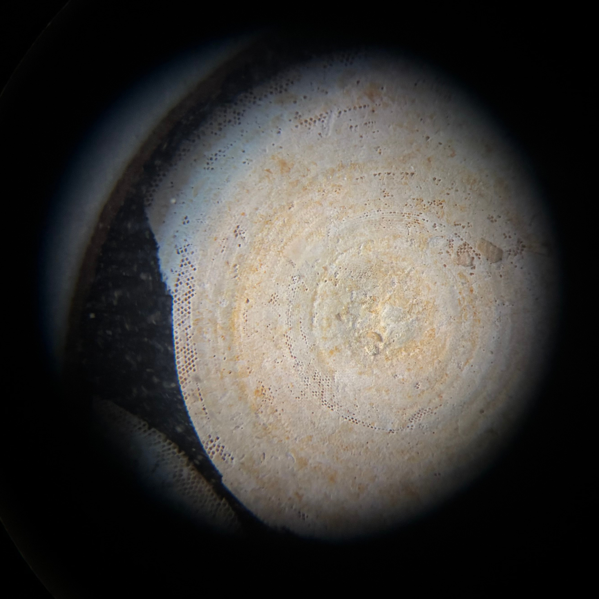
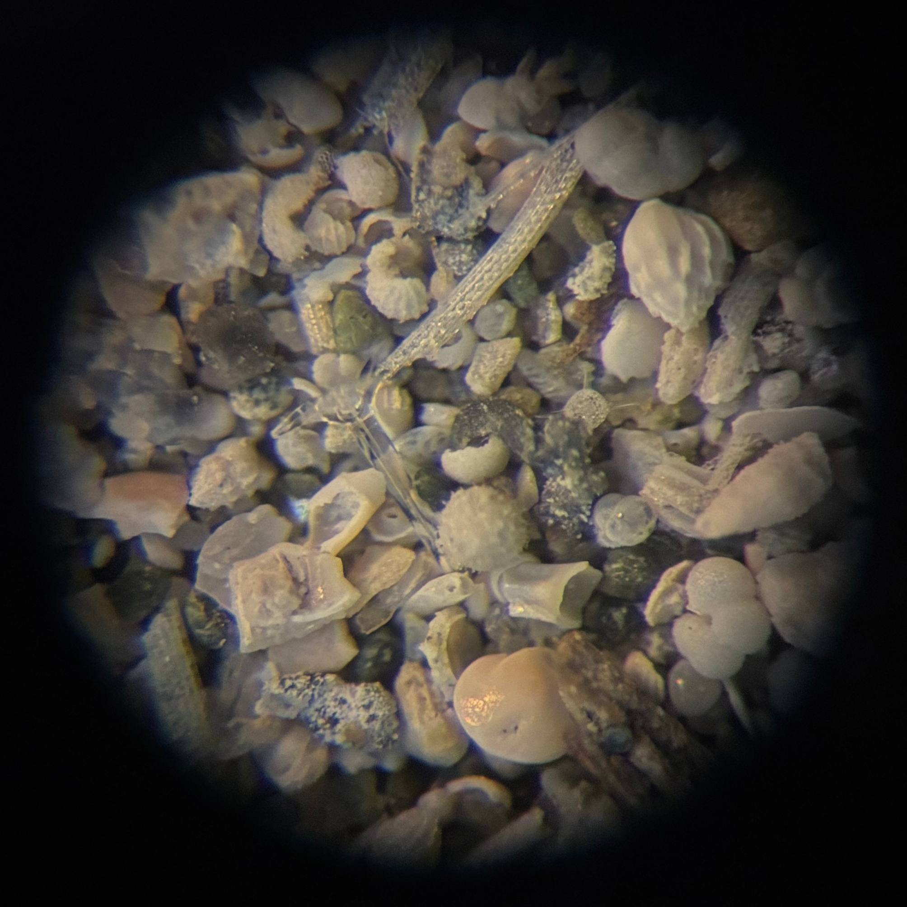

# Foraminiferi

Applicazioni:  
biostratigrafia = datazione dei corpi sedimentari  
ricostruzioni paleoambientali = definire l’ambiente deposizionale  

Nella maggior parte dei Foraminiferi le camere sono disposte secondo una spirale che può essere piana (avvolgimento planispirale) o rialzata (avvolgimento trocospirale). [MBC p35]

- Gusci porcellanacei, imperforati
- Gusci ialini, perforati.

# Foraminiferi e batimetria [SCV-PDF3]

Vicino alla costa (laguna, mare bassa profondità) c'è prevalenza di bentonici,
allontanandosi dalla costa compaiono anche i planctonici.

![Tratto da [Bellier].](fig/CG2010_B02_Fig_10.png)

Interpretare la paleobatimetria considerando l’associazione a
foraminiferi di un campione di sedimento.

I foraminiferi bentonici generalmente aumentano di numero dalle
zone costiere fino al limite superiore della scarpata. Poi
diminuiscono piuttosto rapidamente.

In generale i foraminiferi bentonici come la biomassa bentonica
sono proporzionali alla distribuzione della concentrazione di
carbonio organico nel sedimento, che è alta nella piattaforma
continentale fino al limite superiore della scarpata, poi diminuisce.

Ruolo dominante dei nutrienti e subordinato di altri fattori
(temperatura, salinità, substrato, circolazione nel bacino).

Si calcola l'"Indice di oceanicità":

$P$ = numero di planctonici contati.  
$B$ = numero di bentonici contati.  
Indice di oceanicità: $I=100\frac{P}{P+B}$

Poi si usa una formula esponenziale per calcolare la profondità $D$:

$D=\exp(3.58+0.03\cdot I)$

# Definizioni

Fanti in [PDF8]:  
**Sistematica**: studio scientifico di esseri viventi e fossili con gli obiettivi di **classificazione** e **nomenclatura** univoche.  
**Classificazione**: ordinamento degli essere viventi in gruppi; l'ordinamento è basato sui caratteri comuni degli esseri viventi; i gruppi sono nell'ambito di un sistema gerarchico.  
**Tassonomia**: insieme di regole da usare nella classificazione.  
**Nomenclatura**: insieme di regole per denominare e descrivere gli esseri viventi oggetto della sistematica.  

# Specie e categorie superiori

Secondo Allasinaz [AA p.187] le categorie superiori alla specie sono oggetto di discussione fra gli studiosi: per alcuni sono artificiali  e arbitrarie; per altri sono sì arbitrarie ma possono essere istituite secondo principi evolutivi; per altri sono invece del tutto naturali. 

Fanti in [PDF8] indica queste categorie:

|Nome|Note|
|----|----|
|Phylum|(pl. Phyla)|
|Classe|(-a)|
|Ordine|(-ata o -ida)|
|Famiglia|(-idae)|
|Genere||
|Specie||

# Epoche

<table>
<thead>
<tr>
<th></th><th>name</th><th>end</th><th>begin</th><th>timespan</th>
</tr>
</thead>
<tbody><tr style='background-color: #F9F97F;'><td></td><td>quaternario</td><td>0</td><td>2.58</td><td>2.58</td></tr>
<tr style='background-color: #FFE619;'><td></td><td>neogene</td><td>2.58</td><td>25</td><td>22.42</td></tr>
<tr style='background-color: #FD9A52;'><td></td><td>paleogene</td><td>25</td><td>65</td><td>40</td></tr>
<tr style='background-color: #7FC64E;'><td></td><td>cretacico</td><td>65</td><td>145</td><td>80</td></tr>
<tr style='background-color: #34B2C9;'><td></td><td>giurassico</td><td>145</td><td>200</td><td>55</td></tr>
<tr style='background-color: #812B92;'><td></td><td>triassico</td><td>200</td><td>250</td><td>50</td></tr>
<tr style='background-color: #F04028;'><td></td><td>permiano</td><td>250</td><td>300</td><td>50</td></tr>
<tr style='background-color: #67A599;'><td></td><td>carbonifero</td><td>300</td><td>360</td><td>60</td></tr>
<tr style='background-color: #CB8C37;'><td></td><td>devoniano</td><td>360</td><td>420</td><td>60</td></tr>
<tr style='background-color: #B3E1B6;'><td></td><td>siluriano</td><td>420</td><td>445</td><td>25</td></tr>
<tr style='background-color: #009270;'><td></td><td>ordoviciano</td><td>445</td><td>485</td><td>40</td></tr>
<tr style='background-color: #7FA056;'><td></td><td>cambriano</td><td>485</td><td>540</td><td>55</td></tr>
<tr style='background-color: #FEB342;'><td></td><td>neoproterozoico</td><td>540</td><td>1000</td><td>460</td></tr>
<tr style='background-color: #FDB462;'><td></td><td>mesoproterozoico</td><td>1000</td><td>1600</td><td>600</td></tr>
<tr style='background-color: #F74370;'><td></td><td>paleoproterozoico</td><td>1600</td><td>2500</td><td>900</td></tr>
<tr style='background-color: #F99BC1;'><td></td><td>neoarcheano</td><td>2500</td><td>2800</td><td>300</td></tr>
<tr style='background-color: #F768A9;'><td></td><td>mesoarcheano</td><td>2800</td><td>3200</td><td>400</td></tr>
<tr style='background-color: #F4449F;'><td></td><td>paleoarcheano</td><td>3200</td><td>3600</td><td>400</td></tr>
<tr style='background-color: #DA037F;'><td></td><td>eoarcheano</td><td>3600</td><td>4030</td><td>430</td></tr>
</tbody>
</table>

# Sezioni
Non si può più parlare di sezioni equatoriali, nel vero senso  della parola, nelle forme ad avvolgimento trocospirale: si parla in que  sto caso di sezioni trasversali. [MBC p35]

![Tratto da [MBC fig1 p36].](fig/MBC_fig1_p36.png)

# Nomenclatura macro foraminiferi

|Famiglia|Nome comune|
|--------|-----------|
|Nummulitidae|nummulite (s. f.), nummuliti (p. f.)|

# Distribuzione cronostratigrafica dei macro foraminiferi

Fusuline, Alveoline e Nummuliti.

Alveolina e nummulite sono associate, esistono dal Cretacico ad oggi.

|Alveolina|Nummulite|
|---------|---------|
|||

Fusuline sono estinte, esistevano dal Carbonifero al Permiano.

|Fusulina|
|--------|
||

La seguente distribuzione cronostratigrafica dei macroforaminiferi è tratta da [SCV-PDF4 p37/37].

- Paleozoico: "**CAM**biar **OR**a **SI** **DEV**e **CAR**rozza **PER MI**lano"
- Mesozoico: "**TRI**ppe **GIU**noniche **CRE**scono"
- Cenozoico: "**P**erò **N**on **Q**ua"

<table>
<thead>
<tr>
<th></th><th>name</th><th>end</th><th>begin</th>
<th>Alveolinacea</th>
<th>Nummulitidae</th>
<th>Fusulinidae</th>
</tr>
</thead>
<tbody>
<tr style='background-color: #F9F97F;'>
<td>CZ</td>
<td>quaternario</td>
<td>0</td>
<td><b>2.58</b></td>
<td>X</td>
<td>X</td>
<td></td>
</tr>
<tr style='background-color: #FFE619;'>
<td>CZ</td>
<td>neogene</td>
<td>2.58</td>
<td>25</td>
<td>X</td>
<td>X</td>
<td></td>
</tr>
<tr style='background-color: #FD9A52;'>
<td>CZ</td>
<td>paleogene</td>
<td>25</td>
<td><b>65</b></td>
<td>X</td>
<td>X</td>
<td></td>
</tr>
<tr style='background-color: #7FC64E;'>
<td>MZ</td>
<td>cretacico</td>
<td>65</td>
<td>145</td>
<td>X</td>
<td></td>
<td></td>
</tr>
<tr style='background-color: #34B2C9;'>
<td>MZ</td>
<td>giurassico</td>
<td>145</td>
<td>200</td>
<td></td>
<td></td>
<td></td>
</tr>
<tr style='background-color: #812B92;'>
<td>MZ</td>
<td>triassico</td>
<td>200</td>
<td><b>250</b></td>
<td></td>
<td></td>
<td></td>
</tr>
<tr style='background-color: #F04028;'>
<td>PZ</td>
<td>permiano</td>
<td>250</td>
<td>300</td>
<td></td>
<td></td>
<td>X</td>
</tr>
<tr style='background-color: #67A599;'>
<td>PZ</td>
<td>carbonifero</td>
<td>300</td>
<td>360</td>
<td></td>
<td></td>
<td>X</td>
</tr>
<tr style='background-color: #CB8C37;'>
<td>PZ</td>
<td>devoniano</td>
<td>360</td>
<td>420</td>
<td></td>
<td></td>
<td></td>
</tr>
<tr style='background-color: #B3E1B6;'>
<td>PZ</td>
<td>siluriano</td>
<td>420</td>
<td>445</td>
<td></td>
<td></td>
<td></td>
</tr>
<tr style='background-color: #009270;'>
<td>PZ</td>
<td>ordoviciano</td>
<td>445</td>
<td>485</td>
<td></td>
<td></td>
<td></td>
</tr>
<tr style='background-color: #7FA056;'>
<td>PZ</td>
<td>cambriano</td>
<td>485</td>
<td>540</td>
<td></td>
<td></td>
<td></td>
</tr>
</tbody>
</table>

# Martedì 4 marzo 2025

## _Fusulina_

## _Alveolina_

## _Nummulite_

# Mercoledì 5 marzo 2025

##  _Orbitolites_

Le categorie di appartenenza della seguente tabella sono tratte da [WFM]: [_Orbitolites_ Lamarck, 1801 †](https://www.marinespecies.org/foraminifera/aphia.php?p=taxdetails&id=582373)

|Categoria||
|----|----|
|Phylum|Foraminifera|
|Classe||
|Ordine||
|Famiglia||
|Genere|_Orbitolites_|
|Specie||

![Per i nomi delle sezioni vedi questa figura tratta da [Alla f7.17 p300]. La sezione che appare allungata e schiacciata al centro è la _sezione assiale_; la sezione che appare circolare è la _sezione equatoriale_.](fig/Alla_fig7.17_p300.jpg)

## Famiglia Nummulitidae

![Tratto da [SCV-PDF4 p30/37.]](fig/SCV-PDF4_p30_di_37.png)

## Radiolari, ordine Spumellaria

![Al centro un esemplare dell'ordine spumellaria con la tipica forma sferica, sono visibili le spine radiali (vedi [SCV-PDF5 p12/20]).](2025-03-05/spumellaria_2.PNG)

# Macroinvertebrati

1) Artropodi (solo) Trilobiti
2) Brachiopodi
3) Cnidari (coralli)
   - Rugosa
   - Tabulata
   - Scleractinia
4) Molluschi
   - Bivalvi
   - Gasteropodi
   - Cefalopodi
     - Nautiloidi
     - Ammoniti
     - Belemniti
5) Echinodermi
     - Crinoidea
     - Echinoidea (regolari e irregolari)

# Bibliografia

[AA]  
Andrea Allasinaz, "Paleontologia generale e sistematica degli invertebrati", Genova, 1992, ECIG UNIVERSITAS.

[Bellier]  
Bellier J.-P., Mathieu R. & Granier B. (2010).- Short Treatise on Foraminiferology (Essential on modern and fossil Foraminifera) [Court traité de foraminiférologie (L'essentiel sur les foraminifères actuels et fossiles)].- Carnets de Géologie - Notebooks on Geology, Brest, Book 2010/02 (CG2010_B02), 104 p., 15 figs, 10 pls.
http://paleopolis.rediris.es/cg/BOOKS/CG2010_B02/

[FF-PDF8]  
Federico Fanti, "CLASSIFICARE GLI ORGANISMI VIVENTI E FOSSILI".

[MBC]  
Maria Bianca Cita, "Micro Paleontologia", Milano, 1983, Cisalpino Goliardica.

[SCV-PDF2]  
Stefano Claudio Vaiani, "Foraminiferi".

[SCV-PDF3]  
Stefano Claudio Vaiani, "Foraminiferi e batimetria".

[SCV-PDF4]  
Stefano Claudio Vaiani, "Macro foraminiferi".

[SCV-PDF5]  
Stefano Claudio Vaiani, "Radiolari".

[WFM]  
Hayward, B.W.; Le Coze, F.; Vachard, D.; Gross, O. (2025). World Foraminifera Database. Accessed at https://www.marinespecies.org/foraminifera on 2025-03-29. doi:10.14284/305

# Glossario

Querschnitt = Sezione trasversale (tedesco).

# Abbreviazioni

f.=femminile  
p.=plurale  
pl.=plurale  
s.=singolare  