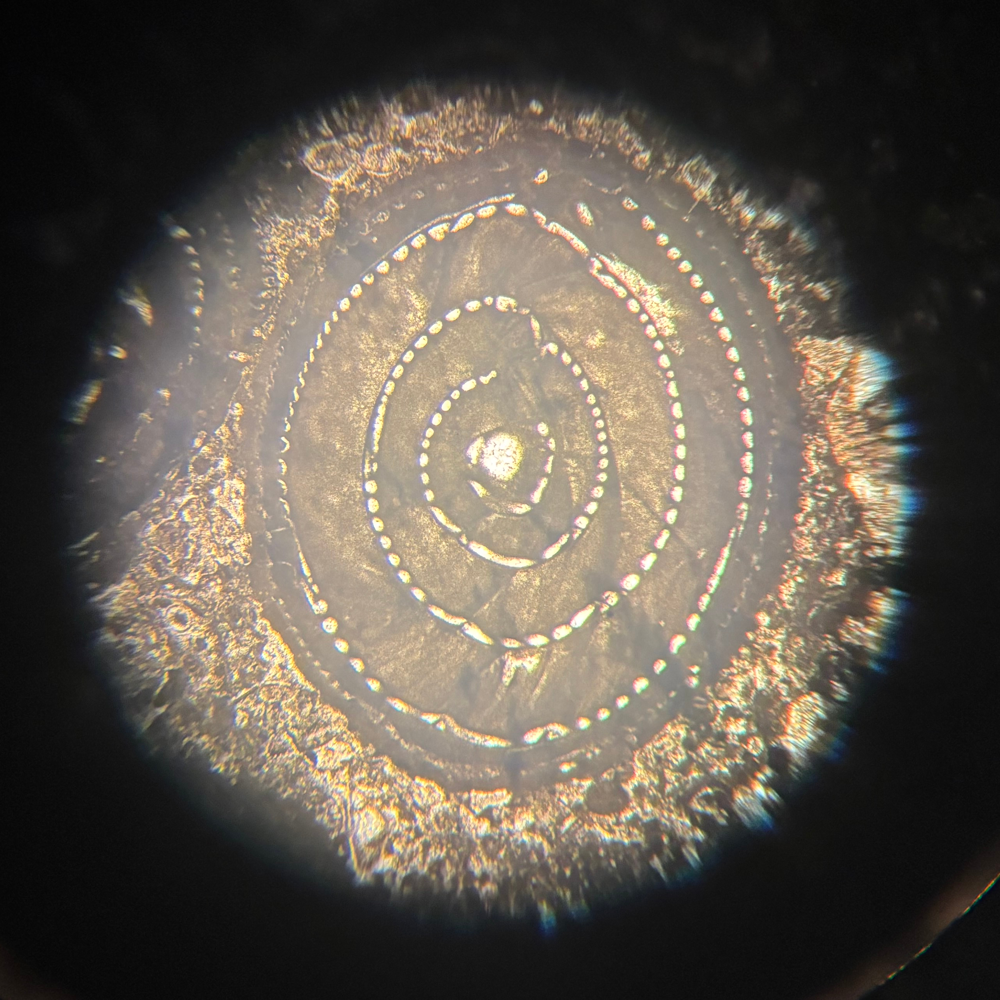

# Specie e categorie superiori

Secondo Allasinaz [Alla p.187] le categorie superiori alla specie sono oggetto di discussione fra gli studiosi: per alcuni sono artificiali  e arbitrarie; per altri sono sì arbitrarie ma possono essere istituite secondo principi evolutivi; per altri sono invece del tutto naturali. 

Fanti in [PDF8] indica queste categorie:

|Nome|Note|
|----|----|
|Phylum|(pl. Phyla)|
|Classe|(-a)|
|Ordine|(-ata o -ida)|
|Famiglia|(-idae)|
|Genere||
|Specie||

# Epoche

<table id="T_4778f">
  <thead>
    <tr>
      <th>name</th>
      <th>end</th>
      <th>begin</th>
      <th>timespan</th>
    </tr>
  </thead>
  <tbody>
<tr style='background-color: #F9F97F;'><td>quaternario</td><td>0</td><td>2.58</td><td>2.58</td></tr>
<tr style='background-color: #FFE619;'><td>neogene</td><td>2.58</td><td>25</td><td>22.42</td></tr>
<tr style='background-color: #FD9A52;'><td>paleogene</td><td>25</td><td>65</td><td>40</td></tr>
<tr style='background-color: #7FC64E;'><td>cretacico</td><td>65</td><td>145</td><td>80</td></tr>
<tr style='background-color: #34B2C9;'><td>giurassico</td><td>145</td><td>200</td><td>55</td></tr>
<tr style='background-color: #812B92;'><td>triassico</td><td>200</td><td>250</td><td>50</td></tr>
<tr style='background-color: #F04028;'><td>permiano</td><td>250</td><td>300</td><td>50</td></tr>
<tr style='background-color: #67A599;'><td>carbonifero</td><td>300</td><td>360</td><td>60</td></tr>
<tr style='background-color: #CB8C37;'><td>devoniano</td><td>360</td><td>420</td><td>60</td></tr>
<tr style='background-color: #B3E1B6;'><td>siluriano</td><td>420</td><td>445</td><td>25</td></tr>
<tr style='background-color: #009270;'><td>ordoviciano</td><td>445</td><td>485</td><td>40</td></tr>
<tr style='background-color: #7FA056;'><td>cambriano</td><td>485</td><td>540</td><td>55</td></tr>
<tr style='background-color: #FEB342;'><td>neoproterozoico</td><td>540</td><td>1000</td><td>460</td></tr>
<tr style='background-color: #FDB462;'><td>mesoproterozoico</td><td>1000</td><td>1600</td><td>600</td></tr>
<tr style='background-color: #F74370;'><td>paleoproterozoico</td><td>1600</td><td>2500</td><td>900</td></tr>
<tr style='background-color: #F99BC1;'><td>neoarcheano</td><td>2500</td><td>2800</td><td>300</td></tr>
<tr style='background-color: #F768A9;'><td>mesoarcheano</td><td>2800</td><td>3200</td><td>400</td></tr>
<tr style='background-color: #F4449F;'><td>paleoarcheano</td><td>3200</td><td>3600</td><td>400</td></tr>
<tr style='background-color: #DA037F;'><td>eoarcheano</td><td>3600</td><td>4030</td><td>430</td></tr>
  </tbody>
</table>

# Martedì 4 marzo 2025

## _Fusulina_

## _Alveolina_

## _Nummulite_

# Mercoledì 5 marzo 2025

## _Orbitolites complanatus_

https://www.marinespecies.org/foraminifera/aphia.php?p=taxdetails&id=582373

# Bibliografia

[Alla]  
Andrea Allasinaz, "Paleontologia generale e sistematica degli invertebrati", Genova, 1992, ECIG UNIVERSITAS.

[PDF8]  
Federico Fant, "CLASSIFICARE GLI ORGANISMI VIVENTI E FOSSILI".

[WFM]  
Hayward, B.W.; Le Coze, F.; Vachard, D.; Gross, O. (2025). World Foraminifera Database. Accessed at https://www.marinespecies.org/foraminifera on 2025-03-29. doi:10.14284/305
