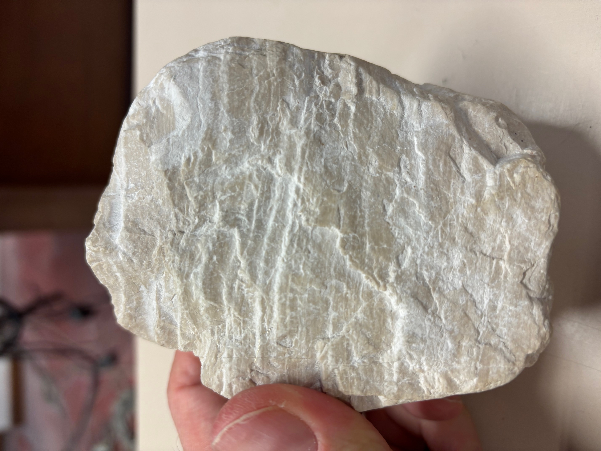
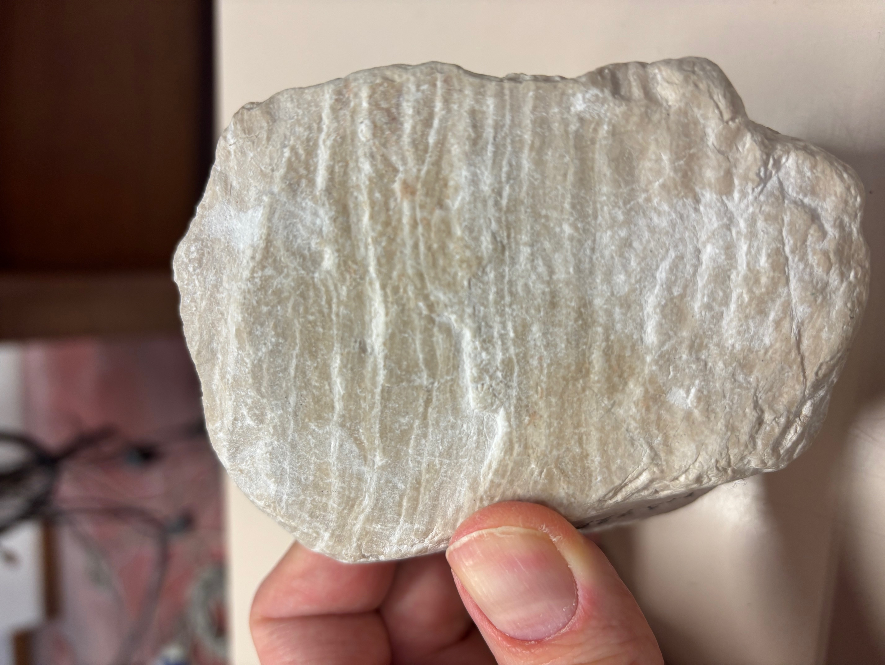
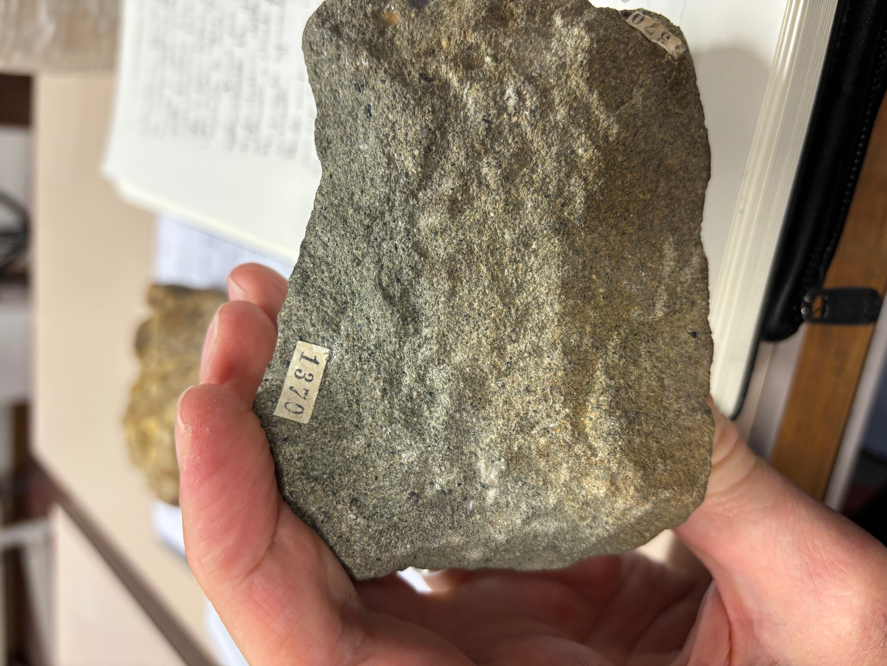
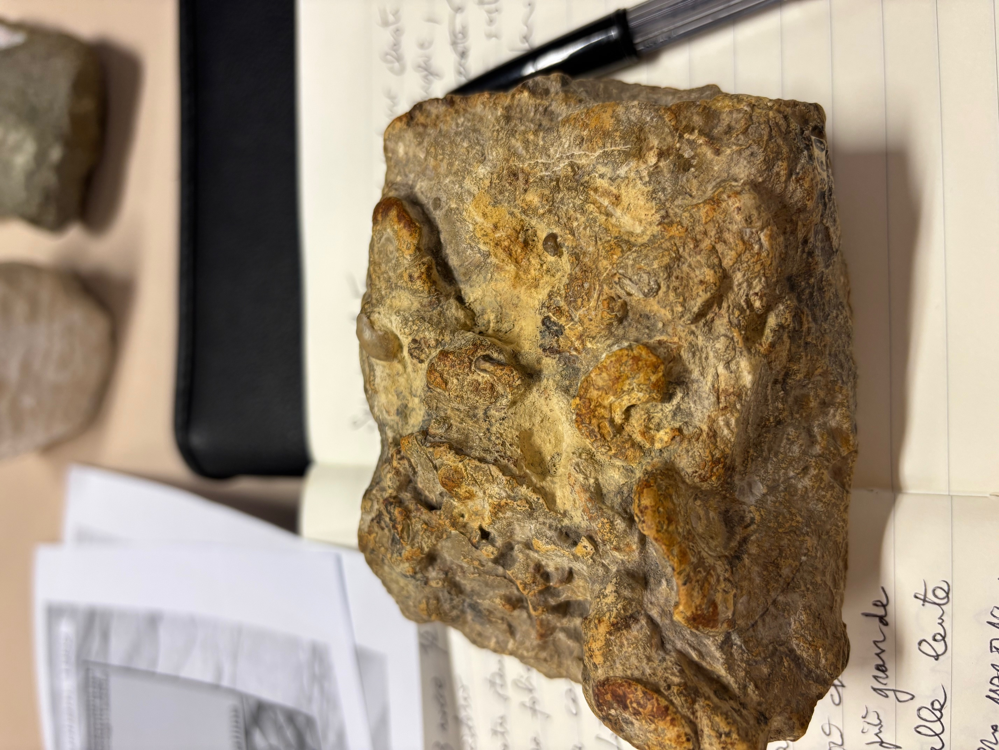
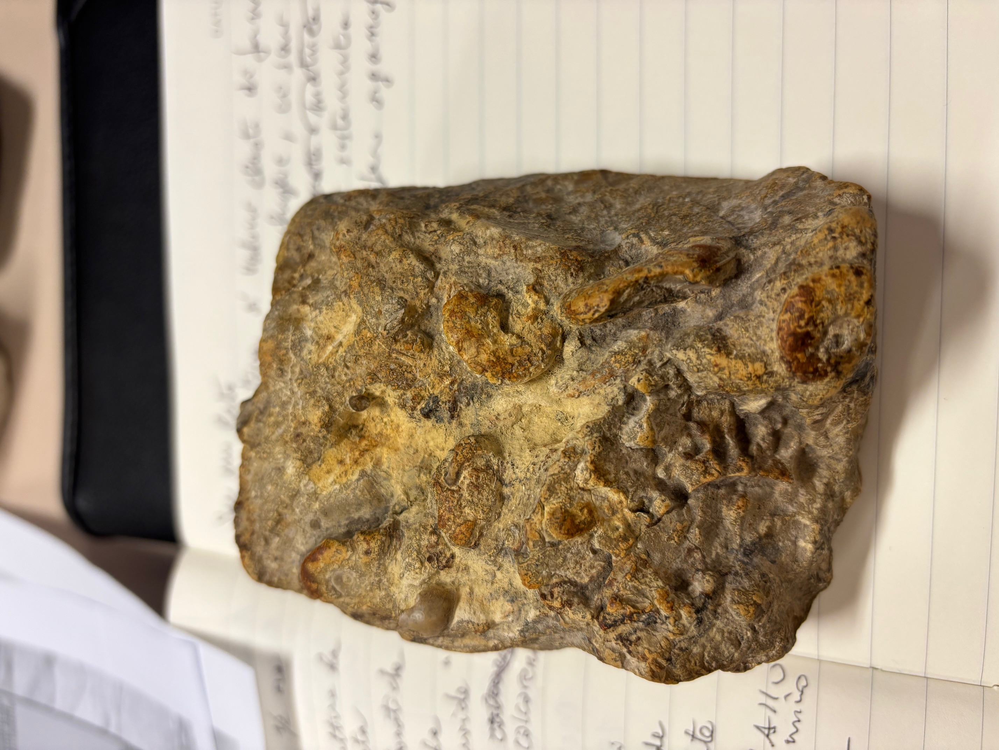
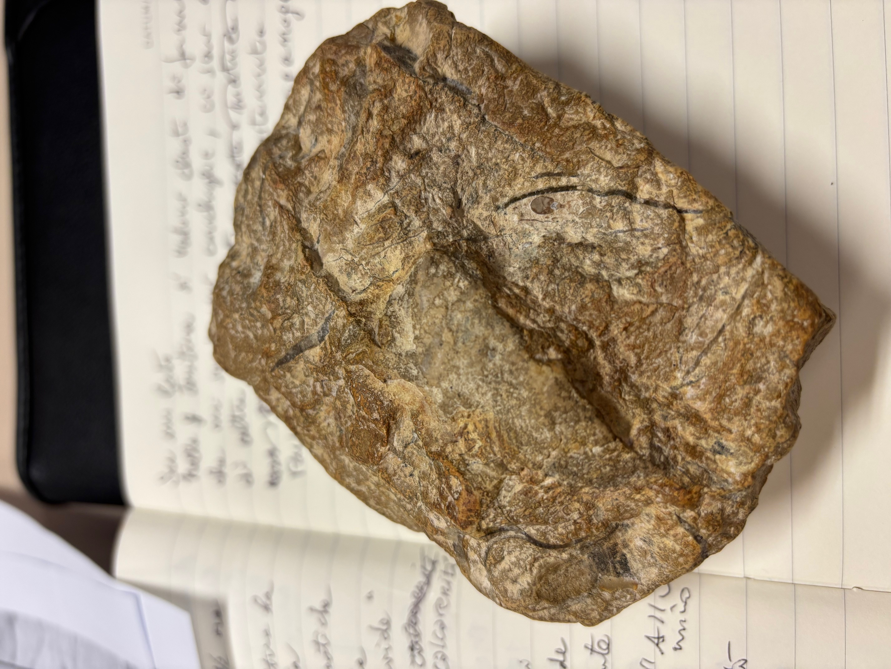
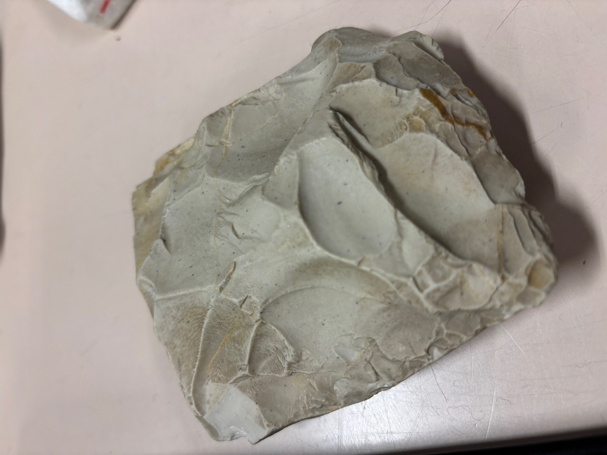
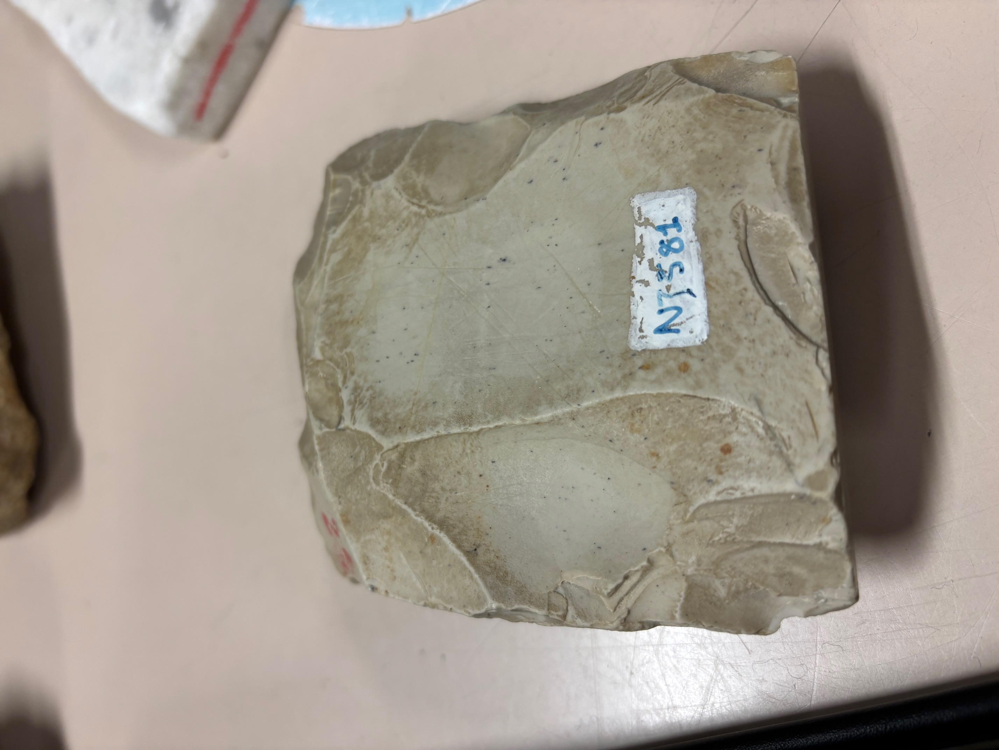
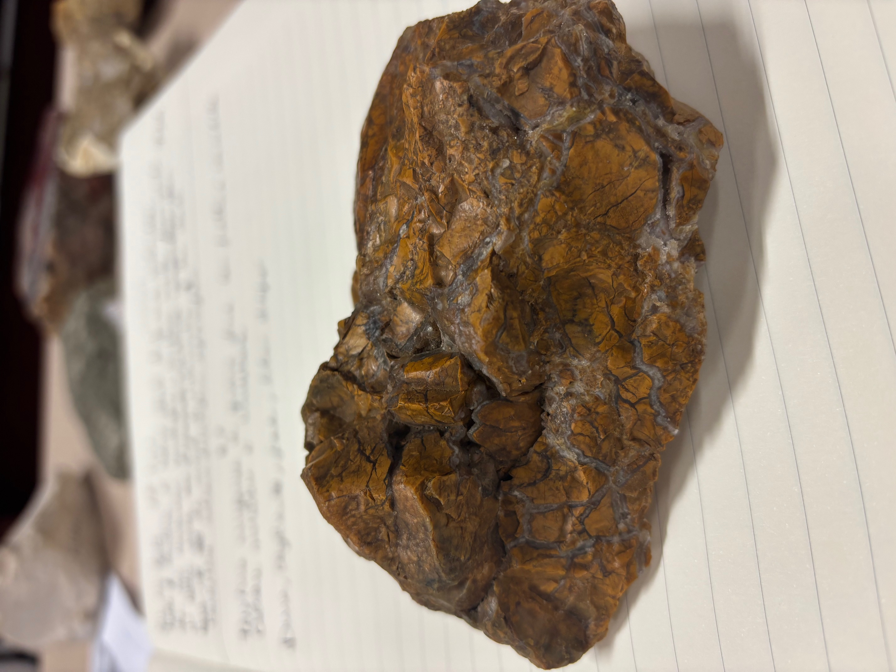
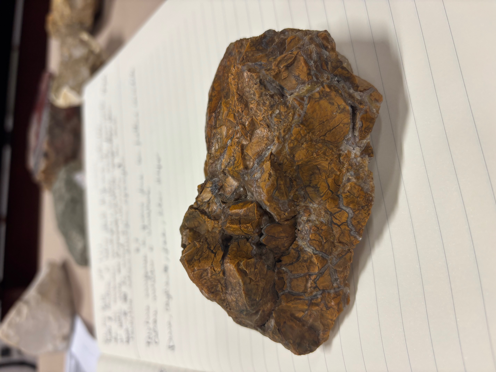

# Laboratorio rocce 26 febbraio 2025

Roccia sedimentaria  
La tessitura è omogenea a grana fine.  
È preferibile dire che qui le strutture sono le _laminazioni_ e riservare il termine _stratificazioni_ al caso in cui siano più grandi.  
  

---

Roccia sedimentaria: Litarenite  
Granulometria delle sabbie, i granuli sono in matrice cementata.  
La struttura è sedimentaria.  
Alla lente si vedono granuli di quarzo stimati a vista < 75%; non si vedono feldspati quindi usando il diagramma di Folk 1954 si classifica la roccia come Litarenite.

---

Roccia sedimentaria: Packstone, calcare fossilifero organogeno  
I clasti di forma arrotondata sono ammoniti (e non come ho detto io "conchiglie"); è presente mud e la roccia è sostenuta dai clasti quindi usando lo schema di Dunham 1962 si classifica come Packstone, calcare fossilifero organogeno.  
  

Attenzione che da questo lato del campione non si vedono a occhio nudo i fossili, quindi guardare sempre bene il campione da tutti i lati!  

---

Roccia sedimentaria: Limestone, calcare micritico  
La tessitura è omogenea a grana fine, le fratture sono concoidali.  
Ho azzardato una "selce" ma la prof ha detto che l'uomo primitivo avrebbe fatto fatica a fare un utensile per raschiare la pelle con questa roccia (perché non è sufficientemente dura?) ed ha poi detto che è un limestone o calcare micritico.  
  

---

Roccia sedimentaria: Diaspro  
La prof ha usato questi aggettivi: "dura, tagliente, fine" concludendo poi con "è un diaspro".  
  
