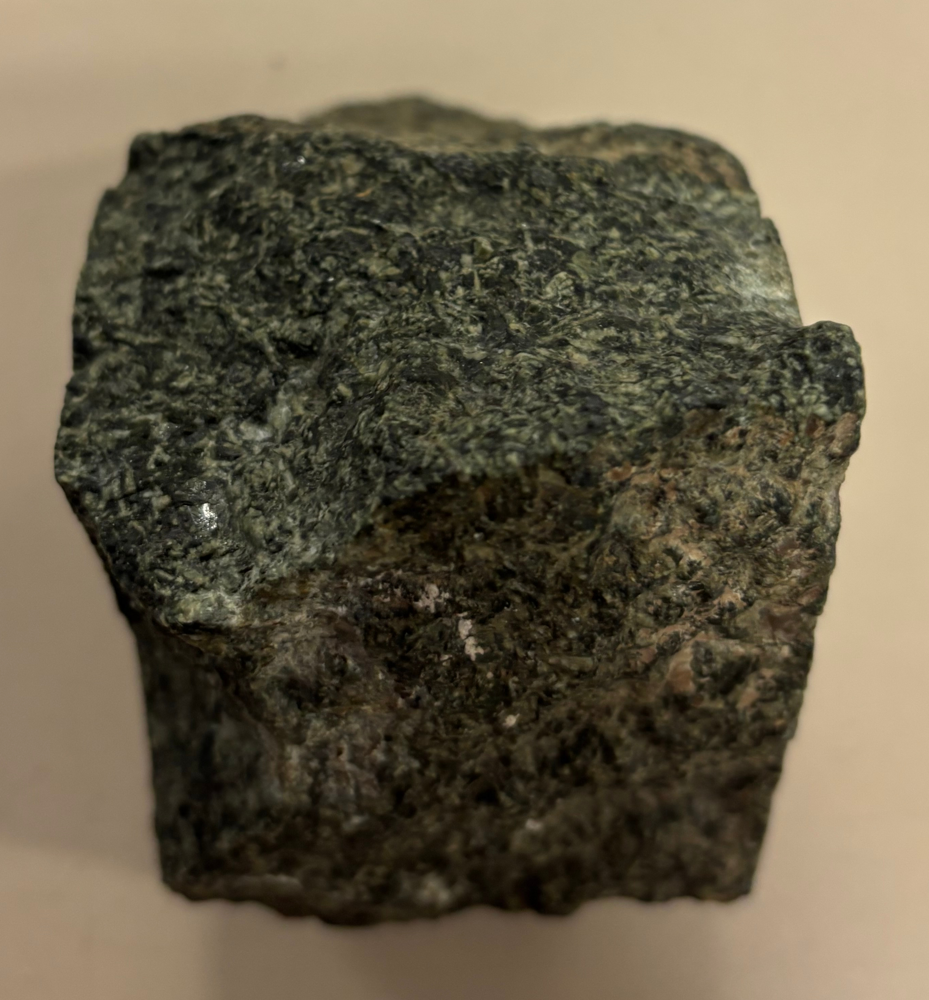

# Laboratorio rocce 5 marzo 2025

Roccia sedimentaria: gesso.  
Non omogenea.  
Non reagisce con acido.  
La parte compatta di colore bianco si scalfisce con unghia.  
Strati compatti ed omogenei di colore bianco alternati a strati di frammenti litici di qualche millimetro.  

La prof ha detto che la scalfitura con unghia porta a classificare la roccia come gesso; ha poi spiegato che negli ambienti evaporitici si può formare sia il gesso con i caratteristici cristalli grandi e parzialmente trasparenti, sia il gesso in questa forma.

\newpage

---

Roccia ignea: gabbro.  
Struttura olocristallina (si percepisce bene nella faccia levigata) indica roccia intrusiva, quindi per classificare si usa il diagramma QAP Streckeisen.  
Come quantità di minerali, tolti quelli scuri/verdi, restano solo quelli chiari che dico essere plagioclasi, non vedo quarzo e quindi la roccia è classificata, seguendo il diagramma, come gabbro.

\newpage

---

Roccia metamorfica: anfibolite.  
Ha tessitura anisotropa, su un lato è più foliata mentre sull'altro lato è più gneissica con "occhi" millimetrici di colore nero.  
Composizione: quarzo, biotite (mica di colore nero), anfiboli (prismatici non brillanti).  
Io ho dichiarato gneiss ma la prof ha corretto in anfibolite che è, se ho capito bene, una roccia che sta diventanto uno gneiss.  

\newpage

---

Roccia metamorfica: anfibolite.  
I minerali a "bastoncino" di colore nero sono anfiboli, qui sono allineati.  
Anche questa roccia è una anfibolite.

