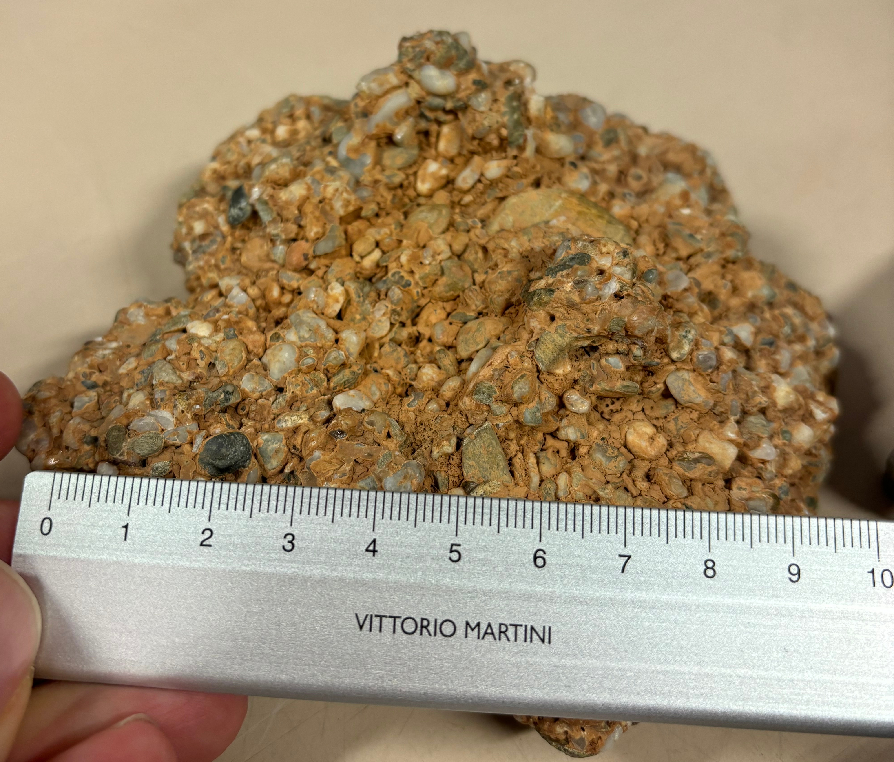
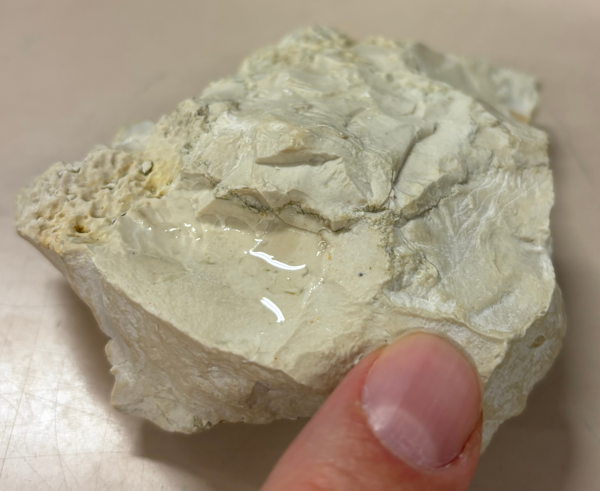
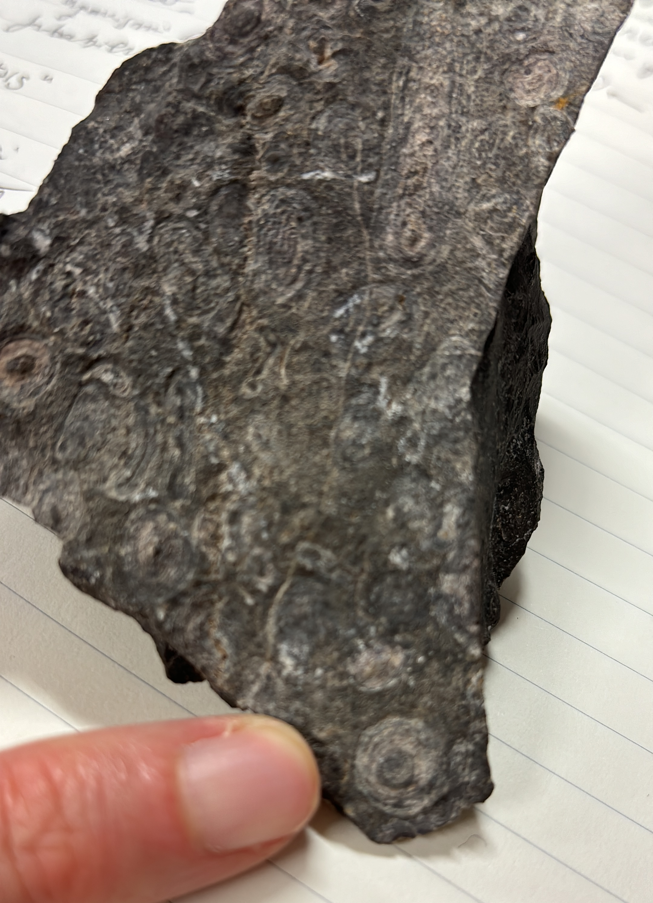
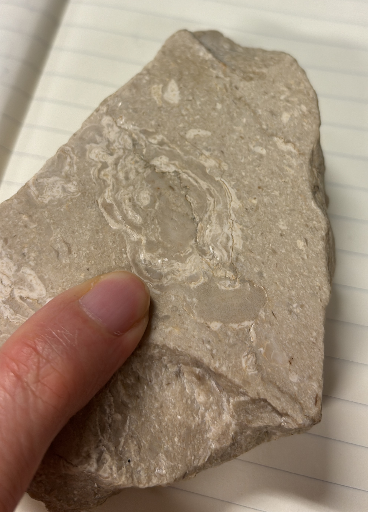
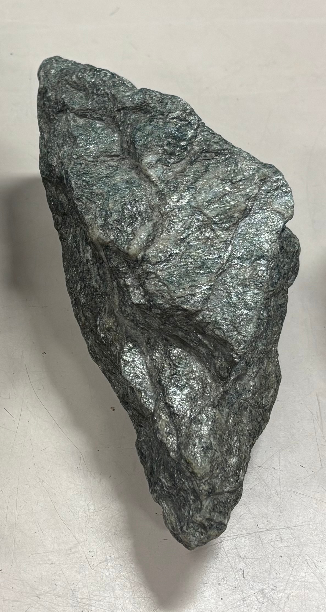
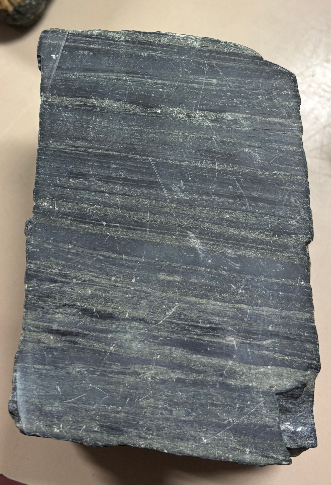
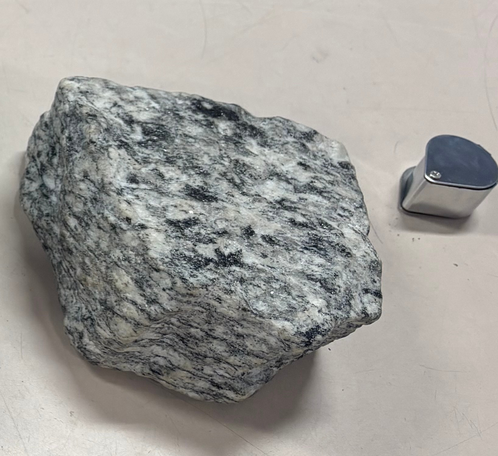
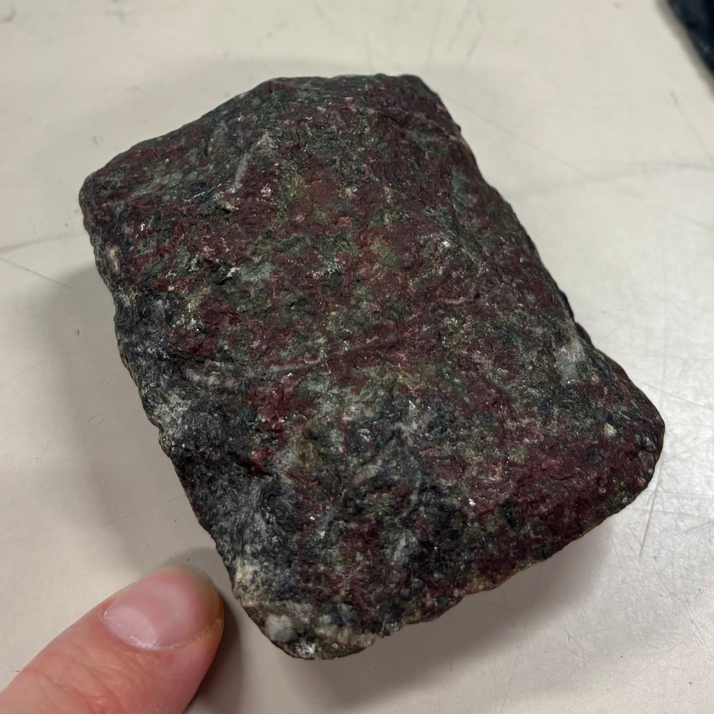
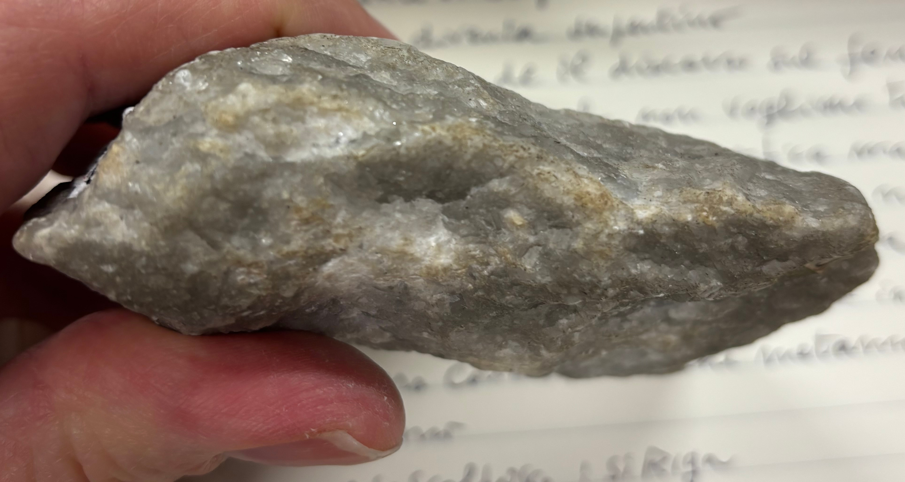

# Rocce ignee
Struttura vs tessitura

* la tessitura si vede solo al microscopio  

---

Struttura [PDF10 p22/45]:

* olocristallina
* porfirica (fenocristalli immersi in pasta di fondo)
* afirica (fenocristalli assenti e quindi è presente la sola pasta di fondo) [BDA p45]
* amorfa (opaca?) o vetrosa (lucida?)

---

|Struttura|Classificare con|
|---------|----------------|
|Olocristallina|Diagramma QAP per rocce intrusive|
|Porfirica|Diagramma QAP per rocce effusive, ignorando la pasta di fondo se non si vedono cristalli, quindi contando solo i fenocristalli|
|Afirica|Diagramma QAP per rocce effusive: attenzione ad eventuali microcristalli chiari!|
|Amorfa|TODO|

---

Dimensione dei cristalli: [BDA p46]

* criptocristalli
* grana fine < 1 mm
* grana media > 1 mm e < 5 mm
* grana grossa > 5 mm

---

Variabilità della dimensione dei cristalli:

* equigranulare [BDA p45]
* eterogranulare

---

Colore e composizione:

* tipicamente scuri i minerali femici
* tipicamente chiari i minerali sialici

---

Suggerimenti uso lente a mano:

* lo stesso minerale va cercato con la lente in più punti del campione
* attenzione ad oggetti "strani": potrebbero essere fossili

---

Strumenti di diagnosi:

* scala delle durezze di Mohs
* comportamento reazione con acido

---

Serie di Bowen (descrizione dei minerali visti nei campioni a mano)

|T xtal/°C|Minerale|Abito|Riflette?|Colore|
|---------|---|--|-|-|
|600-700|Quarzo|Prisma esagonale tozzo con tetto "piramidale"|No|grigio|
||Muscovite|Foglietti|Sì|incolore|
||K-feldspato/Ortoclasio|||rosa|
||Biotite|Foglietti|Sì|nero|
||Anfiboli|Prismi allungati|No|nero|
||Pirosseni|Piani|No|verde|
|1200|Olivina|Compatta arrotondata||verde|

|T xtal/°C|Minerale|Minerale serie continua|Colore Plagioclasio|
|---------|--------|-----------------------|-------------------|
|600-700  |Quarzo  |Plagioclasio Na/Albite |bianco lattiginoso |
|         |Muscovite|                      |                   |
|         |K-feldspato/Ortoclasio|         |                   |
|         |Biotite|                        |                   |
|         |Anfiboli|                       |                   |
|         |Pirosseni|                      |                   |
|1200     |Olivina|Plagioclasio Ca/Anortite|grigio|

\newpage

## Rocce intrusive o plutoniche

### Classificazione con diagramma QAP intrusive
Si basa sulla stima dei componenti Q, A, P, M. [BDA p47] e dell'indice di colore IC.  
Q = Quarzo  
A = Alkali Feldspati  
P = Plagioclasio  
M = Minerali femici (tipicamente di colore scuro e.g. nero, verdone).

$IC=(scuri)/(chiari+scuri)$ espresso in percentuale [KP p291]

1) Descrivere/Riconoscere i minerali chiari (sialici) e scuri (femici).
2) Stimare le quantità Q, A, P, M tramite stima visiva.
3) Esprimerle in percentuale in modo che $Q+A+P+M=100$
4) Sul diagramma disegnare una linea orizzontale al valore $Quarzo=Q/(Q+A+P)$
5) Sul diagramma disegnare un segmento che unisce il vertice alto Q al punto sulla base A-P che è al valore $Plagioclasio=P/(A+P)$. Il vertice in basso a sinistra corrisponde a $Plagioclasio=0$, il vertice in basso a destra corrisponde a $Plagioclasio=100\%$.
6) Il nome della roccia sta all'intersezione tra la linea e il segmento suddetti. 
3) Stimare IC (tramite _stima visiva_)

Note sull'indice di colore:

* IC alto suggerisce P>A, quindi regione dello schema vicina a P. [BDA p47 fig2.19] 

Consigli e avvertimenti per la stima visiva:

* se quarzo "salta all'occhio" allora Q>20%
* attenzione al rischio di sovrastimare i minerali scuri/femici.

\newpage

## Rocce effusive o vulcaniche

Strutture delle rocce effusive [Q p98]:

* microcristallina
* porfirica
* vetrosa 
* clastica 
* scoriacea

\newpage

## Rocce sedimentarie

### Composizione, tessitura, struttura [BMRL p3]

* Composizione: di che materiale è fatto?  
* Tessitura: distribuzione statistica delle dimensioni, forme degli elementi costituenti la roccia.  
* Struttura: stratificazione se grande, laminazione se piccola.

### Una classificazione basata sulle caratteristiche genetico-tessiturali [BMRL p5 fig1.3]

|gruppo|controllato da|feature|esempi
|-|-|-|-|
|Rocce granulari (aka particellari)|gravità, meccanica dei fluidi|stratificate, porose|terrigene|
|Rocce cristalline|processi chimici, regola delle fasi|non porose|salgemma|
|Rocce biocostruite|secrezione biochimica (contro la gravità)|non stratificate, porose|
|Rocce residuali|degradazione chimica/fisica|mal stratificate, possono essere porose|suoli, carbone|

### Famiglie di rocce importanti [BMRL p6]

* Rocce terrigene silicoclastiche
* Rocce carbonatiche
* Evaporiti
* Rocce silicee

\newpage

### Componenti tessiturali delle rocce granulari [BMRL p7]

**granuli** - **matrice** - **cemento**

Nella fase iniziale di genesi della roccia ci sono i **granuli** che sono le unità elementari e che per gravità stanno uno sull'altro, gli spazi vuoti fra i granuli sono i **pori**; con il passare del tempo i pori si riempiono di materia (solida e più fine e.g. fango oppure allo stato fluido come acqua, gas, petrolio) che compone la **matrice**; con il passare di altro tempo i pori possono venir eliminati (e.g. per costipamento) oppure essere riempiti da **cemento** (e.g. cemento costituito da fasi cristalline precipitate chimicamente).  
_Quindi il fattore tempo è importante e si collegherà al concetto di "maturità tessiturale"._

![Tratta da [BMRL]](fig/BMRL_fig1_4.png)

I granuli definiscono l'**impalcatura** aka **intelaiatura granulare**.
Il limite tra impalcatura e matrice è, per quanto riguarda le dimensioni, relativo.

![Tratta da [BMRL]](fig/BMRL_fig1_5.png)

|Tessitura|Ambiente di deposizione|
|-|-|
|Grano-sostenuta|Alta energia|
|Fango-sostenuta|Bassa energia|

|Famiglia|Matrice tipica|Cemento tipico|
|-|-|-|
|Terrigene silicoclastiche|Silt (aka limo) e argilla|Calcite e quarzo|
|Carbonatiche|Fango carbonatico (aka micrite)|Calcite|

### Rocce miste

Ad un estremo c'è calcare (rigido), all'estremo opposto c'è argilla (plastica).
Anche calcilutiti ad un estremo e peliti all'estremo opposto.
A metà strada ci sono le marne che sono composte in parte da minerali argillosi, in parte da carbonati.
Poi ci sono le rocce intermedie:  
calcare -> calcare marnoso -> marna calcarea -> marna -> marna argillosa -> argilla marnosa -> argilla. [MMD p107]

\newpage

## Rocce metamorfiche

Fissile - Fissilità  
Clivaggio  
Paragenesi  
Minerali indice: granato, albite, glaucofane (di alta pressione)  
Foglietto scistogeno dà scistosità  
Scisto è struttura  
Granulitica è struttura  
Slate  
Gneisstosità  
Da roccia sedimentaria silicoclastica a paragneiss  
Da roccia magmatica a ortogneiss  
Bande  
Minerali orientati  
Eclogite  
Banding (?)
Da olivina a serpentino (verdi scuri)  
Rocce serpentiniti hanno parecchie superfici riflettenti che danno idea di scistosità  
La peridotite si serpentinizza  
Da roccia carbonatica (calcite) a marmo  
Da quarzo a quarzite  
Struttura saccaroide  
Struttura granulare  
Lineazioni  
Anatessi

Grado di metamorfismo:

* colori chiari tipicamente indicano grado di metamorfismo basso
* fino al verde il grado di metamorfismo è basso
* se c'è granato (che è rosso violaceo, sfere compatte) il grado di metamorfismo è medio alto. Il granato è un minerale indice che dice che si sta andando verso un grado di metamorfismo alto. Molto spesso granato indica che la roccia madre è sedimentaria.

Rocce citate (ordinate per grado di metamorfismo crescente), rocce madri acide/sialiche:  
Ardesia (grana molto fine)  
Fillade (grana da fine a media)  
Scisto (grana da media a grossa)(e.g. scisti blu)  
Gneiss  

Rocce citate (ordinate per grado di metamorfismo crescente), rocce madri basiche/femiche,
nessuna banda, nessuna scistosità ma struttura granulitica:  
Eclogite  
Serpentinite  

Migmatite  

\newpage

## Campioni a mano 11 novembre 2024 (sedimentarie)

\newpage

\newpage

## Campioni a mano 25 novembre 2024 (sedimentarie)

\newpage

## Campioni a mano 2 dicembre 2024 (sedimentarie)

\newpage

## Campioni a mano 19 febbraio 2025 (metamorfiche)

![Ardesia, clivaggio ardesiaco, grana fine, acida, grado metamorfico basso [BDA p101].](2025-02-19_laboratorio_rocce/ardesia.jpg)

![Fillade, viva lucentezza e scistosità, grana da fine a media, acida, grado metamorfico basso [BDA p101].](2025-02-19_laboratorio_rocce/fillade.jpg)

\newpage

## Bibliografia

[BDA] D'Argenio et alii, "Introduzione allo studio delle rocce", Torino, 1994.  
[BMRL] Bosellini et alii, "Rocce e successioni sedimentarie", Torino, 1989.  
[MMD] Marcello Manzoni, "Dizionario di Geologia", Bologna, 1968.  
[PDF10] 10-Argomento_6-Rocce_magmatiche-3.0 Roccemagmatiche(ignee)  
[Q] quaderno nero  

## Abbreviazioni

aka = also known as = alias = sinonimo di  
e.g. = exempli gratia = per esempio  

