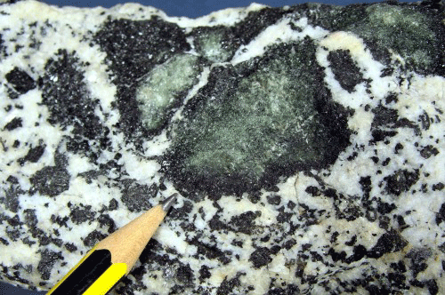

# Esercizi di riconoscimento rocce - 23 febbraio 2025

L'esercizio consiste nel riconoscere una roccia data la sua foto e senza altre informazioni. 

Nella cartella [photos](./photos/) si trovano le foto dei "campioni macroscopici" tratti dall'[Atlante di petrografia del Dipartimento di Scienze della Terra dell'Università di Torino](https://www.atlantepetro.unito.it/page-1d41d.html?).

Nell'Atlante i nomi dei file suggeriscono il tipo di roccia (ignea, sedimentaria, metamorfica); per non avere questo suggerimento i nomi dei file sono stati cambiati in nomi di fantasia come per esempio "Vaderite blu giurassica".

Per svolgere l'esercizio:

1) scegliere una immagine a caso dalla cartella, per esempio la "Vaderite blu giurassica" .

2) applicare i metodi di riconoscimento e giungere ad un nome. Nell'esempio si ha una roccia olocristallina a grana medio-grossa, dunque i cristalli hanno avuto tempo di crescere e questo è tipico delle rocce ignee intrusive o plutoniche.
L'indice di colore M (definito come il rapporto tra "quantità" di minerali scuri e il totale dei minerali) è pari circa al 50% (nello stimare M ho escluso il cristallo più grande indicato dalla punta della matita); i minerali chiari hanno aspetto bianco lattiginoso quindi mi suggeriscono una predominanza di plagioclasi rispetto ai K-feldspati, stimo quindi P/(A+P) > 65%; dalla foto non riesco a vedere con sicurezza quarzo quindi stimo Q < 20%. Dal diagramma QAP per la classificazione speditiva sul camponota 1 si tratta quindi di Dioritoide o Gabbroide.

3) trovare la corrispondenza tra il nome di fantasia ed il nome originale usando la [tabella allegata](corrispondenza_immagini.csv): si ottiene che `Vaderite_Blu_Giurassica.gif` corrisponde all'immagine oridinale `p911.gif`, la `p` nel nome del file suggerisce che si tratta di una roccia plutonica.

4) trovare la corrispondenza tra il nome originale e la descrizione usando il [file di testo allegato](descrizione_immagini.txt): cercando `p911` (o una sua parte come `p91`) nel file si trova `P91 - Frammenti enallogeni, con bordo di reazione, in tonalite.`, quindi non poi così lontano, nel diagramma QAP, dalla classificazione speditiva fatta sopra; probabilmente potendo vedere dal vero il campione a mano si sarebbe riconosciuta una presenza di quarzo superiore al 20% e quindi si sarebbe potuto collocare meglio il campione nel diagramma.

5) Per le informazioni complete trovare la tavola originale fra [tutte le tavole disponibili](https://www.atlantepetro.unito.it/page-27d6d8.html?xsl=tavoleAll) ed andare poi ai dettagli di questa [tonalite](
https://www.atlantepetro.unito.it/page-974d9b3.html?xsl=tavole&xml=macro.Magmatiche4&tavola=p91).

-----------------

nota 1

Il diagramma QAP per la classificazione speditiva sul campo è spiegato nella sezione 
_2.11.3 PROVISIONAL "FIELD" CLASSIFICATION_ e nella Figura 2.10 del libro:
Le Maitre, Streckeisen e altri, "Igneous Rocks: A Classification and Glossary of Terms", Cambridge, Cambridge University Press, 2002.

