Aggiornati al 22 luglio 2026.

# Orientazione di superfici

La superficie è modellata con un piano, o, in altre parole, è assimilata ad un piano.

**Direzione (_strike_)** di una superficie: è l'angolo, misurato in un piano orizzontale, formato dalla direzione del Nord e dalla linea ottenuta come intersezione del piano orizzontale con la superficie da orientare.  
La direzione 0° coincide con il Nord; la direzione positiva è quella del senso orario.  
La direzione va da 0° a 360° e quindi si ha che 0° equivale a Nord, 90° a Est, 180° a Sud e 270° a Ovest.

**Inclinazione (_dip_)** di una superficie: è l'angolo, misurato in un piano verticale, tra il piano orizzontale e la superficie da orientare.  
L'inclinazione va da 0° a 90°.  
L'inclinazione 0° rappresenta una superficie orizzontale.  
L'inclinazione 90° corrisponde ad una superficie verticale. 

**Immersione (_dip direction_)** di una superficie: è l'angolo, misurato in un piano orizzontale, formato dalla direzione del Nord e dalla proiezione sul piano orizzontale di una linea di massima pendenza che giace sulla superficie da orientare.  
Seguendo la regola della mano destra si ha che l'immersione si ottiene sommando 90° alla direzione (e se necessario facendo il modulo a 360).  
La linea di massima pendenza è la linea che seguirebbe il movimento dell'acqua liquida sotto l'azione della forza di gravità.  
La regola della mano destra dice di appoggiare il palmo della mano destra alla superficie da orientare e rendere il pollice parallelo alla direzione, in tal modo l'indice sarà parallelo alla immersione.

|Nome|in inglese|simbolo|
|-|-|-|
|Direzione|_Strike_|$s$|
|Immersione|_Dip direction_|$dd$|
|Inclinazione|_Dip_|$\delta$|

# Orientazione di linee

**Direzione (_trend_)** di una linea: è l'angolo, misurato in un piano orizzontale, formato dalla direzione del Nord e dal piano verticale che contiene la linea.  
La direzione 0° coincide con il Nord; la direzione positiva è quella del senso orario.  
La direzione va da 0° a 360° e quindi si ha che 0° equivale a Nord, 90° a Est, 180° a Sud e 270° a Ovest.

**Inclinazione (_plunge_)** di una linea: è l'angolo, misurato in un piano verticale, tra la linea e la sua proiezione sul piano orizzontale.
L'inclinazione va da 0° a 90°.  
L'inclinazione 0° rappresenta una linea che giace sul piano orizzontale.  
L'inclinazione 90° corrisponde ad una linea verticale.

# Orientazione di linee giacenti su una superficie

Nel caso di superfici poco inclinate (inclinazione < 30°÷35°) si usa il metodo _trend_/_plunge_ mentre per superfici molto inclinate (inclinazione > 30°÷35°) si usa il metodo _pitch_/_plunge_.

**_Pitch_** di una linea su una superficie: è l'angolo misurato sulla superficie tra la direzione della superficie e la linea.  
Va da 0° a 180° e si misura in senso orario.

# Proiezioni di linee e superfici sul reticolo stereografico

Nel rilevamento geologico e nella geologia strutturale si predilige la proiezione equi-areale perché preservando l'area si possono confrontare direttamente le densità delle proiezioni tra parti diverse del reticolo.  
La densità si misura in m-2 ed indica il numero di superfici e/o di linee per metro quadro (vedi [Fossen p.448]).

# Proiezioni di linee 
1) Sovrapporre il trasparente al reticolo, ricalcare sul trasparente il cerchio primitivo (con un compasso), poi marcare con un punto il Nord sul cerchio primitivo e infine marcare con un punto il centro del cerchio primitivo.
2) Sovrapporre il trasparente al reticolo ed allineare il Nord.
3) Se necessario convertire la linea nel formato direzione/inclinazione.
4) Marcare sul cerchio primitivo del trasparente un punto in corrispondenza della direzione della linea.
5) Ruotare il trasparente per allineare il punto ad Est (oppure ad Ovest).
6) Partendo dal punto sul cerchio primitivo, e muovendosi sul diametro E-O verso il centro del reticolo, contare tanti gradi quanti sono quelli dell'inclinazione e, lì arrivati, disegnare il punto che rappresenta la linea in oggetto.

# Proiezione di superfici
1) Sovrapporre il trasparente al reticolo, ricalcare sul trasparente il cerchio primitivo (con un compasso), poi marcare con un punto il Nord sul cerchio primitivo e infine marcare con un punto il centro del cerchio primitivo.
2) Sovrapporre il trasparente al reticolo ed allineare il Nord.
3) Se necessario convertire la superficie nel formato immersione/inclinazione.
4) Marcare sul cerchio primitivo del trasparente un punto in corrispondenza dell'immersione della superficie.
5) Ruotare il trasparente per allineare il punto ad Est (oppure ad Ovest, ho verificato e il risultato finale non cambia scegliendo Est piuttosto che Ovest).
6) Partendo dal punto sul cerchio primitivo, e muovendosi sul diametro E-O verso il centro del reticolo, contare tanti gradi quanti sono quelli dell'inclinazione e, lì arrivati, ricalcare l'intera ciclografica (da Sud a Nord sul reticolo) corrispondente che rappresenta la superficie in oggetto.
7) Per disegnare il polo: partendo dalla ciclografica suddetta, e muovendosi sul diametro E-O verso il centro del reticolo, contare 90° e, lì arrivati, disegnare il punto che rappresenta il polo della superficie in oggetto.

All vertical planes will project as straight lines passing through the centre of the stereogram.
https://geo.libretexts.org/Bookshelves/Geology/Geological_Structures_-_A_Practical_Introduction_(Waldron_and_Snyder)/01%3A_Topics/1.04%3A_Stereographic_Projection

# Proiezione di linee che giacciono su una superficie
0) È necessario conoscere il _pitch_ della linea.
1) Disegnare la proiezione della superficie seguendo il metodo precedentemente illustrato.
2) Ruotare il trasparente per allineare la ciclografica in modo che i suoi estremi coincidano con il Nord e con il Sud.
3) Partendo da Nord, e muovendosi lungo la ciclografica, contare tanti gradi quanti sono quelli del _pitch_ e, lì arrivati, disegnare il punto che rappresenta la linea in oggetto.

# Come leggere le informazioni sul reticolo stereografico

## Un punto sul reticolo corrisponde ad una linea

Come trovare la direzione della linea?  
Disegnare un segmento che ha come primo estremo il centro del reticolo e come secondo estremo il punto, prolungare poi il segmento da questo secondo estremo fino ad intersecare il cerchio primitivo, la suddetta intersezione indica la direzione.

Come trovare l'inclinazione della linea?  
Più il punto è vicino al cerchio primitivo e minore è l'inclinazione della linea.  
Indicata con $d$ la distanza radiale tra il cerchio primitivo ed il punto (misurata in mm sul trasparente), con $x$ l'inclinazione incognita ricercata espressa in gradi, con $R$ il raggio del cerchio primitivo (misurato sul trasparente con la stessa unità di misura usata per $d$), si ha che approssimativamente vale la proporzione $d:x=R:90$ e quindi $x=90\frac{d}{R}$

## Una ciclografica sul reticolo corrisponde ad una superficie

Come trovare l'immersione della superficie?  
Tracciare la perpendicolare alla ciclografica passante per il centro del cerchio primitivo, la sua intersezione con il cerchio primitivo dà l'immersione della superficie.

Come trovare la direzione della superficie?
La direzione è indicata dall'intersezione della ciclografica con il cerchio primitivo, considerare l'intersezione più vicina al Nord.

Come trovare l'inclinazione della superficie?  
Più la ciclografica è vicino al cerchio primitivo e minore è l'inclinazione della superficie.  
Indicata con $d$ la distanza radiale tra il cerchio primitivo e la ciclografica (misurata in mm sul trasparente), con $x$ l'inclinazione incognita ricercata espressa in gradi, con $R$ il raggio del cerchio primitivo (misurato sul trasparente con la stessa unità di misura usata per $d$), si ha che approssimativamente vale la proporzione $d:x=R:90$ e quindi $x=90\frac{d}{R}$

# Strutture planari
* Strati
* Confini/limiti planari tra unità diverse (confini/limiti litostratigrafici)
* Piani di faglia (la faglia è la frattura in due parti di un volume di roccia con conseguente moto relativo delle due parti, la superficie della frattura è assimilabile ad un piano detto _piano/specchio di faglia_)
* Piani assiali di pieghe (il piano assiale di una piega contiene tutte le linee di cerniera e divide la piega nei due fianchi, nel caso di un cilindro parabolico è il piano che contiene la bisettrice di tutte le parabole).

**N.B.**: la struttura si approssima con un piano infinito ma un modello più accurato è quello di un parallelepipedo (aka scatola a facce piane e parallele) finito.

# Data la giacitura di un piano trovare l'intersezione tra il piano e la superficie topografica

Oppure, detto in altri termini, trovare il limite affiorante (espressione usata a p.26/73 in pdf "Lez 5_Elementi di stratimetria", "Elementi di stratimetria").

Attenzione alla differenza che c'è tra il piano geometrico (che si estende all'infinito) ed il piano materiale rappresentato dallo strato che sarà un parallelepipedo più o meno esteso lateralmente ma comunque finito.

La superficie topografica è la funzione $z=f(x,y)$ dove $z$ è la quota, $x$ è la longitudine e $y$ è la latitudine (vedi [Bonciani]).

È data la coordinata di un punto $P$ in cui si è misurata la giacitura di un piano espressa come immersione/inclinazione ($dd$/$\delta$); si vuole ricavare l'intersezione di questo piano con la superficie topografica e riportare in carta tale intersezione.

1) Calcolare la direzione $s$ del piano: per la regola della mano destra la direzione si ottiene sottraendo 90° dall'immersione.  
$s=dd-90°$
2) Individuare l'isoipsa più vicina al punto $P$, detta isoipsa abbia quota $q$.
3) Individuare il punto $Q$ più vicino a $P$.
4) Disegnare in $Q$ il simbolo della giacitura (preferisco quello che ha la freccia che indica l'immersione).
5) Disegnare la direzione (_strike_) del piano passante per $Q$: disegnare un segmento rettilineo che passa per $Q$ e che è ruotato di $s$ gradi in senso orario rispetto al Nord.  
Scrivere vicino al segmento la quota $q$.  
Questo segmento rettilineo è una **direttrice**, in particolare è la direttrice alla quota $q$ che indico con il simbolo $D_q$.
6) Adesso si devono disegnare le altre direttrici, quelle a quote $<q$ e quelle a quote $>q$.
7) Sia $h$ l'equidistanza fra le curve di livello ed $d$ la distanza in pianta tra due direttrici adiacenti, $d$ è incognita; vale la formula $\tan\delta=h/d$ quindi $d=h/\tan\delta$. Le direttrici devono essere distanti l'una dall'altra di $d$ opportunamente messo alla scala della carta.
8) Per le direttrici a quote diverse considerare che potrebbe non aver senso disegnarle tutte; fare però attenzione a non dimenticarne qualcuna che potrebbe essere decisiva nel tracciare il limite!
9) Disegnare la direttrice a quota inferiore $D_{q-h}$: disegnare una linea parallela a $D_q$, distante $d$ da $D_q$ e che sta dalla parte indicata dalla freccia del simbolo di giacitura. Spiegazione: la freccia indica dove il piano immerge e quindi dove la quota diminuisce.
10) Disegnare la direttrice a quota superiore $D_{q+h}$: disegnare una linea parallela a $D_q$, distante $d$ da $D_q$ e che sta dalla parte opposta a quella indicata dalla freccia del simbolo di giacitura.
11) Disegnare le altre direttrici $D_{q\pm i\cdot h}$ con $i>1$.
12) Per ogni direttrice $D_{q\pm i\cdot h}$ individuare i punti di intersezione con le corrispondenti isoipse $q\pm i\cdot h$.  
Muoversi lungo la direttrice e verificare tutte le ioipse che con lei si intersecano.
13) Per aiutarsi si possono anche disegnare direttrici a quote intermedie rispetto alle isoipse presenti in carta; attenzione che però di dovranno poi disegnare le isoipse intermedie interpolando opportunamente tra quelle presenti in carta.
14) Unire fra di loro i suddetti punti di intersezione ottenendo una spezzata.
La spezzata è la soluzione al problema in oggetto, essa approssima l'intersezione tra il piano in oggetto e la superficie topografica.
15) Occorre una buona dose di interpretazione perché collegare i punti può non essere sufficiente, sopratutto se il limite affiorante è composto da più componenti non connesse.

Qui sotto ho disegnato una sezione geologica, se considero una giacitura misurata in 1 e la devo usare per tracciare il limite affiorante, allora non ha senso disegnare direttrici a quote inferiori a quella del punto 1 anche se lo strato immerge verso Nord: non ha senso perché a Nord del punto 1, come si può ben vedere dalla sezione, non c'è volume di roccia in cui entri lo strato!  
Allo stesso modo, da una giacitura presa al punto e da cui tracciare il limite affiorante, non ha senso disegnare direttrici a quote superiori a quella del punto 2 perché, come prima, verso Sud non ci sono volumi di roccia a quote più alte di quella del punto 2 in cui possano entrare gli strati!

Immaginare come il limite cambia aumentando oppure diminuendo l'inclinazione, immaginare l'animazione con aumento/diminuizione dell'inclinazione e conseguente spostamento del limite.
Le due condizioni estreme sono strati orizzontali in cui il limite coincide con le isoipse e strati verticali in cui il limite è una singola linea rettilinea. Indicativamente se le inclinazioni sono basse allora il limite dovrebbe non discostarsi troppo dalle isoipse mentre al crescere dell'inclinazione il limite tende a raddrizzarsi restando sempre più vicino al punto in cui è data la giacitura.

# Data la superficie limite determinarne la giacitura

Indicazioni tratte dalle pagine da 55/73 a 61/73 in pdf "Lez 5_Elementi di stratimetria", "Elementi di stratimetria").  
Nel seguito uso in maniera equivalente "isoipsa" e "curva di livello".

1) La superficie limite va indicata con la coppia di formazioni/unità litologiche di cui è confine.

2) La procedura da seguire:
   * individuare una isoipsa $q_1$ che intersechi in almeno due punti la superficie limite.  
   Se i punti di intersezione sono esattamanete due allora la retta che li congiunge è la direttrice alla quota della isoipsa $q_1$. L'angolo tra il Nord e questa direttrice corrisponde alla direzione $\delta$ dello strato.  
   Se i punti di intersezione sono più di due allora verificare se la spezzata che li unisce sia sufficientemente rettilinea, se lo è allora si tratta della direttrice $D_1$ alla quota $q_1$.
   * con la sola direttrice $q_1$, e senza altre informazioni aggiuntive, non è possibile determinare l'immersione che può essere $\delta\pm90^{\circ}$; occorre quindi una seconda isoipsa $q_2$ che intersechi in almeno due punti la superficie limite. Se si trova detta $q_2$ allora ripetere i passaggi visti prima per $q_1$ per ottenere la direttrice rettilinea oppure una spezzata sperabilmente abbastanza rettilinea; sia essa $D_2$.
   * $D_1$ deve essere decentemente parallela a $D_2$.
   * L'immersione è ortogonale a $D_1$ (e quindi in virtù del punto precedente è ortogonale anche a $D_2$) e ha il verso dalla isoipsa a quota maggiore alla isoipsa a quota minore.
   * Si possono poi trovare anche altre isoipse che intersecano la superficie limite, dovrebbero essere tutte fra loro equidistanti alla distanza pari a quella già trovata per $q_1$ e $q_2$. Se non sono equidistanti calcolare la distanza media.  
   Ovviamente le isoipse hanno tutte la stessa equidistanza.
   * Per determinare l'inclinazione sia $d$ la distanza (eventualmente media) fra le direttrici adiacenti espressa in metri ($d$ è nel mondo reale e si ottiene applicando la scala alla distanza fra le direttrici misurata in carta), sia $h$ l'equidistanza fra le curve di livello espressa in metri, l'inclinazione $\alpha$ si ottiene con la formula $\alpha=\arctan\frac{h}{d}$.

3) **NOTA BENE**: ricercare le isoipse intersecanti anche in porzioni non connesse della superficie limite!

4) In Simpson 1992, a pagina 59, trova una direttrice (indicata con 2-2) ottenuta da due punti di intersezione della superficie limite pelite/marna con l'isoipsa a quota 300; poi però le altre direttrici (alle quote 400 e 500) sono tracciate considerando **una sola intersezione** delle corrispondenti isoipse, la seconda intersezione molto probabilmente cade fuori dallo stralcio di carta riportata in figura 53A; sono tracciate (direi ovviamente se si assume che non ci siano pieghe) parallele alla direttrice a quota 300.

5) In Cremonini 1977 nelle figure 206 e 207 potrebbe essere sufficiente una sola direttrice, che dà la direzione della giacitura, e stimare poi l'immersione tramite l'andamento qualitativo del confine rispetto alle isoipse (con aspetto tipico reggipoggio, franapoggio), non saprei però come stimare l'inclinazione (forse da quanto curva il confine rispetto alle isoipse?).

6) Dovendo stimare l'immersione e l'inclinazione di un limite, come fare se nel limite in oggetto si individua una sola direttrice e con le isoipse presenti in carta non si trova una seconda direttrice (non si trovano cioè altre due intersezioni tra una isoipsa qualunque diversa da quella già usata e il limite)?  
   - Se si riesce, interpolare una isoipsa vicina a quella già usata!
   - Se l'entità delimitata dal limite è planare allora le altre direttrici si trovano tracciando linee parallele a quella trovata e che intersecano le isoipse almeno in un punto.  
   Qquesto metodo l'ho dedotto vedendo quanto fatto nel pdf "pieghe e faglie" da p.22/29 a p.29/29; è comunque anche illustrato a p.174 di Venturini che scrive (grassetto mio):  
     > si ricostruisce la direttrice 175 m e si disegnano la successiva e le precedenti direttrici parallelamente a essa, utilizzando **l'unico punto** di intersezione traccia-isoipsa.

7) E se le intersezioni limite-isoipsa forniscono un solo punto utile?  
   Attenzione che potrebbe essere che il limite in oggetto sia parte di un limite vicino di cui sono già note le direttrici. Il caso è trattato a p.175 di Venturini.

8) E se il limite non interseca mai le isoipse?  
   Attenzione che potrebbe essere parallelo alle isoipse, in tal caso si tratta di un limite di trato orizzontale.

7) **NOTA BENE**: se si assume che il limite fra unità litostratigrafiche sia planare allora le direttrici devono essere fra loro parallele! 

## Regola della V, _V's rule_
Una valle/impluvio ha le isoipse che formano una V con il vertice verso monte.
Si si collegano tutti i vertici delle V si ottiene la linea dell'impluvio.  
Individuare una valle/impluvio possibilmente con la linea di impluvio ortogonale al limite in esame (l'ortogonalità è indicata nelle dispense ["GEOLOGIA 2 E PRINCIPI DI RILEVAMENTO GEOLOGICO - SECONDA PARTE" a cura di Gian Andrea Pini e Lorenzo Bonini, Università degli studi di Trieste](https://moodle2.units.it/pluginfile.php/396407/mod_resource/content/1/Geologia%202%20e%20Principi%20di%20Rilevamento%20-%20Seconda%20parte%20-%20Lezione%201.pdf)), si hano quindi i seguenti casi descritti in Figura 2.17 di Lisle 2004.
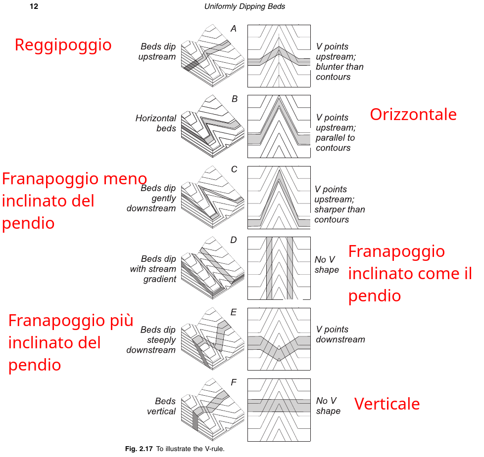

## Data una faglia in carta determinare la giacitura del piano di faglia

Caso di faglia normale o diretta: nel simbolo i trattini indicano la parte ribassata, quindi il piano di faglia immergerà sempre nel verso dei trattini del simbolo?

Caso di faglia inversa: nel simbolo i triangoli indicano la parte rialzata, quindi il piano di faglia immergerà sempre nel verso opposto a quello dei triangoli?

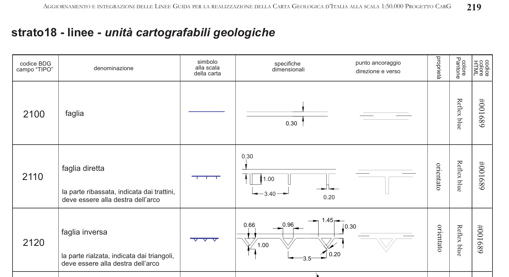

# Sezioni speditive
Da p14/73 a p17/73 di pdf "Lez 5_Elementi di stratimetria", "Elementi di stratimetria".

Con **limite** si intende la curva che rappresenta l'intersezione di un piano con la superficie topografica.

Un limite in carta può appartenere ad una di queste classi
1) verticale
2) orizzontale
3) reggipoggio
4) franapoggio meno inclinata del pendio
5) franapoggio più inclinata del pendio

Per sezione speditiva:

1) individuare in carta il limite di interesse, è limite tra due elementi geologici
2) classificare il limite usando lo schema della figura seguente  
, la classificazione si basa sulla forma del limite rispetto a quella delle isoipse a lui vicine.
3) determinare quale elemento geologico sta in alto topografico (aka alle quote più alte) e quale sta in basso topografico (aka alle quote più basse) oservando le quote delle isoipse che interessano i due elementi
4) disegnare la sezione geologica speditiva tipica di una delle cinque classi suddette. È speditiva perché le inclinazioni non sono calcolate e quindi in sezione sono solo indicative.
5) ripetere eventualmente per un altro limite.

# Metodo dei tre punti
Da p34/73 a p39/73 di pdf "Lez 5_Elementi di stratimetria", "Elementi di stratimetria".

Dati in carta tre punti quotati che stanno su una superficie piana, ricavare l'intersezione del suddetto piano con la superficie topografica.

1) Individuare l'equidistanza tra le curve di livello, sia $e$.
2) Per ogni punto, disegnare il punto semplificato sulla isoipsa più vicina.
3) Costruire il triangolo che unisce i tre punti.
4) Per ogni lato del triangolo fare queste operazioni
   * individuare l'estremo a quota massima, la quota sia $Q$
   * l'altro estremo del lato ha la quota minima $q$
   * calcolare il dislivello $\Delta=Q-q$
   * calcolare il numero $n$ di curve di livello che sono presenti tra i due estremi: $n=\Delta/e-1$. Nota bene: $\Delta/e$ sarà un numero intero perché ho usato i punti semplificati.
   * suddividere il lato in $n+1$ parti uguali disegnando sul lato gli $n$ punti equidistanti (questo è vero perché è dato che i tre punti stanno su un piano).
5) Trovare una coppia di punti su due lati diversi che siano alla stessa quota, la linea congiungente questi due punti è la direttrice a quella quota (questo è vero perché è dato che i tre punti stanno su un piano).
6) Verificare che altre coppie di punti diano direttrici compatibili con quella trovata al punto precedente.
7) A questo punto si può procedere come già visto in [Data la giacitura di un piano trovare l'intersezione tra il piano e la superficie topografica](#data-la-giacitura-di-un-piano-trovare-lintersezione-tra-il-piano-e-la-superficie-topografica)

# Limiti concordanti

**Concordanza (_conformity_)**, limiti concordanti: parallelismo di stratificazione fra due strati, non separati da superficie di erosione e senza interruzione di deposizione (Manzoni 1968 "Concordanza" e "Continuità"). Vedi anche Conti sulle sezioni geologiche!!!

La giacitura presa per una formazione della sequenza stratigrafica è rappresentativa di tutte le formazioni della sequenza stratigrafica.

In carta i limiti tra le formazioni tendono ad essere paralleli fra di loro senza avere intersezioni.

# Pieghe

## Anatomia di una piega

Quanto segue l'ho prodotto come elaborazione di Conti 2016, "Elementi di Geologia Strutturale - Applicazioni all’esplorazione petrolifera".

Consideriamo un singolo strato $s_i$ inizialmente rettilineo, di spessore infinitesimo, questo strato si incurva e prende la forma di una una parabola (si _raccorcia_); consideriamo poi anche altri strati sopra, $s_{i+1}$, e sotto, $s_{i-1}$, al precedente, anche loro si incurvano e diventano parabole "parallele" alla precedente.  

Ho messo queste parabole in un sistema di riferimento x-orizzontale, z-verticale.  

Nella parabola i due lembi si chiamano rami mentre nella piega si chiamano **fianchi**.  

Il punto di massima curvatura di ogni strato piegato si chiama **punto di cerniera**, nel caso delle parabole il punto di cerniera è il vertice.  

Aggiungere adesso al sistema di riferimento l'asse y per fare una terna secondo la regola della mano destra.  
Traslare ricopiandole le parabole dal piano $y=0$ a tutti i piani $y\gt0$; si ottiene così una struttura tridimensionale (direi che è un [cilindro parabolico](https://mathworld.wolfram.com/ParabolicCylinder.html)).

Se si collegando i punti di cerniera lungo y si ottiene una linea che è detta **linea di cerniera**.

La linea di cerniera può essere curva oppure rettilinea; se è rettilinea è detta **asse della piega**.

Una piega con linea di cerniera rettilinea è detta **piega cilindrica**.

Le linee di cerniera dei vari strati $s_{i-1}$, $s_i$, $s_{i+1}$ stanno su una superficie detta **superficie assiale** della piega.

Se tutte le linee di cerniera dei vari strati $s_{i-1}$, $s_i$, $s_{i+1}$ stanno su un piano allora la superficie assiale è un piano che è detto **piano assiale** della piega.

È quindi il piano assiale che divide la piega nei due fianchi.

La **struttura lineare** della piega è la **linea di cerniera**.

Le **strutture planari** della piega sono i **fianchi** e la **superficie assiale**.

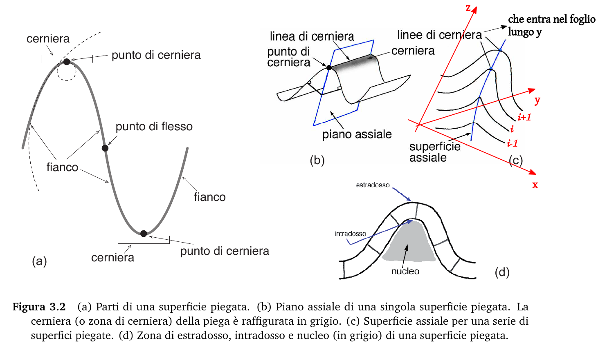

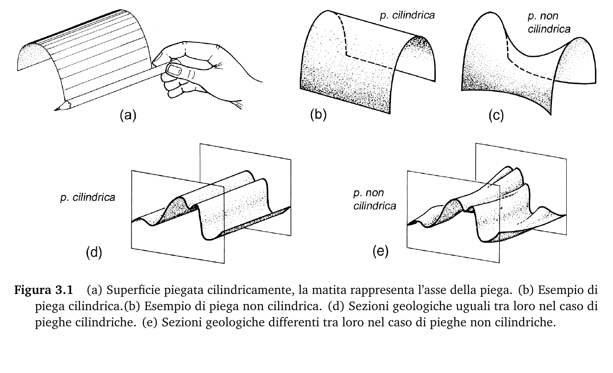

Le pieghe si classificano in vari modi, Fleuty 1964 usa due caratteristiche della piega:
1) l'inclinazione del piano assiale,
2) l'inclinazione dell'asse della piega.

 

## Come riconoscere piega
* Almeno due formazioni diverse (due campiture di diverso colore/diverso soprassegno).
* Limite che dà una curva chiusa, oppure se non si osserva in carta l'intera curva chiusa si dovrebbe quanto meno osservare una porzione di limite che è compatibile con una curva chiusa (vedi esercizio 12-12 in Weijermars 1997 oppure "ESERCIZIO 2: Pieghe, faglie, trasgressione" p.17/29 in pdf "Lez 5bis_stratimetria per pieghe e faglie").
* Il modello, descritto in Figura 6.11b in Conti, è quello di due ellissi concentriche come visibile nella figura qui sotto
  1) 1-2 è il fianco sinistro, 5-6 è il fianco destro, 1-5 è la parte a massima curvatura dove c'è il punto di cerniera; anche 2-6 è una parte a massima curvatura dove c'è il punto di cerniera
  2) la stessa cosa vale per 3-4 (fianco sinistro), 7-8 (fianco destro), 3-7 (cerniera superiore), 4-8 (cerniera inferiore).
  3) le direttrici da mettere in sezione sono quelle di 1-2, 3-4, 5-6, 7-8.  
     1-2, 3-4, 5-6, 7-8 sono limiti, per ognuno occorrono almeno due direttrici.

1) Il limite si richiude su se stesso (pdf 5p/29)
2) I punti massima curvatura del limite sono punti di cerniera (Conti p.60)
3) La linea che unisce tutti i punti di cerniera è la traccia del piano assiale della piega (Conti p.60)

Strategia: individuare punti di massima curvatura, sono le cerniere.
Le direttrici si fanno a destra e a sinistra, si possono unire limiti diversi,
vedi esercizio 12-12 in Weijermars

## Attenzione a prendere le direttrici giuste!

Tratta dal pdf "Lez 5bis_stratimetria per pieghe e faglie" p5/29.  
La figura seguente riporta i limiti senza direttrici.
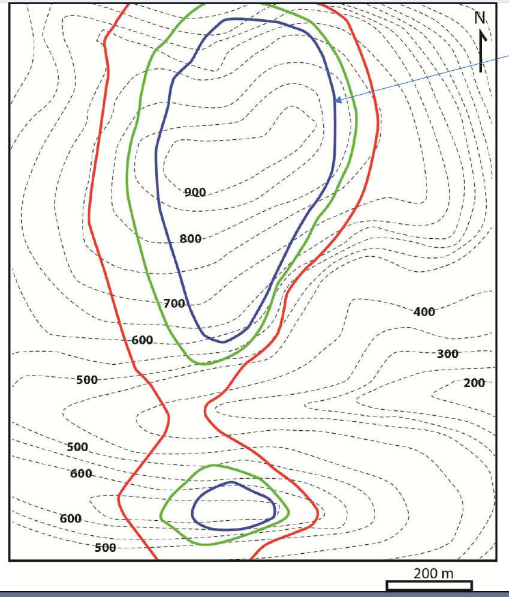

Nella figura seguente, i segmenti marcati C sono fra di loro paralleli; anche i segmenti marcati D sono fra di loro paralleli; quindi questi segmenti rispettano il requisito di parallelismo delle direttrici.
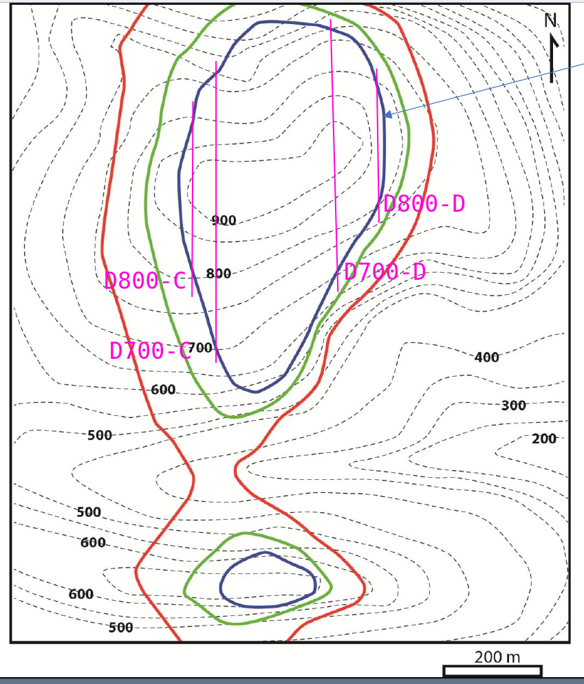

Invece nella figura seguente i segmenti marcati B non sono fra di loro paralleli; nemmeno quelli marcati A non sono fra di loro paralleli.
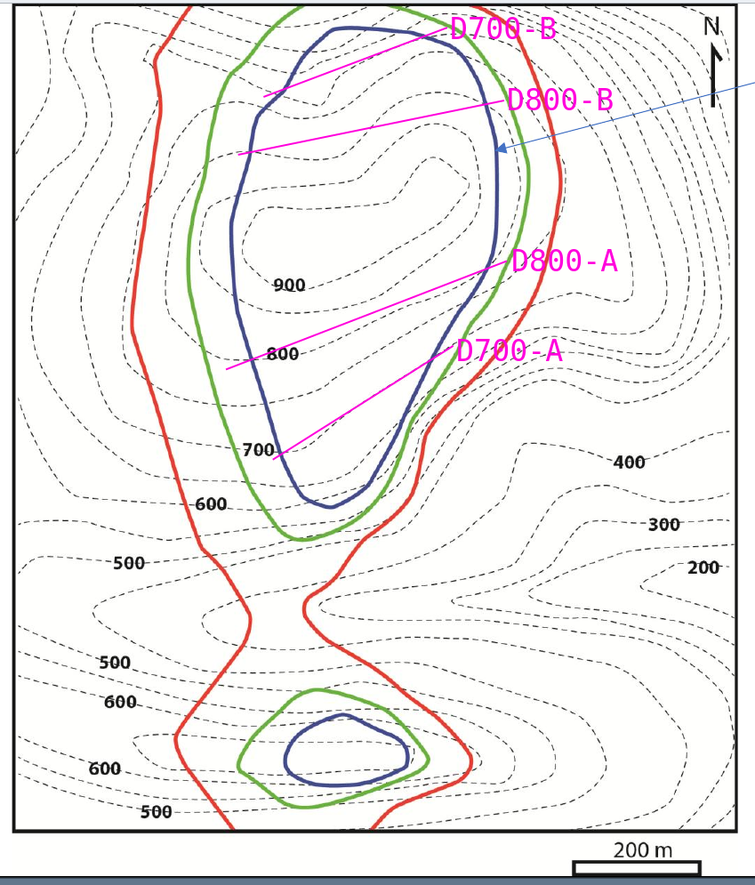

Se vale l'assunzione che i due fianchi della piega sono planari allora le direttrici devono essere parallele.

Il problema evidentemente è noto agli autori più attenti alla pedagogia: 
> “A common elementary confusion is that when the intersections of topography and a bedding plane are determined, upon first sight there may appear to be ambiguity in the way they are connected. The correct of possibilities will be parallel to the respective flanks of the fold. The alternative set of misconstructed stratum contours will cut across the symmetry of the fold and be inconsistent with topography.” ([Borradaile, 2014, p. 139](zotero://select/library/items/468RG8MI)) ([pdf](zotero://open-pdf/library/items/RSXD3BYZ?page=145))

# Faglie

## Rigetto

Metodo dedotto da quanto illustrato nell'esercizio del pdf "Pieghe e faglie" da p.22/29 a p.29/29

1) Individuare le direttrici del piano di faglia (il piano si assume ovviamente planare): trovare almeno una direttrice costruita trovando due intersezioni tra la faglia ed una isoipsa; le altre isoipse devono avere almeno una intersezione con la faglia, le altre direttrici passano per queste intersezioni e sono parallele alla prima direttrice trovata.

2) Individuare le direttrici di un limite al letto della faglia: nell'esercizio suddetto è un limite dell'unità grigia a contatto occidentale con la faglia, il limite è tra unità grigia e unità bianca

3) Individuare le direttrici di un limite al tetto della faglia: nell'esercizio suddetto è un limite dell'unità grigia a contatto occidentale con la faglia, il limite è tra unità grigia e unità bianca ed è il limite corrispondente a quello del letto.

4) Per il rigetto lungo strike:
   - individuare una direttrice alla stessa quota sia a letto che a tetto
   - intersecare la direttrice di letto con la direttrice alla stessa quota della faglia ottenendo così il punto $S_L$;
   - intersecare la direttrice di tetto con la direttrice alla stessa quota della faglia ottenendo così il punto $S_T$;
   - il rigetto lungo strike è la distanza misurata sulla carta tra $S_L$ ed $S_T$, va poi riportata in metri usando la scala.

5) Per il rigetto lungo dip:
   - intersecare le direttrici di letto con le direttrici di faglia alle quote corrispondenti: si ottiene una sequenza di punti che teoricamente sono allineati lungo un segmento rettilineo $L$
   - intersecare le direttrici di tetto con le direttrici di faglia alle quote corrispondenti: si ottiene una sequenza di punti che teoricamente sono allineati lungo un segmento rettilineo $T$   
   - $L$ e $T$ teoricamente sono parallele e la loro distanza misurata in carta, e riportata in metri con la scala è il rigetto lungo dip.

# Sezioni

## Linee guida generali

1) disegnare il **profilo morfologico/topografico**

2) riportare sul profilo i **colori** delle unità litostratigrafiche [vedi riferimento alla fonte](#colori)

3) riportare i limiti che aiutano a definire i **settori** di proiezione dei dati-strato (vedi [proiezione di dati-strato](#proiezioni-di-giaciture-venturini-li-chiama-dati-strato-oppure-assetti)) e capire se le proiezioni dei dati-strato cadono o meno nei **settori equivalenti** (che se ho capito hanno la proprietà di raggruppare giaciture con assetti simili).
Limiti tipici da riportare sono **faglie** (**piani tettonici** p.175 Venturini), **limiti discordanti** (p.175 Venturini)

4) proiezione degli altri limiti

5) proiezioni delle giaciture

6) correlazione delle giaciture (bisettrici, archi di cerchio invece per rovescei correlazione "a mano" p.180 Venturini)

7) motivo deformativo aka non collegare giaciture da stessa linea di correlazione Venturini p.181

## Accessori

* Unità di misura asse verticale, in metri.
* Scala verticale uguale all'orizzontale, riportata graficamente.
* Estremi A-B della sezione
* Orientazione degli estremi della sezione
* Legenda
* Eventuali punti notevoli (cima, fiume, toponimi)

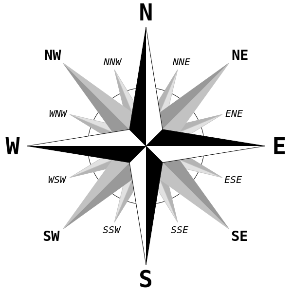

## Colori
I colori che si vedono in carta muovendosi lungo la traccia di sezione devono essere riportati in sezione poco sotto al profilo morfologico, vedi pdf lezioni Vignaroli (figura qui sotto) e fig.8.4 in Conti "Carte e Sezioni Geologiche".

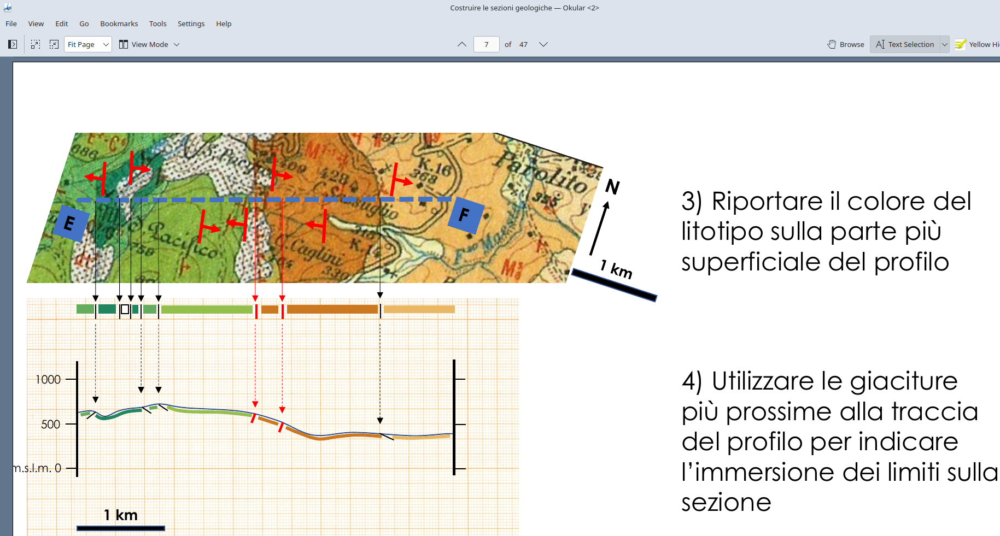

## Inclinazione apparente di un piano

Data la giacitura di un piano che ha inclinazione $\alpha$ e la cui direzione forma un angolo $\gamma$ con la traccia di sezione (angolo che è il minore dei due), l'inclinazione apparente $\omega$ del piano riportato nella sezione è dato dalla formula

$\omega=\arctan(\tan(\alpha)\sin(\gamma))$

Per ricordarsi la formula:

1) ricordarsi che c'è un seno
2) ricordarsi che c'è una tangente
3) quale è l'argomento della tangente?
4) ricordarsi che una giacitura verticale, i.e. $\alpha=90°$, ha inclinazione apparente che resta 90° e quindi la tangente sarà quella di $\alpha$ perché la tangente di 90° è infinito e l'arcotangente di infinito è appunto 90°.
5) resta che il seno deve essere quello di $\gamma$.

Si può usare anche un nomogramma (Palmer 1919).

## Proiezione di limiti (Venturini li chiama _dati lineari_)

Quella che segue è la procedura per il limite di struttura planare (e.g. superficie stratigrafica, limite tra unità litostratigrafiche) che cioè non è piegata; Venturini a p.147 dice
> il metodo delle direttrici non è applicabile a quelle superfici stratigrafiche che, per loro stessa natura, assumono andamenti molto irregolari.

La procedura qui sotto è illustrata da Venturini nelle figure 3.24 e 3.25 (p.148).

Se si sa che la superficie stratigrafica di cui si ha il limite è planare allora anche se le sue direttrici non sono perfettamente parallele è comunque lecito interpolare i punti in sezione con una segmento rettilineo (Venturini fig 3.26).

1) Sulla carta, individuare l'isoipsa alla quota $q$ che interseca il limite in almeno due punti.  
Se invece apparentemente tutte le isoipse hanno solamente un punto di contatto con il limite (Venturini p.159) allor si deve osservare meglio perché il limite potrebbe coincidere con parte di una isoipsa!  
Se questo è il caso, scegliere allora due punti qualunque sulla porzione di limite che coincide con una isoipsa, la cui quota sia $q$: quei due punti individuano la direttrice $D_q$ alla quota di quella isoipsa. 

2) Si ha quindi la direttrice $D_q$ alla quota $q$ (per i dettagli vedi "(vedi il paragrafo [Data la superficie limite determinarne la giacitura"](#data-la-superficie-limite-determinarne-la-giacitura)).

3) Sulla carta, trovare l'intersezione tra $D_q$ e la traccia di sezione, sia $P$ tale punto di intersezione.

4) Sulla carta, proiettare $P$ ortogonalmente alla traccia di sezione e verso il profilo topografico (che Venturini chiama profilo morfologico) nel punto $Q$ alla quota $q$.  
$Q$ è un punto che appartiene alla rappresentazione in sezione del limite in oggetto.  
$Q$ non è più in carta ma è in sezione.

5) Sulla sezione, $Q$ può essere sopra o sotto il profilo topografico.

6) Ripetere per una nuova isoipsa alla quota $q_1$ che intersechi il limite in almeno due punti, unendo i due punti si avrà la direttrice $D_{q_1}$ e di conseguenza si troverà in sezione il punto $Q_1$. Congiungere $Q$ a $Q_1$, trattandosi di struttura planare potrebbero bastare questi due punti, meglio però verificare con altre isoipse.  
Se invece si è nel caso in cui le isoipse hanno un solo punto di contatto con il limite (Venturini p.159) allora individuare l'unica intersezione della isoipsa a quota $q_1$ con il limite e tracciare una retta parallela alla $D_q$ precedentemente trovata e passante per detta intersezione; questa retta è la direttrice $D_{q_1}$ e si può quindi continuare come già visto. Anche in questo caso meglio ripetere con altre isoipse.

### Note

Le faglie $\alpha$ e $\alpha'$ di fig. 3.54, "sezione geologica 8" p.177 Venturini, sono in parte parallele alle isoipse e in parte no, in sezione le disegna quindi piegate: c'è una parte orizzontale ed una parte inclinata.

## Proiezioni di giaciture (Venturini li chiama _dati-strato_ oppure _assetti_)

Qui si tratta la giacitura come la misura dell'assetto di una porzione di roccia affiorante che non è detto che sia una struttura planare; queste giaciture sono invece misure fatte su strutture non planari come per esempio i fianchi delle pieghe. Se la giacitura rappresentasse invece una struttura planare allora si applica la procedurà già vista nella sezione ["Proiezione di limiti"](#proiezione-di-limiti).

La giacitura ha inclinazione $\alpha$. 

1) Sulla carta, prolungare la direzione della giacitura fino ad intersecare la traccia di sezione nel punto $P$.

2) Sulla carta, Misurare l'angolo $\gamma$ tra la traccia di sezione e il suddetto prolungamento della direzione.  
$\gamma$ ha vertice in $P$ ed è il più piccolo dei due angoli: i due sommati danno 180°.

3) Calcolare l'inclinazione apparente $\omega$ tramite la formula  
$\tan \omega=\tan(\alpha)\sin(\gamma)$  
$\omega=\arctan(\tan(\alpha)\sin(\gamma))$

4) Sulla carta, proiettare $P$ ortogonalmente alla traccia di sezione e verso il profilo topografico (che Venturini chiama profilo morfologico) nel punto $Q$ alla quota della giacitura. $Q$ non è più in carta ma è in sezione.

5) Sulla sezione, $Q$ può essere sopra o sotto il profilo topografico.

6) Sulla sezione, da $Q$ spiccare un segmento lungo 2-3 mm (massimo 5, v. Venturini p.149) che ha angolo $\omega$ rispetto all'orizzontale;  
il segmento deve puntare verso l'immersione della giacitura.  
$R$ è il secondo estremo del segmento e deve stare a quota inferiore a $Q$.  
$Q$ è detto _punto di aggancio_ della giacitura.  

### Note

1) in caso di pieghe le giaciture vanno proiettate parallele al piano assiale della piega, non allo strike della giacitura (Conti; Venturini p.174; Venturini p.176 per giaciture orizzontali)

1) usare anche le giaciture ragionevolmente vicine alla traccia di sezione anche se la loro proiezione cade fuori dalla traccia di sezione (fig. 3.53, p.176 Venturini)

1) giaciture in unità separate da limite discordante, quindi giaciture sopra e sotto al limite discordante, vanno correlate separatamente (p.180 Venturini)

# Difficoltà in campagna nell'individuare le superfici di stratificazione

Le superfici di stratificazione possono essere suggerite da variazioni di granulometria (Vignaroli com. pers. Ovindoli).

# Orientare uno sketch panoramico con la bussola Brunton
0) Il lato lungo della bussola è quello costituito dalla bussola e dal coperchio.
1) Aprire la bussola, il coperchio va vicino al corpo.
2) Leggere il valore sulla scala graduata in corrispondenza della freccia N, questa è la direzione in cui si sta guardando, è il centro dello sketch. 
3) Si può aggiungere mentalmente 90° per marcare il lato destro dello sketch e sottrarre 90° per marcare il lato sinistro dello sketch; oppure si può
4) Ruotare la bussola nel verso che incrementa i valori puntati dalla freccia N fino ad avere il lato lungo della bussola parallelo al panorama; la freccia N indica il valore da scrivere nella parte destra dello sketch, la freccia S indica il valore da scrivere nella parte sinistra dello sketch.

# Domande

* Limite vs confine vs contatto (in Damiani contatto è sinonimo di limite come indicato nell'indice analitico).

* Caso di faglia normale o diretta: nel simbolo i trattini indicano la parte ribassata, quindi il piano di faglia immergerà sempre nel verso dei trattini del simbolo?

* Caso di faglia inversa: nel simbolo i triangoli indicano la parte rialzata, quindi il piano di faglia immergerà sempre nel verso opposto a quello dei triangoli?

* Venturini in figura 3.48, per il sovrascorrimento $\alpha'$ disegna le direttrici a quota 700, 675, 650 (vedi in verde nello screenshot qui sotto) e le disegna verticali.
  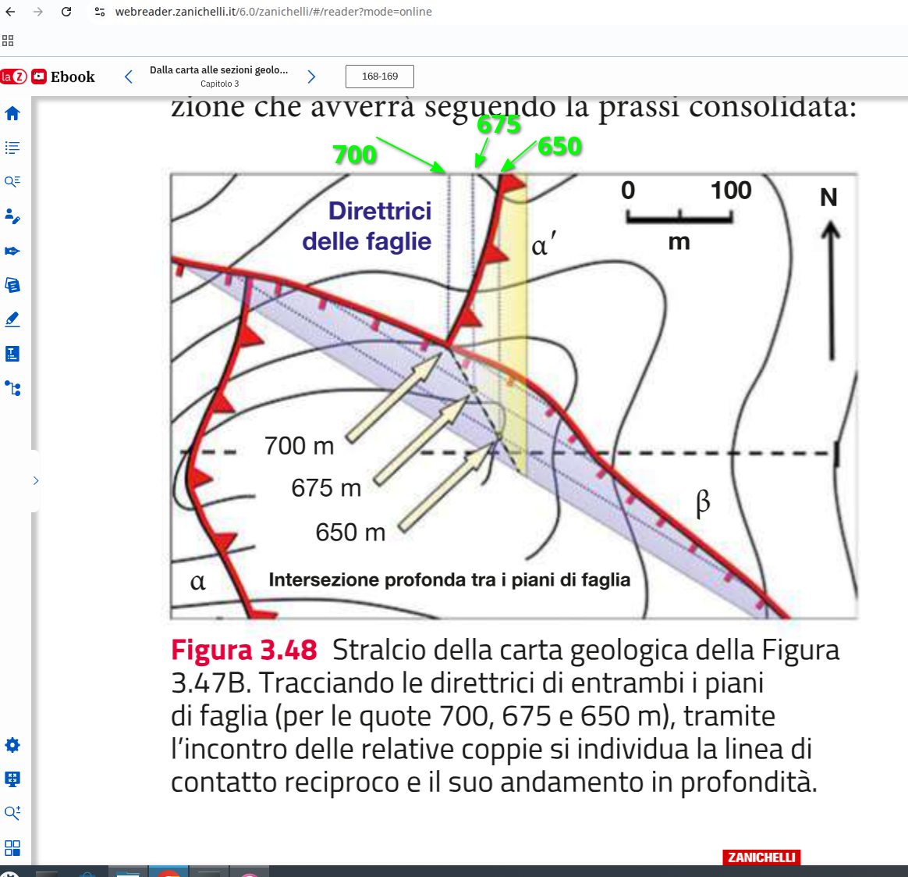
  Come però si può vedere sia nella figura qui sopra che nella figura 3.47 seguente, le isoipse intersecano in solo punto la faglia e quindi non so proprio come possa disegnare le direttrici verticali perché per disegnarle verticali servirebbe, per ogni direttrice, un secondo piunto di intersezione con le isoipse!
  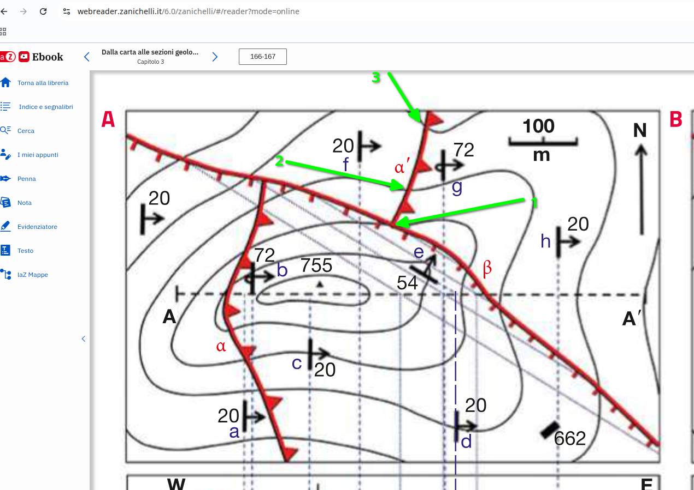

* Dove trovare le soluzioni di Lisle?

* Dove trovare le soluzioni di Simpson?

* Dove trovare le soluzioni di Bennison?

* Nei fogli degli esercizi svolti ci sono domande.

# Isoipse aka curve di livello

Data topografia $z=f(x,y)$ densa allora si usa l'algoritmo "Marching squares" per ottenere le curve di livello (vedi Wenger 2013).

Data topografia sparsa, i.e. solo qualche punto quotato, occorre una triangolazione (vedi pdf Conti su profili topografici).

# Glossario

**Direttrice** (_stratum contour_) è una curva di livello di un piano inclinato.
In inglese da Bose e p19/73 di pdf "Lez 5_Elementi di stratimetria", "Elementi di stratimetria".

## pdf "Lez 0_Rilevamento geologico - programma generale", "Introduzione al corso"

**Affioramenti rocciosi**

**Limiti stratigrafici**

**Piani di strato**

**Strutture tettoniche**

**Successione stratigrafica**

**Superfici tettoniche**

## pdf "Lez 1_Introduzione al Rilevamento", "Il Rilevamento Geologico e l’approccio al terreno"

**Scala del panorama**

**Scala dell'affioramento**

**Scala del campione mesoscopico di roccia**

**Percorsi circolari**

**Percorsi lineari (traverse)**

**Percorsi seguendo i contatti**

## pdf "Lez 2_Limiti e strutture geologiche", "Tipologia delle strutture geologiche"

**Strutture planari**

**Elementi lineari**

**Strutture primarie** formazione

**Strutture tettoniche** deformazione

Tabella dedotta dalla prefazione in Fossen.
|Tipo di deformazione|Esempi
|-|-|
|Fragile _Brittle_|Faglia _Fault_|
|Duttile _Ductile_|Piega _Folding_|

# Bibliografia

[Bonciani] BONCIANI & CONTI, Costruzione di profili topografici, 2022.

[Bose] Narayan BOSE & S. Mukherjee – Map interpretation for structural
geologists. Elsevier.

[Cremonini] Cremonini, Rilevamento Geologico, Bologna 1977, Pitagora Editrice Bologna.

[Lisle] RICHARD J. LISLE, Geological Structures and Maps, A PRACTICAL GUIDE, Third edition, Burlington, MA 2004, Elsevier.

[Fossen] Haakon FOSSEN, Geologia strutturale, Bologna 2020, Zanichelli.

[Simpson] Brian Simpson, Lettura delle carte geologiche, Palermo, 1992, Dario Flaccovio Editore.

[Wenger] Isosurfaces: geometry topology and algorithms. . 2013. 

[Venturini] Corrado Venturini, Rilevamento geologico, Bologna, 2023, Zanichelli.