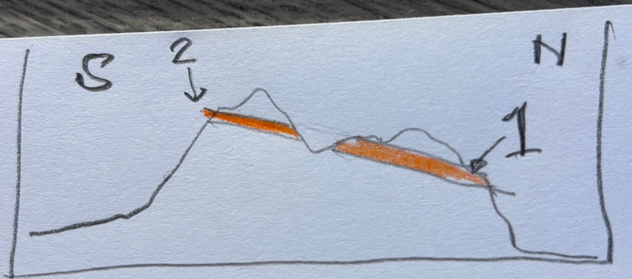
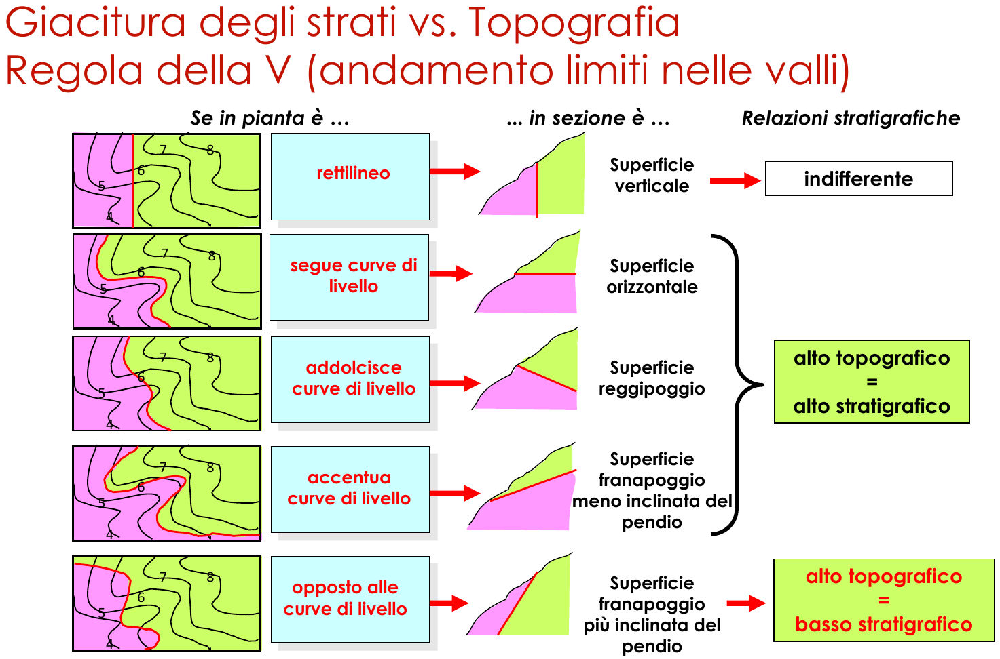

Aggiornati al 20 giugno 2026.

# Orientazione di superfici

La superficie è modellata con un piano, o, in altre parole, è assimilata ad un piano.

**Direzione (_strike_)** di una superficie: è l'angolo, misurato in un piano orizzontale, formato dalla direzione del Nord e dalla linea ottenuta come intersezione del piano orizzontale con la superficie da orientare.  
La direzione 0° coincide con il Nord; la direzione positiva è quella del senso orario.  
La direzione va da 0° a 360° e quindi si ha che 0° equivale a Nord, 90° a Est, 180° a Sud e 270° a Ovest.

**Inclinazione (_dip_)** di una superficie: è l'angolo, misurato in un piano verticale, tra il piano orizzontale e la superficie da orientare.  
L'inclinazione va da 0° a 90°.  
L'inclinazione 0° rappresenta una superficie orizzontale.  
L'inclinazione 90° corrisponde ad una superficie verticale. 

**Immersione (_dip direction_)** di una superficie: è l'angolo, misurato in un piano orizzontale, formato dalla direzione del Nord e dalla proiezione sul piano orizzontale di una linea di massima pendenza che giace sulla superficie da orientare.  
Seguendo la regola della mano destra si ha che l'immersione si ottiene sommando 90° alla direzione (e se necessario facendo il modulo a 360).  
La linea di massima pendenza è la linea che seguirebbe il movimento dell'acqua liquida sotto l'azione della forza di gravità.  
La regola della mano destra dice di appoggiare il palmo della mano destra alla superficie da orientare e rendere il pollice parallelo alla direzione, in tal modo l'indice sarà parallelo alla immersione.

|Nome|in inglese|simbolo|
|-|-|-|
|Direzione|_Strike_|$s$|
|Immersione|_Dip direction_|$dd$|
|Inclinazione|_Dip_|$\delta$|

# Orientazione di linee

**Direzione (_trend_)** di una linea: è l'angolo, misurato in un piano orizzontale, formato dalla direzione del Nord e dal piano verticale che contiene la linea.  
La direzione 0° coincide con il Nord; la direzione positiva è quella del senso orario.  
La direzione va da 0° a 360° e quindi si ha che 0° equivale a Nord, 90° a Est, 180° a Sud e 270° a Ovest.

**Inclinazione (_plunge_)** di una linea: è l'angolo, misurato in un piano verticale, tra la linea e la sua proiezione sul piano orizzontale.
L'inclinazione va da 0° a 90°.  
L'inclinazione 0° rappresenta una linea che giace sul piano orizzontale.  
L'inclinazione 90° corrisponde ad una linea verticale.

# Orientazione di linee giacenti su una superficie

Nel caso di superfici poco inclinate (inclinazione < 30°÷35°) si usa il metodo _trend_/_plunge_ mentre per superfici molto inclinate (inclinazione > 30°÷35°) si usa il metodo _pitch_/_plunge_.

**_Pitch_** di una linea su una superficie: è l'angolo misurato sulla superficie tra la direzione della superficie e la linea.  
Va da 0° a 180° e si misura in senso orario.

# Proiezioni di linee e superfici sul reticolo stereografico

Nel rilevamento geologico e nella geologia strutturale si predilige la proiezione equi-areale perché preservando l'area si possono confrontare direttamente le densità delle proiezioni tra parti diverse del reticolo.  
La densità si misura in m-2 ed indica il numero di superfici e/o di linee per metro quadro (vedi [Fossen p.448]).

# Proiezioni di linee 
1) Sovrapporre il trasparente al reticolo, ricalcare sul trasparente il cerchio primitivo (con un compasso), poi marcare con un punto il Nord sul cerchio primitivo e infine marcare con un punto il centro del cerchio primitivo.
2) Sovrapporre il trasparente al reticolo ed allineare il Nord.
3) Se necessario convertire la linea nel formato direzione/inclinazione.
4) Marcare sul cerchio primitivo del trasparente un punto in corrispondenza della direzione della linea.
5) Ruotare il trasparente per allineare il punto ad Est (oppure ad Ovest).
6) Partendo dal punto sul cerchio primitivo, e muovendosi sul diametro E-O verso il centro del reticolo, contare tanti gradi quanti sono quelli dell'inclinazione e, lì arrivati, disegnare il punto che rappresenta la linea in oggetto.

# Proiezione di superfici
1) Sovrapporre il trasparente al reticolo, ricalcare sul trasparente il cerchio primitivo (con un compasso), poi marcare con un punto il Nord sul cerchio primitivo e infine marcare con un punto il centro del cerchio primitivo.
2) Sovrapporre il trasparente al reticolo ed allineare il Nord.
3) Se necessario convertire la superficie nel formato immersione/inclinazione.
4) Marcare sul cerchio primitivo del trasparente un punto in corrispondenza dell'immersione della superficie.
5) Ruotare il trasparente per allineare il punto ad Est (oppure ad Ovest).
6) Partendo dal punto sul cerchio primitivo, e muovendosi sul diametro E-O verso il centro del reticolo, contare tanti gradi quanti sono quelli dell'inclinazione e, lì arrivati, ricalcare l'intera ciclografica (da Sud a Nord sul reticolo) corrispondente che rappresenta la superficie in oggetto.
7) Per disegnare il polo: partendo dalla ciclografica suddetta, e muovendosi sul diametro E-O verso il centro del reticolo, contare 90° e, lì arrivati, disegnare il punto che rappresenta il polo della superficie in oggetto.

# Proiezione di linee che giacciono su una superficie
0) È necessario conoscere il _pitch_ della linea.
1) Disegnare la proiezione della superficie seguendo il metodo precedentemente illustrato.
2) Ruotare il trasparente per allineare la ciclografica in modo che i suoi estremi coincidano con il Nord e con il Sud.
3) Partendo da Nord, e muovendosi lungo la ciclografica, contare tanti gradi quanti sono quelli del _pitch_ e, lì arrivati, disegnare il punto che rappresenta la linea in oggetto.

# Come leggere le informazioni sul reticolo stereografico

## Un punto sul reticolo corrisponde ad una linea

Come trovare la direzione della linea?  
Disegnare un segmento che ha come primo estremo il centro del reticolo e come secondo estremo il punto, prolungare poi il segmento da questo secondo estremo fino ad intersecare il cerchio primitivo, la suddetta intersezione indica la direzione.

Come trovare l'inclinazione della linea?  
Più il punto è vicino al cerchio primitivo e minore è l'inclinazione della linea.  
Indicata con $d$ la distanza radiale tra il cerchio primitivo ed il punto (misurata in mm sul trasparente), con $x$ l'inclinazione incognita ricercata espressa in gradi, con $R$ il raggio del cerchio primitivo (misurato sul trasparente con la stessa unità di misura usata per $d$), si ha che approssimativamente vale la proporzione $d:x=R:90$ e quindi $x=90\frac{d}{R}$

## Una ciclografica sul reticolo corrisponde ad una superficie

Come trovare l'immersione della superficie?  
Tracciare la perpendicolare alla ciclografica passante per il centro del cerchio primitivo, la sua intersezione con il cerchio primitivo dà l'immersione della superficie.

Come trovare la direzione della superficie?
La direzione è indicata dall'intersezione della ciclografica con il cerchio primitivo, considerare l'intersezione più vicina al Nord.

Come trovare l'inclinazione della superficie?  
Più la ciclografica è vicino al cerchio primitivo e minore è l'inclinazione della superficie.  
Indicata con $d$ la distanza radiale tra il cerchio primitivo e la ciclografica (misurata in mm sul trasparente), con $x$ l'inclinazione incognita ricercata espressa in gradi, con $R$ il raggio del cerchio primitivo (misurato sul trasparente con la stessa unità di misura usata per $d$), si ha che approssimativamente vale la proporzione $d:x=R:90$ e quindi $x=90\frac{d}{R}$

# Strutture planari
* Strati
* Confini/limiti planari tra unità diverse (confini/limiti litostratigrafici)
* Piani di faglia (la faglia è la frattura in due parti di un volume di roccia con conseguente moto relativo delle due parti, la superficie della frattura è assimilabile ad un piano detto _piano/specchio di faglia_)
* Superfici assiali di pieghe (definirle)

**N.B.**: la struttura si approssima con un piano infinito ma un modello più accurato è quello di un parallelepipedo finito.

# Data la giacitura di un piano trovare l'intersezione tra il piano e la superficie topografica

Oppure, detto in altri termini, trovare il limite affiorante (espressione usata a p.26/73 in pdf "Lez 5_Elementi di stratimetria", "Elementi di stratimetria").

Attenzione alla differenza che c'è tra il piano geometrico (che si estende all'infinito) ed il piano materiale rappresentato dallo strato che sarà un parallelepipedo più o meno esteso lateralmente ma comunque finito.

La superficie topografica è la funzione $z=f(x,y)$ dove $z$ è la quota, $x$ è la longitudine e $y$ è la latitudine (vedi [Bonciani]).

È data la coordinata di un punto $P$ in cui si è misurata la giacitura di un piano espressa come immersione/inclinazione ($dd$/$\delta$); si vuole ricavare l'intersezione di questo piano con la superficie topografica e riportare in carta tale intersezione.

1) Calcolare la direzione $s$ del piano: per la regola della mano destra la direzione si ottiene sottraendo 90° dall'immersione.  
$s=dd-90°$
2) Individuare l'isoipsa più vicina al punto $P$, detta isoipsa abbia quota $q$.
3) Individuare il punto $Q$ più vicino a $P$.
4) Disegnare in $Q$ il simbolo della giacitura (preferisco quello che ha la freccia che indica l'immersione).
5) Disegnare la direzione (_strike_) del piano passante per $Q$: disegnare un segmento rettilineo che passa per $Q$ e che è ruotato di $s$ gradi in senso orario rispetto al Nord.  
Scrivere vicino al segmento la quota $q$.  
Questo segmento rettilineo è una **direttrice**, in particolare è la direttrice alla quota $q$ che indico con il simbolo $D_q$.
6) Adesso si devono disegnare le altre direttrici, quelle a quote $<q$ e quelle a quote $>q$.
7) Sia $h$ l'equidistanza fra le curve di livello ed $d$ la distanza in pianta tra due direttrici adiacenti, $d$ è incognita; vale la formula $\tan\delta=h/d$ quindi $d=h/\tan\delta$. Le direttrici devono essere distanti l'una dall'altra di $d$ opportunamente messo alla scala della carta.
8) Per le direttrici a quote diverse considerare che potrebbe non aver senso disegnarle tutte; fare però attenzione a non dimenticarne qualcuna che potrebbe essere decisiva nel tracciare il limite!
9) Disegnare la direttrice a quota inferiore $D_{q-h}$: disegnare una linea parallela a $D_q$, distante $d$ da $D_q$ e che sta dalla parte indicata dalla freccia del simbolo di giacitura. Spiegazione: la freccia indica dove il piano immerge e quindi dove la quota diminuisce.
10) Disegnare la direttrice a quota superiore $D_{q+h}$: disegnare una linea parallela a $D_q$, distante $d$ da $D_q$ e che sta dalla parte opposta a quella indicata dalla freccia del simbolo di giacitura.
11) Disegnare le altre direttrici $D_{q\pm i\cdot h}$ con $i>1$.
12) Per ogni direttrice $D_{q\pm i\cdot h}$ individuare i punti di intersezione con le corrispondenti isoipse $q\pm i\cdot h$.  
Muoversi lungo la direttrice e verificare tutte le ioipse che con lei si intersecano.
13) Per aiutarsi si possono anche disegnare direttrici a quote intermedie rispetto alle isoipse presenti in carta; attenzione che però di dovranno poi disegnare le isoipse intermedie interpolando opportunamente tra quelle presenti in carta.
14) Unire fra di loro i suddetti punti di intersezione ottenendo una spezzata.
La spezzata è la soluzione al problema in oggetto, essa approssima l'intersezione tra il piano in oggetto e la superficie topografica.
15) Occorre una buona dose di interpretazione perché collegare i punti può non essere sufficiente, sopratutto se il limite affiorante è composto da più componenti non connesse.

Qui sotto ho disegnato una sezione geologica, se considero una giacitura misurata in 1 e la devo usare per tracciare il limite affiorante, allora non ha senso disegnare direttrici a quote inferiori a quella del punto 1 anche se lo strato immerge verso Nord: non ha senso perché a Nord del punto 1, come si può ben vedere dalla sezione, non c'è volume di roccia in cui entri lo strato!  
Allo stesso modo, da una giacitura presa al punto e da cui tracciare il limite affiorante, non ha senso disegnare direttrici a quote superiori a quella del punto 2 perché, come prima, verso Sud non ci sono volumi di roccia a quote più alte di quella del punto 2 in cui possano entrare gli strati!

Immaginare come il limite cambia aumentando oppure diminuendo l'inclinazione, immaginare l'animazione con aumento/diminuizione dell'inclinazione e conseguente spostamento del limite.
Le due condizioni estreme sono strati orizzontali in cui il limite coincide con le isoipse e strati verticali in cui il limite è una singola linea rettilinea. Indicativamente se le inclinazioni sono basse allora il limite dovrebbe non discostarsi troppo dalle isoipse mentre al crescere dell'inclinazione il limite tende a raddrizzarsi restando sempre più vicino al punto in cui è data la giacitura.

# Sezioni speditive
Da p14/73 a p17/73 di pdf "Lez 5_Elementi di stratimetria", "Elementi di stratimetria".

Con **limite** si intende la curva che rappresenta l'intersezione di un piano con la superficie topografica.

Un limite in carta può appartenere ad una di queste classi
1) verticale
2) orizzontale
3) reggipoggio
4) franapoggio meno inclinata del pendio
5) franapoggio più inclinata del pendio

Per sezione speditiva:

1) individuare in carta il limite di interesse, è limite tra due elementi geologici
2) classificare il limite usando lo schema della figura seguente  
, la classificazione si basa sulla forma del limite rispetto a quella delle isoipse a lui vicine.
3) determinare quale elemento geologico sta in alto topografico (aka alle quote più alte) e quale sta in basso topografico (aka alle quote più basse) oservando le quote delle isoipse che interessano i due elementi
4) disegnare la sezione geologica speditiva tipica di una delle cinque classi suddette. È speditiva perché le inclinazioni non sono calcolate e quindi in sezione sono solo indicative.
5) ripetere eventualmente per un altro limite.

# Metodo dei tre punti
Da p34/73 a p39/73 di pdf "Lez 5_Elementi di stratimetria", "Elementi di stratimetria".

Dati in carta tre punti quotati che stanno su una superficie piana, ricavare l'intersezione del suddetto piano con la superficie topografica.

1) Individuare l'equidistanza tra le curve di livello, sia $e$.
2) Per ogni punto, disegnare il punto semplificato sulla isoipsa più vicina.
3) Costruire il triangolo che unisce i tre punti.
4) Per ogni lato del triangolo fare queste operazioni
   * individuare l'estremo a quota massima, la quota sia $Q$
   * l'altro estremo del lato ha la quota minima $q$
   * calcolare il dislivello $\Delta=Q-q$
   * calcolare il numero $n$ di curve di livello che sono presenti tra i due estremi: $n=\Delta/e-1$. Nota bene: $\Delta/e$ sarà un numero intero perché ho usato i punti semplificati.
   * suddividere il lato in $n+1$ parti uguali disegnando sul lato gli $n$ punti equidistanti (questo è vero perché è dato che i tre punti stanno su un piano).
5) Trovare una coppia di punti su due lati diversi che siano alla stessa quota, la linea congiungente questi due punti è la direttrice a quella quota (questo è vero perché è dato che i tre punti stanno su un piano).
6) Verificare che altre coppie di punti diano direttrici compatibili con quella trovata al punto precedente.
7) A questo punto si può procedere come già visto in [Data la giacitura di un piano trovare l'intersezione tra il piano e la superficie topografica](#data-la-giacitura-di-un-piano-trovare-lintersezione-tra-il-piano-e-la-superficie-topografica)

# Difficoltà nell'individuare le superfici di stratificazione

Le superfici di stratificazione possono essere suggerite da variazioni di granulometria (Vignaroli com. pers. Ovindoli).

# Orientare uno sketch panoramico con la bussola Brunton
0) Il lato lungo della bussola è quello costituito dalla bussola e dal coperchio.
1) Aprire la bussola, il coperchio va vicino al corpo.
2) Leggere il valore sulla scala graduata in corrispondenza della freccia N, questa è la direzione in cui si sta guardando, è il centro dello sketch. 
3) Si può aggiungere mentalmente 90° per marcare il lato destro dello sketch e sottrarre 90° per marcare il lato sinistro dello sketch; oppure si può
4) Ruotare la bussola nel verso che incrementa i valori puntati dalla freccia N fino ad avere il lato lungo della bussola parallelo al panorama; la freccia N indica il valore da scrivere nella parte destra dello sketch, la freccia S indica il valore da scrivere nella parte sinistra dello sketch.

# Domande

Limite vs confine vs contatto.

# Isoipse aka curve di livello

Data topografia $z=f(x,y)$ densa allora si usa l'algoritmo "Marching squares" per ottenere le curve di livello (vedi Wenger 2013).

Data topografia sparsa, i.e. solo qualche punto quotato, occorre una triangolazione (vedi pdf Conti su profili topografici).

# Glossario

**Direttrice** (_stratum contour_) è una curva di livello di un piano inclinato.
In inglese da Bose e p19/73 di pdf "Lez 5_Elementi di stratimetria", "Elementi di stratimetria".

## pdf "Lez 0_Rilevamento geologico - programma generale", "Introduzione al corso"

**Affioramenti rocciosi**

**Limiti stratigrafici**

**Piani di strato**

**Strutture tettoniche**

**Successione stratigrafica**

**Superfici tettoniche**

## pdf "Lez 1_Introduzione al Rilevamento", "Il Rilevamento Geologico e l’approccio al terreno"

**Scala del panorama**

**Scala dell'affioramento**

**Scala del campione mesoscopico di roccia**

**Percorsi circolari**

**Percorsi lineari (traverse)**

**Percorsi seguendo i contatti**

## pdf "Lez 2_Limiti e strutture geologiche", "Tipologia delle strutture geologiche"

**Strutture planari**

**Elementi lineari**

**Strutture primarie** formazione

**Strutture tettoniche** deformazione

Tabella dedotta dalla prefazione in Fossen.
|Tipo di deformazione|Esempi
|-|-|
|Fragile _Brittle_|Faglia _Fault_|
|Duttile _Ductile_|Piega _Folding_|

# Bibliografia

[Bonciani] BONCIANI & CONTI, Costruzione di profili topografici, 2022.

[Fossen] Haakon FOSSEN, Geologia strutturale, Bologna 2020, Zanichelli.

[Bose] Narayan BOSE & S. Mukherjee – Map interpretation for structural
geologists. Elsevier.

[Wenger] Isosurfaces: geometry topology and algorithms. . 2013. 
