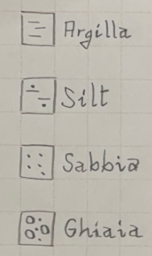
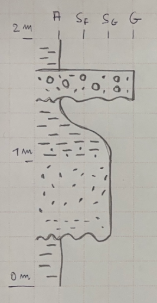
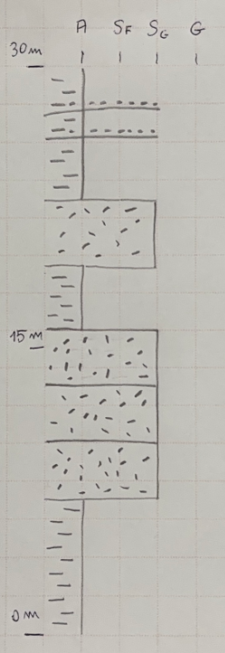
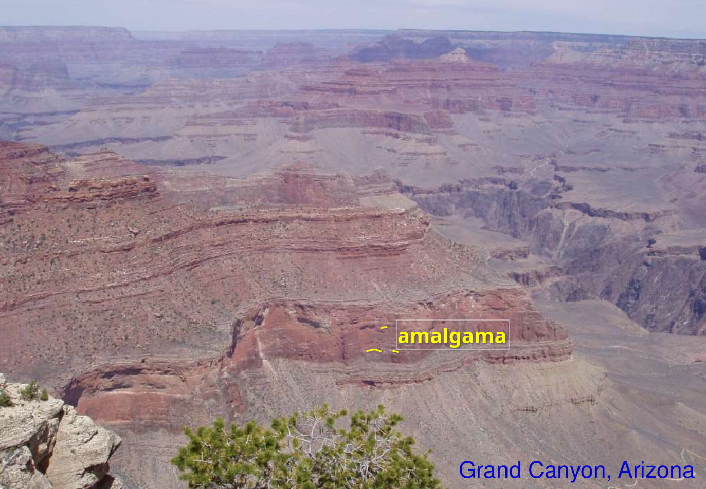
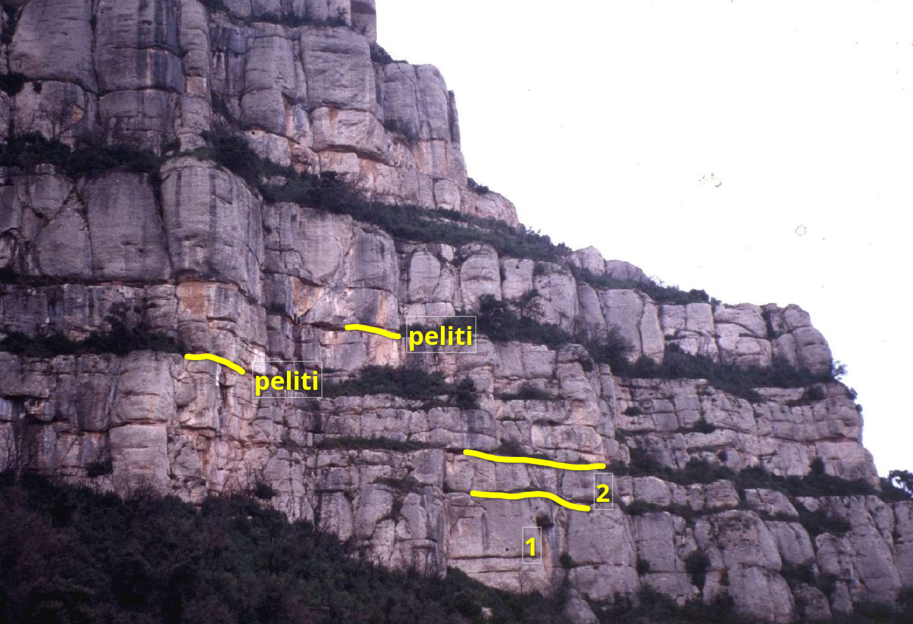
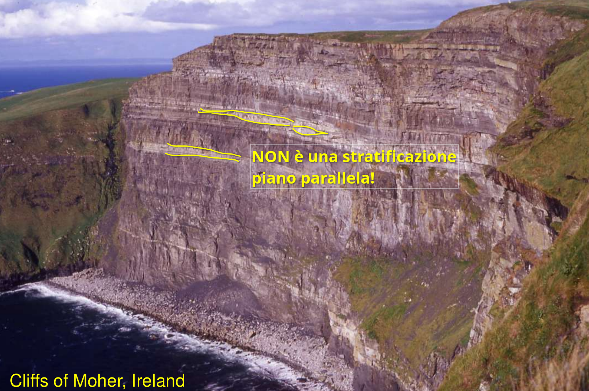

# Rappresentazione grafica degli strati

Stratigrafia e sedimentologia - Prof. Alessandro Amorosi - Lezione del 9 ottobre 2025.

Ci sono due metodi di rappresentare graficamente gli strati di un affioramento.
Il primo metodo è il log stratigrafico, il secondo metodo è lo schizzo schematico (_sketch_).

# Log stratigrafico

Il log stratigrafico è una rappresentazione grafica e codificata. Non esiste una codifica universale e, per esempio, a parità di affioramento visto in campagna, il log disegnato dagli anglosassoni (vedi figura 5.1 In Nichols) è diverso da quello degli italiani.

Noi consideriamo due tipi di log: il primo è il log detto _alla scala dell’affioramento_, il secondo è per gli affioramenti lontani.
Il primo si usa per gli affioramenti che vediamo direttamente e che misuriamo direttamente con il metro (estensione tipica un paio di metri, per esempio del "Livello Bonarelli" alla Gola del Bottaccione, Gubbio); il secondo si usa per affioramenti estesi che vediamo da lontano (estensione tipica delle decine o anche centinaia di metri, esempio del Grand Canyon, Arizona).  
Durante l'esame sarà importante riconoscere se l'affioramento di cui si deve disegnare il log è a scala vicina o lontana perché i due log saranno disegnati seguendo due metodi in parte diversi.

Il log rappresenta in verticale lo spessore degli strati mentre in orizzontale rappresenta la granulometria.  
Nella parte destra del log vengono poi indicate le strutture sedimentarie.

Usare tutto lo sviluppo verticale della pagina del quaderno di campagna per disegnare il log (occorre un quaderno che abbia una dimensione verticale minima, non sotto al formato A5).

## Spessore degli strati

Disegnare al bordo sinistro della pagina un asse verticale.  
Mettere almeno tre tacche: quella all’estremo inferiore, quella a metà e quella dell’estremo superiore. Sono utili anche le tacche intermedie che delimitano i quarti.  
Indicare a sinistra della tacca il valore numerico corrispondente e l’unità di misura (per esempio per un affioramento esteso in verticale un paio di metri indicare `0 m` per la tacca inferiore, `2 m` per la tacca superiore e `1 m` per la tacca centrale).  
Il disegno deve essere fatto in scala quindi è preferibile avere un quaderno a quadretti.

## Granulometria degli strati

Disegnare sul lato alto della pagina un asse orizzontale che rappresenta la granulometria.  
Le classi granulometriche rappresentate sono argilla (granulometria inferiore ad 1/16 di mm), sabbia (granulometria superiore a 1/16 di mm e inferiore a 2 mm) e ghiaia (granulometria superiore a 2 mm).

La sabbia si suddivide teoricamente in 5 classi:  

<pre>
ff = finissima  
f  = fine  
m  = media  
g  = grossolana  
gg = molto grossolana
</pre>

Spesso però in campagna non si è in grado di distinguere queste cinque classi1 e quindi ci si limita a due: la sabbia "fine" e quella "grossolana" (vanno messe tra virgolette); notare nello schema sottostante che le "fini" si sovrappongono alle "grossolane" in corrispondenza delle medie.

<pre>
   fini
---------------
|             |           2
ff     f     m     g     gg
1/16        |_____________|
               grossolane
</pre>

Pertanto la scala orizzontale riporterà quattro tacche, la più fine è l'argilla A e va posta a sinistra, seguono la sabbia fine Sf, la sabbia grossolana Sg e la ghiaia G.

<pre>
A     Sf     Sg     G
|-----|------|------|
</pre>

Nel disegno si parte dal basso, mai dall'alto.

La litologia si rappresenta all'interno della colonna stratigrafica e si disegna con questi riempimenti simbolici:

<pre>
Argilla: trattini alti e bassi
   Silt: trattini e puntini
 Sabbia: puntini
 Ghiaia: pallini e puntini
</pre>

I tre contatti che conosciamo sono: erosivo, netto e graduale.  
Questi contatti si rappresentano con tre simboli:

<pre>
 Erosivo: linea orizzontale ondulata
   Netto: linea orizzontale dritta
Graduale: linea curva che raccorda le due granulometrie
</pre>

INSERIRE FIG 2 con i tre contatti

Se la granulometria diminuisce dal basso verso l'alto si dice in italiano che la gradazione è diretta o positiva ma si usa poi di  consuetudine il termine inglese _fining upward_ abbreviato in FU.

Se la granulometria aumenta dal basso verso l'alto si dice in italiano che la gradazione è inversa o negativa ma si usa poi di  consuetudine il termine inglese _coarsening upward_ abbreviato in CU.

FU e CU si usano solamente alla scala dell'affioramento, non si usano per affioramenti visti in lontananza.

## Esempio di log alla scala dell'affioramento

Il log nella figura seguente corrisponde a questa descrizione testuale dal basso verso l'alto: 40 cm di pelite in contatto erosivo con 60 cm di sabbia grossa; la sabbia grossa ha un contatto graduale con mezzo metro di argilla che è poi in contatto erosivo con 25 cm di ghiaia; la ghiaia è in contatto netto con 25 cm di argilla.

## Log per affioramento visto da lontano

Il log per l'affioramento visto da lontano segue le stesse regole di quello alla scala dell'affioramento con l'importante eccezione dei contatti che non devono mai essere rappresentati come graduali.

## Esempio di log per affioramenti visti da lontano

Il log nella figura seguente corrisponde a questa descrizione testuale dal basso verso l'alto: 7 m di argilla, 9 m di tre strati amalgamati di arenaria, 3.5 m di argilla, 3.5 m di arenaria, 7 m di argilla; in questi ultimi 7 m di argilla si osservano strati di arenaria2.

Nei log degli affioramenti visti da lontano si usano le espressioni inglesi _thinning up_ (abbreviato con ThU) quando la spessore del materiale più grossolano va diminuendo dal basso verso l'alto e _thickening up_ (abbreviato con TkU) quando lo spessore va crescendo dal basso verso l'alto3.  
Thinning e thickening si riferiscono ai materiali più grossolani, quindi per esempio alle arenarie della figura seguente.

INSERIRE FIG 5 con i due log ThU e TkU

## Strutture sedimentarie

# Esempi 

INSERIRE FIG log grand canyon

INSERIRE FIG log due litologie

Note  
--
1La classificazione delle sabbie in cinque classi è usabile quando si è in grado di misurare con accuratezza la granulometria tramite strumenti da laboratorio; in campo tipicamente non si riescono a usare cinque classi ottenendo un ampio consenso: per esempio quasi sicuramente due persone diverse daranno due classificazioni granulometriche diverse alla stessa sabbia osservandola ad occhio nudo. Esistono tecniche che verranno spiegate durante le esercitazioni in escursione. L'uso invece delle due classi "fine" e "grossolana" troverà consenso oiltre al 90%.

2Per spessore minimo risolvibile si intende lo spessore rappresentabile nel disegno del log. Per esempio se si usa un pennarello che traccia un segno di 3 mm allora non si potranno rappresentare spessori che in scala sono inferiori a 3 mm. Se la scala è 1 cm = 10 m (cioè 1 cm sul disegno corrisponde a 10 m nella realtà) allora non si potranno rappresentare spessori inferiori a 3 m (questi 3 m si ottengono risolvendo la proporzione 1 cm : 10 m = 0.3 cm : x, dove i primi due termini sono quelli della scala e il terzo termine è lo spessore del segno del pennarello).

3Non c'è un corrispettivo italiano per questi termini a meno di non usare l'intera frase "spessore che va crescendo verso l'alto", eccetera.
