# Rappresentazione grafica degli strati

Stratigrafia e sedimentologia - Prof. Alessandro Amorosi - Lezione del 9 ottobre 2025. Appunti di Alessandro Gentilini.

Ci sono due metodi di rappresentare graficamente gli strati di un affioramento.
Il primo metodo è il log stratigrafico, il secondo metodo è lo schizzo schematico (_sketch_).

# Log stratigrafico

Il log stratigrafico è una rappresentazione grafica e codificata. Non esiste una codifica universale e, per esempio, a parità di affioramento osservato in campagna, il log disegnato dagli anglosassoni (vedi più avanti negli Esempi un confronto) è diverso da quello degli italiani.

Noi consideriamo due tipi di log: il primo è il log detto _alla scala dell'affioramento_, il secondo è per gli affioramenti lontani.
Il primo si usa per gli affioramenti che vediamo direttamente e che misuriamo direttamente con il metro (estensione tipica un paio di metri, per esempio del "Livello Bonarelli" alla Gola del Bottaccione, Gubbio); il secondo si usa per affioramenti estesi che vediamo da lontano (estensione tipica delle decine o anche centinaia di metri, esempio del Grand Canyon, Arizona).  
Durante l'esame sarà importante riconoscere se l'affioramento di cui si deve disegnare il log è a scala vicina o lontana perché i due log saranno disegnati seguendo due metodi in parte diversi.

Il log rappresenta in verticale lo spessore degli strati mentre in orizzontale rappresenta la granulometria.  
Nella parte destra del log vengono poi indicate le strutture sedimentarie.

Usare tutto lo sviluppo verticale della pagina del quaderno di campagna per disegnare il log (occorre un quaderno che abbia una dimensione verticale minima, non sotto al formato A5).

## Spessore degli strati

Disegnare al bordo sinistro della pagina un asse verticale.  
Mettere almeno tre tacche: quella all'estremo inferiore, quella a metà e quella dell'estremo superiore. Sono utili anche le tacche intermedie che delimitano i quarti.  
Indicare a sinistra della tacca il valore numerico corrispondente e l'unità di misura (per esempio per un affioramento esteso in verticale un paio di metri indicare `0 m` per la tacca inferiore, `2 m` per la tacca superiore e `1 m` per la tacca centrale).  
Il disegno deve essere fatto in scala quindi è preferibile avere un quaderno a quadretti.

## Granulometria degli strati

Disegnare sul lato alto della pagina un asse orizzontale che rappresenta la granulometria.  
Le classi granulometriche rappresentate sono argilla (granulometria inferiore ad 1/16 di mm), sabbia (granulometria superiore a 1/16 di mm e inferiore a 2 mm) e ghiaia (granulometria superiore a 2 mm).

La sabbia si suddivide teoricamente in 5 classi:  

<pre>
ff = finissima  
f  = fine  
m  = media  
g  = grossolana  
gg = molto grossolana
</pre>

Spesso però in campagna non si è in grado di distinguere queste cinque classi1 e quindi ci si limita a due: la sabbia "fine" e quella "grossolana" (vanno messe tra virgolette); notare nello schema sottostante che le "fini" si sovrappongono alle "grossolane" in corrispondenza delle medie.

<pre>
   fini
---------------
|             |           2
ff     f     m     g     gg
1/16        |_____________|
               grossolane
</pre>

Pertanto la scala orizzontale riporterà quattro tacche, la più fine è l'argilla A e va posta a sinistra, seguono la sabbia fine Sf, la sabbia grossolana Sg e la ghiaia G.

<pre>
A     Sf     Sg     G
|-----|-----|------|
</pre>

Nel disegno si parte dal basso, mai dall'alto.

La litologia si rappresenta all'interno della colonna stratigrafica e si disegna con questi riempimenti simbolici:

<pre>
Argilla: trattini alti e bassi
   Silt: trattini e puntini
 Sabbia: puntini
 Ghiaia: pallini e puntini
</pre>

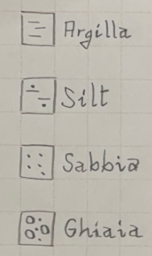

I tre contatti che conosciamo sono: erosivo, netto e graduale.  
Questi contatti si rappresentano con tre simboli:

<pre>
 Erosivo: linea orizzontale ondulata
   Netto: linea orizzontale dritta
Graduale: linea curva che raccorda le due granulometrie
</pre>

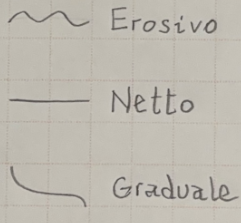

Se la granulometria diminuisce dal basso verso l'alto si dice in italiano che la gradazione è diretta o positiva ma si usa poi di  consuetudine il termine inglese _fining upward_ abbreviato in FU.

Se la granulometria aumenta dal basso verso l'alto si dice in italiano che la gradazione è inversa o negativa ma si usa poi di  consuetudine il termine inglese _coarsening upward_ abbreviato in CU.

FU e CU si usano solamente alla scala dell'affioramento, non si usano per affioramenti osservati in lontananza.

## Esempio di log alla scala dell'affioramento

Il log nella figura seguente corrisponde a questa descrizione testuale dal basso verso l'alto: 40 cm di pelite in contatto erosivo con 60 cm di sabbia grossa; la sabbia grossa ha un contatto graduale con mezzo metro di argilla che è poi in contatto erosivo con 25 cm di ghiaia; la ghiaia è in contatto netto con 25 cm di argilla.

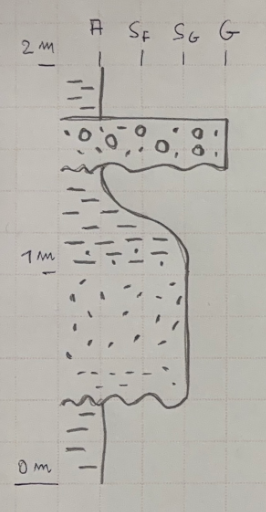

Notare nella figura precedente che in corrispondenza del contatto graduale si è inserito il simbolo di silt (vedi tra 1 m e 1.2 m) tra la sabbia grossa sottostante e l'argilla sovrastante.

## Log per affioramento osservato da lontano

Il log per l'affioramento osservato da lontano segue le stesse regole di quello alla scala dell'affioramento con l'importante eccezione dei **contatti che non devono mai essere rappresentati come graduali** (perché difficilmente apprezzabili come tali nell'osservazione da lontano).

Nell'osservazione da lontano considerare sempre le differenze di erosione:

* sporge il materiale più grossolano che si erode meno mentre
* rientra il materiale più fine che si erode di più.

Poi, spesso le arenarie danno versanti sub-verticali mentre le peliti versanti meno inclinati e più dolci.  
Ed ancora, la vegetazione ricopre i versanti più dolci ma non quelli più inclinati quindi la presenza di vegetazione può suggerire peliti ma non è una regola fissa.

## Esempio di log per affioramenti osservati da lontano

Il log nella figura seguente corrisponde a questa descrizione testuale dal basso verso l'alto: 7 m di argilla, 9 m di tre strati amalgamati di arenaria, 3.5 m di argilla, 3.5 m di arenaria, 7 m di argilla.

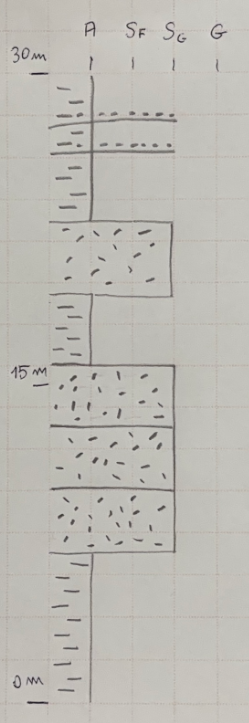

Negli ultimi 7 m di argilla si osservano strati di arenaria che sono evidenziati nelle annotazioni `C` e `D` della seguente figura; notare che `C` e `D` corrispondono a due linee "aperte" a differenza per esempio dello strato di arenaria in cui `A` è collegato ("chiuso") con `B`; le linee aperte si usano per rappresentare strati di spessore inferiore al minimo risolvibile.2
Quindi nella figura seguente `C` e `D` sono linee aperte e rappresentano strati visibili in lontananza ma non rappresentabili alla scala del disegno.

Nei log degli affioramenti osservati da lontano si usano le espressioni inglesi _thinning up_ (abbreviato con ThU) quando la spessore del materiale più grossolano va diminuendo dal basso verso l'alto e _thickening up_ (abbreviato con TkU) quando lo spessore va crescendo dal basso verso l'alto.3  
Thinning e thickening si riferiscono ai materiali più grossolani, quindi per esempio alle arenarie della figura seguente.

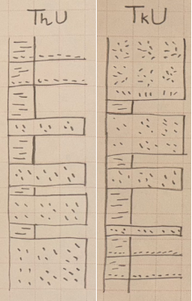

## Strutture sedimentarie

Per le principali strutture sedimentarie si usano i simboli della figura seguente.

* Stratificazione/laminazione piano parallela  
* Stratificazione incrociata concava  
* Stratificazione incrociata tabulare  
* Stratificazione incrociata cuneiforme  
* Stratificazione concava convessa ad _hummocky_ (abbreviata con HCS _Hummocky Cross Stratification_)  
* Ripple da onda  
* Fossile _incertae sedis_4

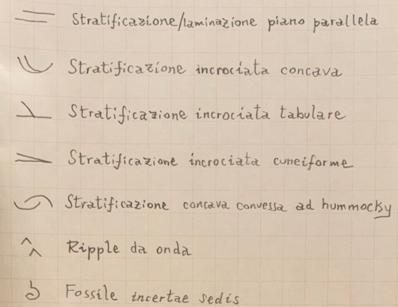

Nel caso si sia in grado di determinare la specie o il genere del fossile si può usare un simbolo più evocativo.

Altri simboli si usano per:

* bioturbazione
* foglie
* presenza di radici

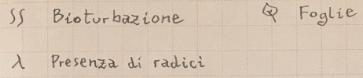

Le strutture sedimentarie si affiancano alla destra della colonna stratigrafica, come visibile nella figura seguente.

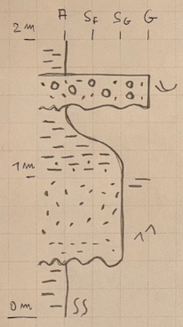

La figura seguente mostra altri simboli usabili per la litologia: calcari, dolomie (non confonderle con la dolomite che è il minerale), carbone e torba, paleosuoli.

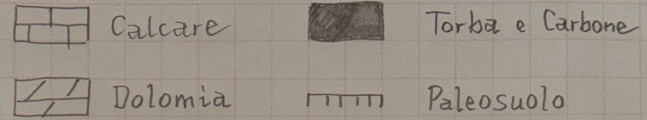

# Sketch

Nella figura seguente (5.4 in Nichols) è mostrato il secondo modo di rappresentare un affioramento di rocce sedimentarie: lo _sketch di affioramento_. Si tratta di un disegno semplificato (non una riproduzione artistica!) di come appare l'affioramento; va prediletto l'aspetto geometrico relativo alle superfici e alle superfici erosive.  
Per esempio si nota come gli strati non abbiano continuità laterale (vanno assottigliandosi, vedere per esempio l'arenaria che contiene "crevasse splay" che si assottiglia verso SW); il segno giallo evidenzia una superficie in cui gli strati a SW sono stati "tagliati" da quello che è etichettato come "Channel" che quindi, tagliando gli strati, ha una età successiva agli strati stessi (o, detto in altre parole, è più giovane degli strati).

È utile arricchire lo sketch accompagnandolo per esempio con log stratigrafici, qui sarebbe utile disegnare quello indicato dal segno rosso 1 e quello 2. Se si disegnasse solamente 1 (o solamente 2) questo non spiegherebbe completamente l'affioramento.

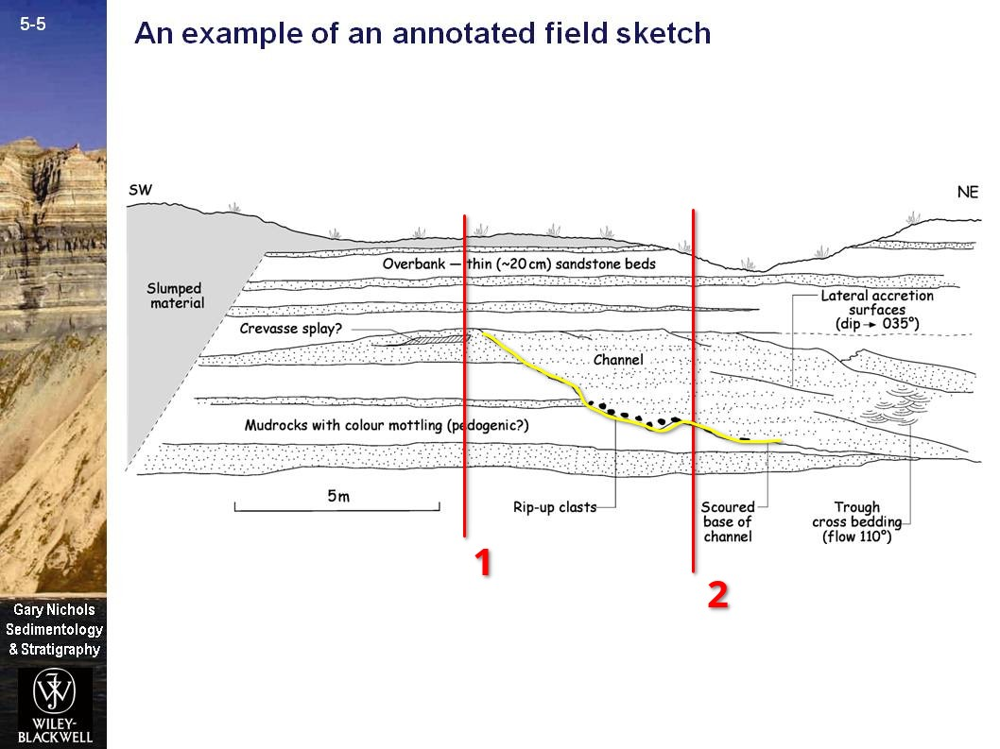

# Esempi 

## Confronto con un log stratigrafico anglosassone

La figura 5.1 in Nichols è riprodotta qui sotto, notare che:

* La scala granulometrica è la terza colonna.
* La scala granulometrica non contiene le litologie (come invece nello stile italiano) ma invece contiene le strutture sedimentarie.
* Le litologie sono riportate invece nella seconda colonna che non è la scala granulometrica.
* Poco sotto ai 4 m inizia uno strato di circa 30 cm di carbone.

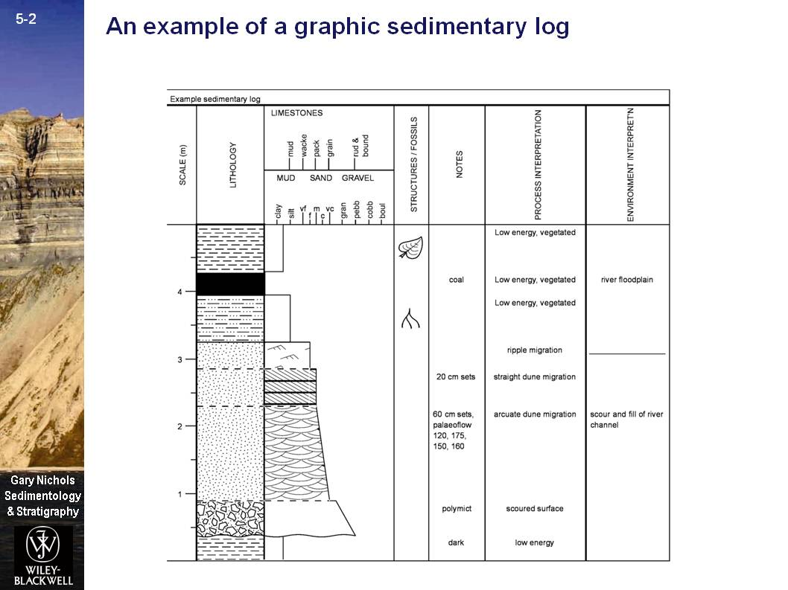

La legenda è riportata nella figura seguente (5.2 in Nichols).

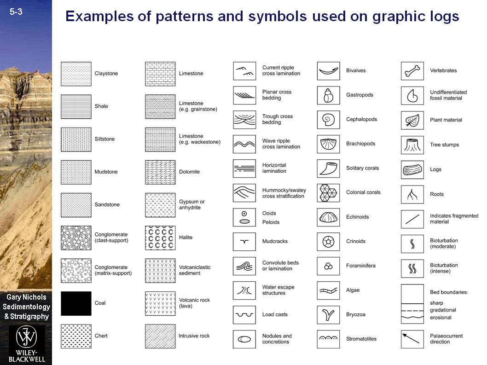

## Grand Canyon
Il Grand Canyon in Arizona e l'affioramento con la A maiuscola; qui la continuità stratigrafica è osservabile per km perché l'ambiente è sub-desertico e la vegetazione non copre troppo gli affioramenti.

Nella figura seguente, , si osserva la parte rossiccia e la parte grigia.
La parte rossiccia dà luogo a pareti sub-verticali mentre la grigia a paretei meno inclinate, se ne deduce che la parte rossa potrebbe essere una arenaria mentre la grigia una pelite.
I segni gialli evidenziano gli strati amalgamati di arenaria.

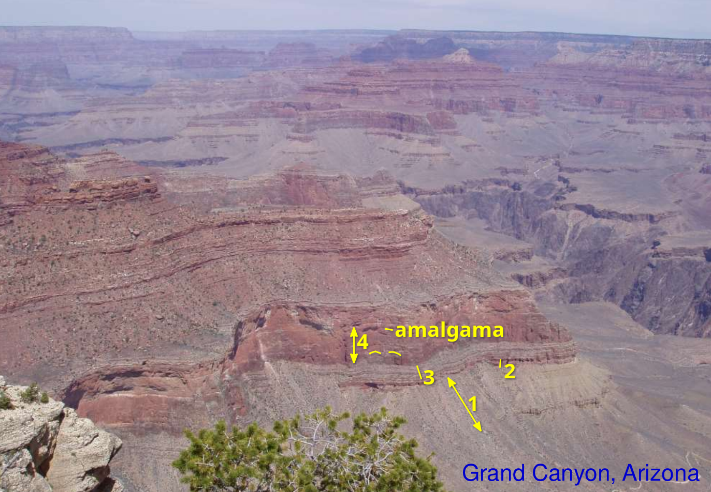

I quattro strati indicati con 1, 2, 3, 4 in giallo sono poi rappresentati nel log stratigrafico seguente (in cui si omettono le scale).

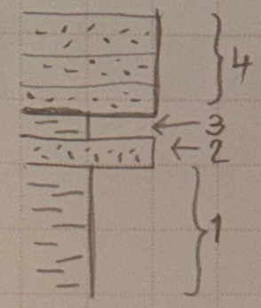

## Due litologie

Quante litologie sono presenti nella figura seguente?

A prima vista una sola, quella grigia... ma su cosa poggia la vegetazione?  
La vegetazione ha bisogno di acqua per vivere e le peliti essendo impermeabili possono trattenere acqua... ecco quindi che la vegetazione può indicare che c'è una pelite sottostante.

Quindi nella figura seguente i segni gialli con scritto "peliti" evidenziano la litologia pelitica (roccia di colore rossiccio) diversa da quella più grossolana di colore grigio. I numeri 1 e 2 sono riportati anche nel log stratigrafico della figura seguente.

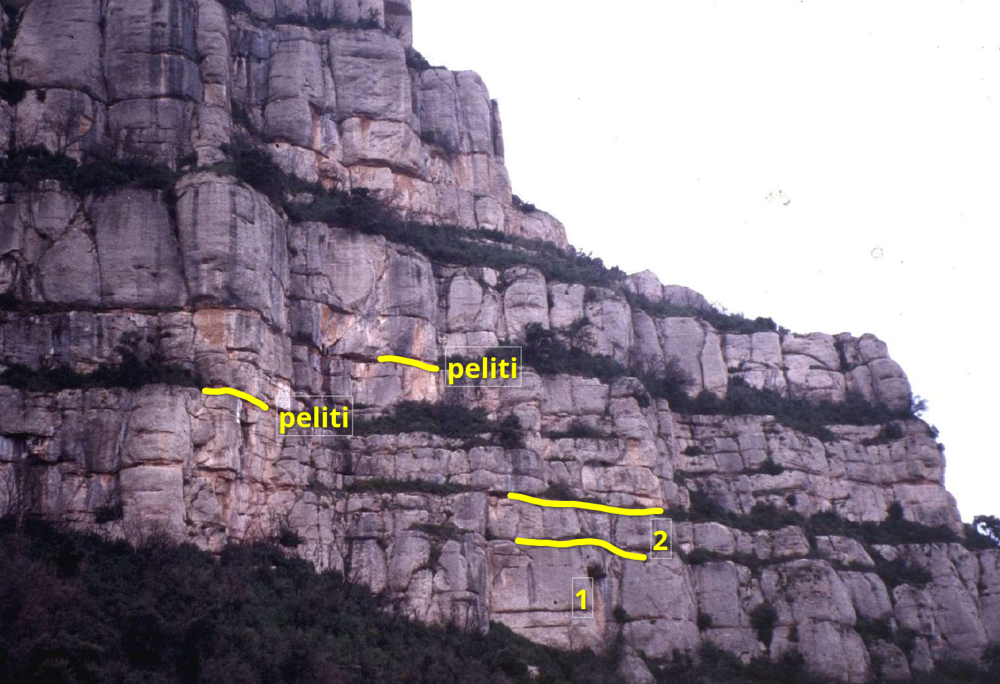

I numeri 1 e 2 sono riportati anche nel log stratigrafico della figura seguente.

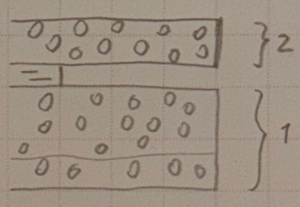

## Thickening up

Nella figura seguente, i segni gialli nella parte bassa della figura evidenziano come la roccia di colore giallo sia più sporgente rispetto a quella grigia; la roccia più sporgente è quella meno erosa e quindi è tipicamente la più grossolana.
s1, s2, s3 indicano gli spessori di tre strati della roccia grossolana di colore giallo, si ha $s1 < s2 < s3$ e quindi si può descrivere questo affioramento come _thickening up_ abbreviato con ThU.

## Cliffs of Moher

La figura seguente mostra un esempio in cui lo sketch è più indicato rispetto al log stratigrafico. Si osservano strati che vanno assottigliandosi (evidenziati dai segni gialli) e da questo si deduce che non si tratta di una stratificazione piano parallela.

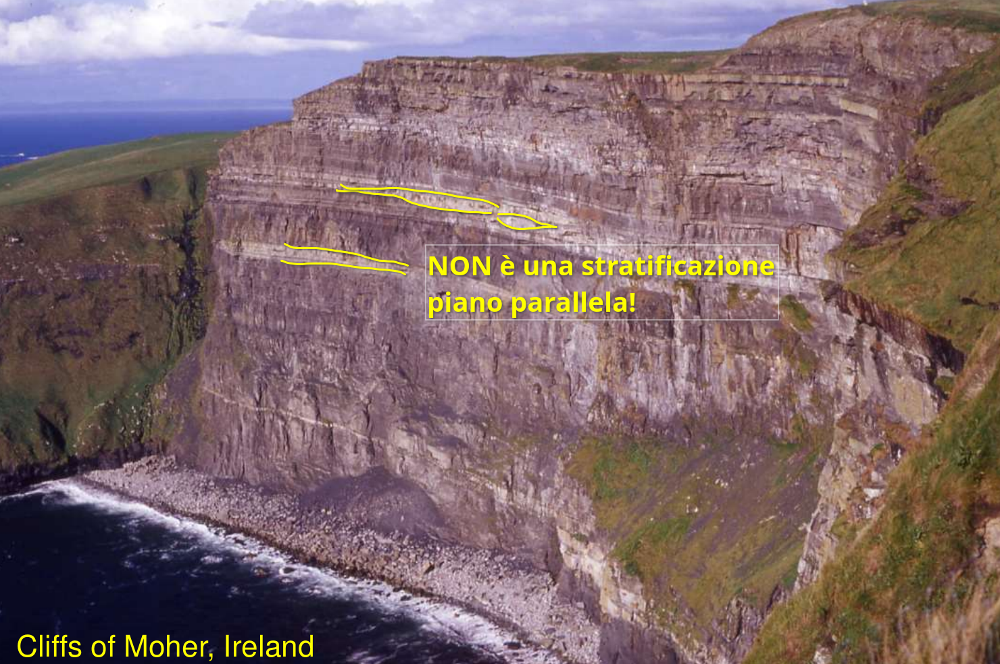

# Riassunto della procedura per disegnare il log stratigrafico

1) Individuare il log più adatto: log alla scala dell'affioramento oppure log per affioramento osservato da lontano?

2) Se si è sull'affioramento: misurare l'altezza complessiva dell'affioramento da disegnare.  
Se invece si osserva l'affioramento da lontano l'altezza va stimata.

3) Disegnare l'asse verticale con la scala degli spessori degli strati, indicare l'opportuna unità di misura (metri, centimetri, eccetera).  
Disegnare almeno tre tacche: in fondo, a metà, in alto (è il fondo scala misurato o stimato al punto precedente).

4) Disegnare nella parte alta del log l'asse orizzontale della granulometria e segnare le quattro tacche: Argilla, Sabbia Fine, Sabbia Grossa, Ghiaia.

5) Individuare sull'affioramento lo strato più in basso ed iniziare a disegnarlo in scala partendo dalla parte più bassa del log.  
**NOTA BENE:** disegnare partendo sempre dal basso.

6) Disegnare la litologia del primo strato.

7) Individuare il contatto tra primo e secondo strato e disegnarlo opportunamente.  
**NOTA BENE:** nel log per affioramento lontano non disegnare mai contatti graduali.

8) Aggiungere alla destra dello strato eventuali strutture sedimentare e/o altre annotazioni.

9) Ripetere per tutti gli altri strati.

10) **NOTA BENE:** fare attenzione al punto di partenza ed al punto di arrivo dei contatti graduali, devono essere in corrispondenza della corretta tacca dell'asse delle granulometrie.

11) **NOTA BENE:** nel log per affioramento da lontano disegnare con un segmento orizzontale gli strati osservati ma troppo sottili per essere disegnati con uno spessore.

Bibliografia  
--
Gary Nichols, Sedimentology and Stratigraphy, Second Edition. 2009, Chichester, UK, Wiley-Blackwell.  
Le figure usate si trovano al link [https://bcs.wiley.com/he-bcs/Books?action=index&bcsId=4994&itemId=1405135921](https://bcs.wiley.com/he-bcs/Books?action=index&bcsId=4994&itemId=1405135921).

Note  
--
1La classificazione delle sabbie in cinque classi è usabile quando si è in grado di misurare con accuratezza la granulometria tramite strumenti da laboratorio; in campo tipicamente non si riescono a usare cinque classi ottenendo un ampio consenso: per esempio quasi sicuramente due persone diverse daranno due classificazioni granulometriche diverse alla stessa sabbia osservandola ad occhio nudo. Esistono tecniche che verranno spiegate durante le esercitazioni in escursione. L'uso invece delle due classi "fine" e "grossolana" troverà consenso in oltre il 90% dei partecipanti.

2Per spessore minimo risolvibile si intende lo spessore rappresentabile nel disegno del log. Per esempio se si usa un pennarello che traccia un segno di 3 mm allora non si potranno rappresentare spessori che in scala sono inferiori a 3 mm. Se la scala è 1 cm = 10 m (cioè 1 cm sul disegno corrisponde a 10 m nella realtà) allora non si potranno rappresentare spessori inferiori a 3 m (questi 3 m si ottengono risolvendo la proporzione 1 cm : 10 m = 0.3 cm : x, dove i primi due termini sono quelli della scala e il terzo termine è lo spessore del segno del pennarello).

3Non c'è un corrispettivo italiano per questi termini a meno di non usare l'intera frase "spessore che va crescendo verso l'alto", eccetera.

4_Incertae sedis_ è una espressione latina che significa letteralmente "di incerta sede" e si usa quando non si è in grado di determinare la specie o il genere di un fossile.  
Si pronuncia "incerte sedis".
