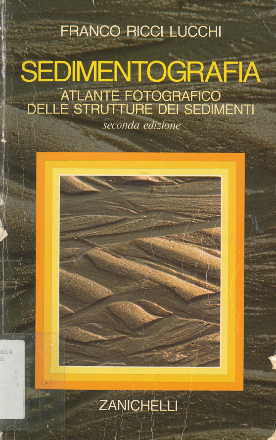

# Suggerimenti per esame di Stratigrafia e Sedimentologia con il professor Alessandro Amorosi (a.a. 2025/26)

    L'esame prevede una prova pratica di riconoscimento di strutture
    sedimentarie (immagine fotografica del libro di testo "Sedimentografia"), 
    necessaria per il superamento dell'esame, seguita da un colloquio orale, 
    durante il quale saranno accertate: (1) la capacità dello studente di 
    disegnare correttamente un log stratigrafico, (2) la conoscenza delle 
    informazioni di base della stratigrafia sequenziale. Sul voto finale, la 
    prova pratica pesa per il 33,33% e l'orale per il 66,66%.

Tratto da [37467 - STRATIGRAFIA E SEDIMENTOLOGIA
Anno Accademico 2025/2026](https://www.unibo.it/it/studiare/insegnamenti-competenze-trasversali-moocs/insegnamenti/insegnamento/2025/350755)

Il libro citato è:

Franco Ricci Lucchi  
Sedimentografia  
Atlante fotografico delle strutture dei sedimenti  
Seconda edizione  
Bologna, 1992, Zanichelli.

In poche parole l'esame orale è un dialogo che si compone di tre parti:

1) discussione sulla fotografia
2) disegno del log stratigrafico
3) domanda sulla stratigrafia sequenziale

## Discussione della fotografia

Il prof mostra una fotografia dal libro e copre la didascalia in modo che non sia leggibile, può dare alcune indicazioni (per esempio la dimensione reale dell'affioramento mostrato) ma può anche non aggiunger altro, poi lascia la parola allo studente.

Io vi consiglio di seguire questi passi:

### Capire la scala

Siccome poi dovrete disegnare il log stratigrafico in scala, per prima cosa tentate di capire se si tratta della foto di un affioramento visto da vicino oppure da lontano.

Per farsi una idea delle dimensioni, si può per esempio vedere se c'è della vegetazione (un cespuglio potrebbe avere una altezza attorno al metro, un albero attorno ai tre-quatro metri) oppure un oggetto di dimensioni note (tipicamente il martello da geologo che è lungo una trentina di cm).

Se non capite a che scala sia la foto, potete chiederlo ma sforzatevi di arrivarci da soli con un ragionamento logico.

Per esempio a me ha chiesto questa foto qui sotto che non riporta elementi utili per la scala, però mi ha detto che era una quindicina di metri.

Il prof può chiedere anche foto che non rappresentano un affioramento, per esempio una "carota" (Tavola 68, "Gradazione normale o diretta", pagina 99) oppure una profilo sismico (Tavola 13, "Canali erosivi in sedimenti attuali e recenti", la sola foto a pagina 33); in questi casi in genere dà qualche spiegazione preliminare, non spaventatevi perché vi guiderà.

### Prima descrivere, poi interpretare

Anche se avete già capito quale sia il soggetto della foto, per esempio una torbidite, evitate di dichiararlo subito perché dareste l'idea di aver imparato il libro a memoria e questo non è apprezzato dal prof, quindi, evitatelo.

Prima di tutto si deve fare la descrizione di quello che si vede e solo successivamente darne una interpretazione.

La descrizione ha l'obiettivo di essere oggettiva mentre l'interpretazione è per definizione soggettiva, più avanti farò un esempio.

Per la descrizione

Per esempio 

1) Prima descrizione litologie, poi descrizione strutture sedimentarie, poi tipicamente disegno del log stratigrafico, poi riconoscimento di facies e interpretazione facies/ambienti. Poi tipicamente domanda collegata di stratigrafia sequenziale.

2) Non studiarlo a memoria

3) Non dire subito l'interpretazione anche se la si sa gia.

indice, usare il glossario

## Disegno del log stratigrafico

Vedi [la lezione sul log stratigrafico](./logstrat/log_stratigrafico.md).

