# Torbiditi 

## Strato Contessa nella valle del Santerno

Nella figura seguente i segni rossi individuano lo "strato Contessa".

## Sequenza di Bouma

Nella figura seguente tra 1 e 2 si osserva il letto arenaceo della sequenza di Bouma, tra 2 e 3 la parte della sequenza a granulometria più fine.
Sopra a 3 inizia una altra sequenza di Bouma.

## Peliti e marne

Nella figura seguente si alternano peliti torbiditiche a marne epipelagiche. Ma quali sono le prime? Quali le seconde?

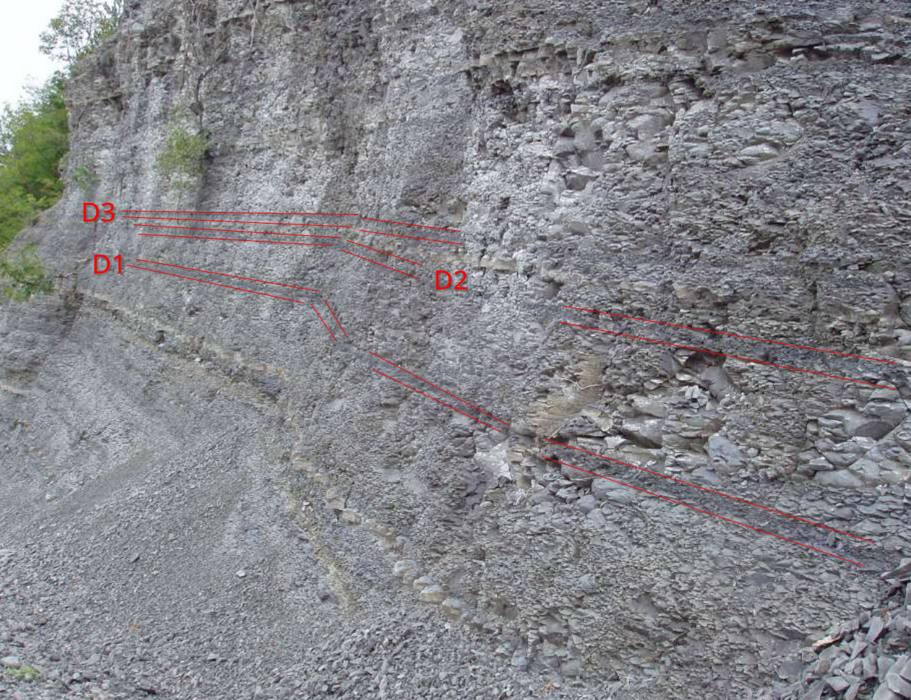

## Verghereto?

Nella figura seguente Verghereto? Che cosa c'è di pertinente?

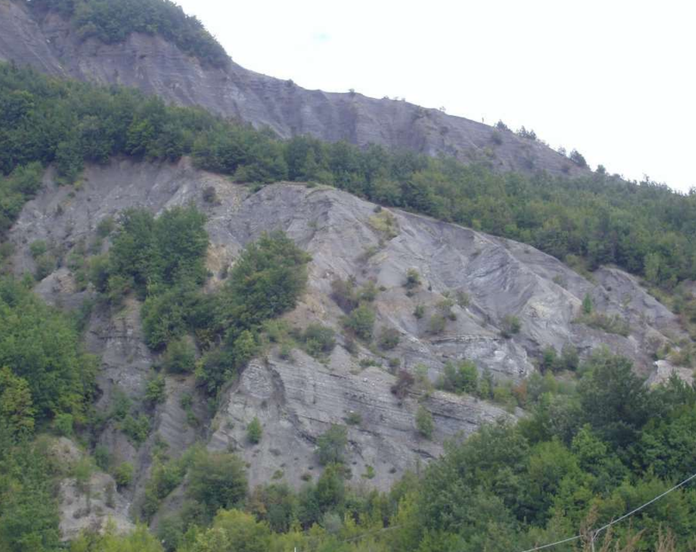

## _Slump_

Nella figura seguente si osserva uno _slump_ all'interno del rettangolo di colore rosso.

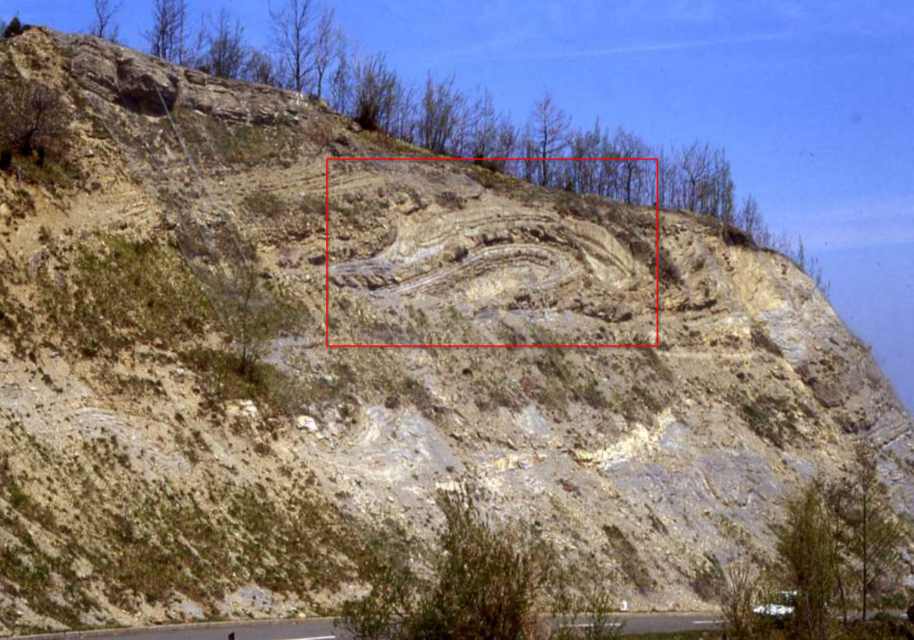

## Strato Contessa a Gubbio

Nella figura seguente si osserva lo strato Contessa a Gubbio (compreso tra le due linee spezzate di colore rosso).

## Torbidite metrica

Nella figura seguente la base areneacea di una torbidite con dimensioni metriche è compresa tra le linee spezzate rosse 1 e 2, usare la casa in costruzione come scala.

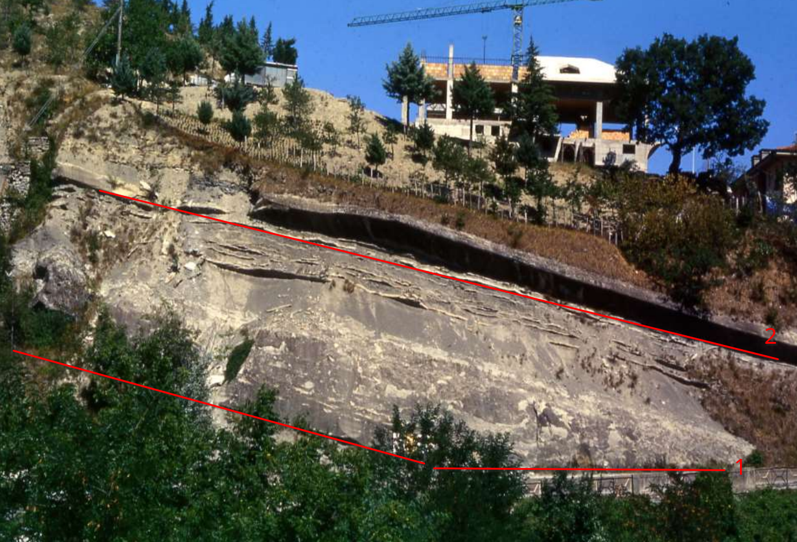

## Torbidite rovesciata

Nella figura seguente si osserva una torbidite inclinata di quasi 90°, tra le linee 1 e 2 (in colore rosso) si osserva il letto arenaceo della sequenza di Bouma, tra le linee 2 e 3 (in colore giallo) si osserva la parte a granulometria più fine della sequenza. Notare che la parte basale ha un contatto netto.

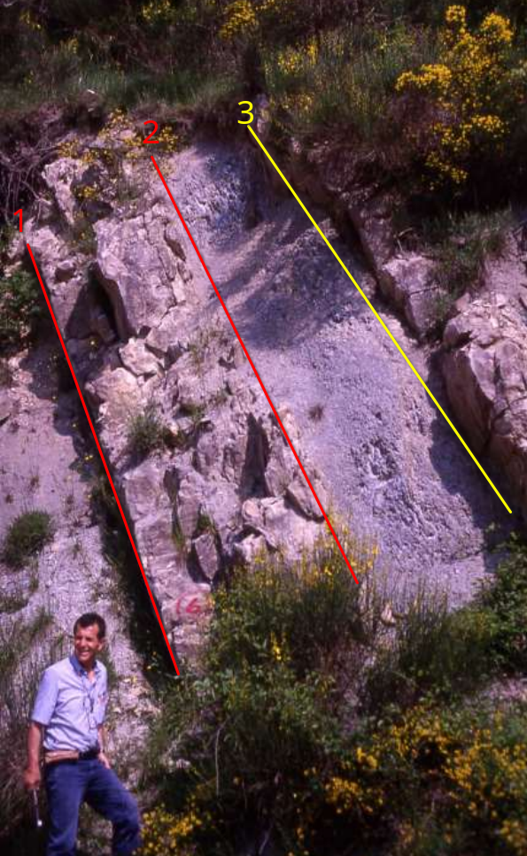

Se la torbidite non fosse stata soggetta alle forze che l'hanno inclinata, avrebbe potuto apparire come nella figura seguente; linee hanno andamento orizzontale e rappresentano la condizione di sedimentazione originale.

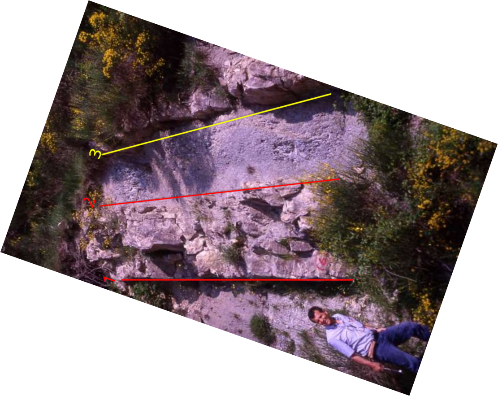

## Il fondo della base della torbidite

Nella figura seguente si osserva una torbidite alla scala dell'affioramento; compreso tra le linee spezzate B1 e T1 si osserva il letto arenaceo che costituisce la base della sequenza di Bouma. La parte di foto compresa tra le linee spezzate B1 e B2 mostra il fondo del blocco arenaceo in cui tipicamente si osservano le strutture sedimentarie di controimpronta.

## _Flute cast_ e direzione della paleocorrente

Nella figura seguente si osservano alcuni _flute cast_ in cui si è indicato con la lettera B il bulbo e con la lettera A le due ali della struttura. Il verso della paleocorrente è da B ad A.  
Notare che il bulbo è in rilievo rispetto alla parte circostante: nel _flute cast_ più in basso si sono indicate con N due parti che sono più lontane dal punto di ripresa rispetto al bulbo B che è più vicino al punto di ripresa, detto in altri termini B è in rilievo rispetto ad N.

Prestare attenzione che nella figura seguente le due linee di colore verde che divergono da 1 a 2 **NON** sono le ali del _flute cast_ perché manca il bulbo in rilievo in corrispondenza di 1.

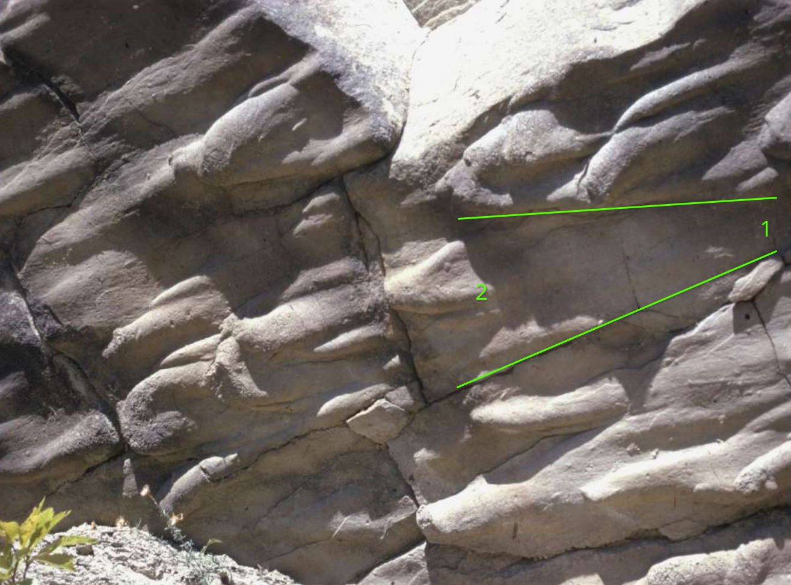

## _Turbidite for lazy people_

Nella figura seguente (_turbidite for lazy people_ che non si devono sforzare per vedere il fondo della base :-) sono annotati i _flute cast_ che stanno sul fondo della base di una torbidite. B indica il bulbo e le A indicano le ali del _flute cast_. Il piano che contiene questi _flute cast_ era in origine orizzontale e rivolto verso il basso. La paleoccorente scorreva da B ad A,riportando all'orizzontalità il piano suddetto si può quindi ottenere la direzione ed il verso della paleocorrente (esercizi tipici con il reticolo di Schmidt che stiamo facendo in questi tempi nel corso di Rilevamento geologico).

![Nella figura sono annotati i _flute cast_ che stanno sul fondo della base di una torbidite. B indica il bulbo e le A indicano le ali del _flute cast_. Il piano che contiene questi _flute cast_ era in origine orizzontale e rivolto verso il basso. La paleoccorente scorreva da B ad A,riportando all'orizzontalità il piano suddetto si può quindi ottenere la direzione ed il verso della paleocorrente (esercizi tipici con il reticolo di Schmidt che stiamo facendo in questi tempi nel corso di Rilevamento geologico).](turbidite_for_lazy_people-annotata.png)

## Altri _flute cast_

Altri _flute cast_, il bulbo è indicato dalla lettera B, le ali dalla lettere A. Il verso della paleocorrente era da B ad A.

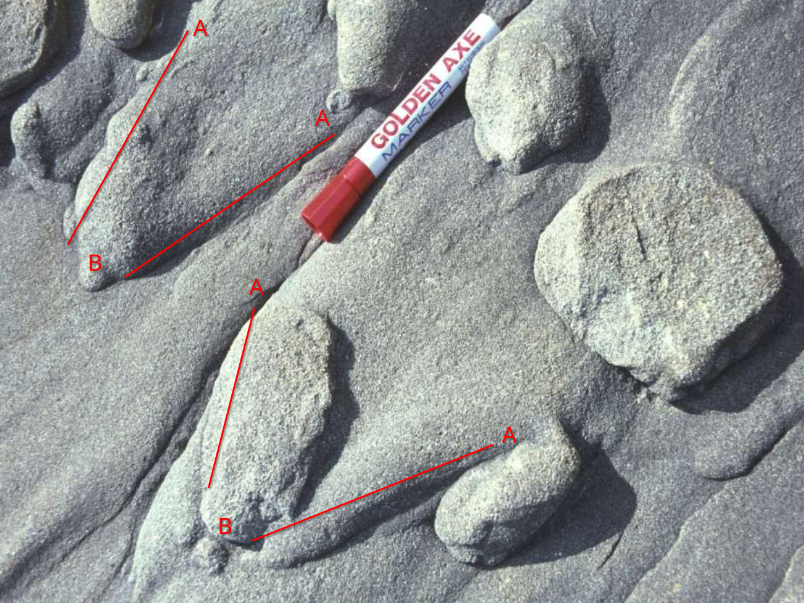

## _Chevron cast_ o del solletico

I _chevron cast_ sono stati tracciati da un elemento che sfiorava appena la superficie. La paleocorrente fluiva verso il vertice delle V annotate in rosso.

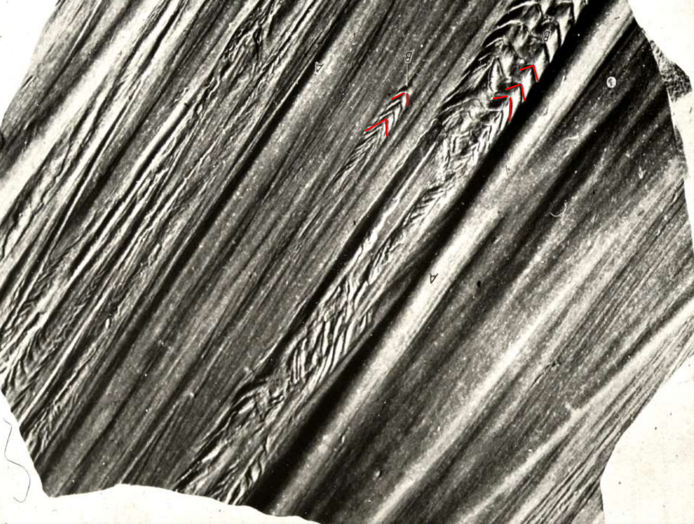

La Tavola 101 nel libro Sedimentografia di Ricci Lucchi, seconda edizione, 1992, descrive i _chevron cast_, vedi figura seguente.

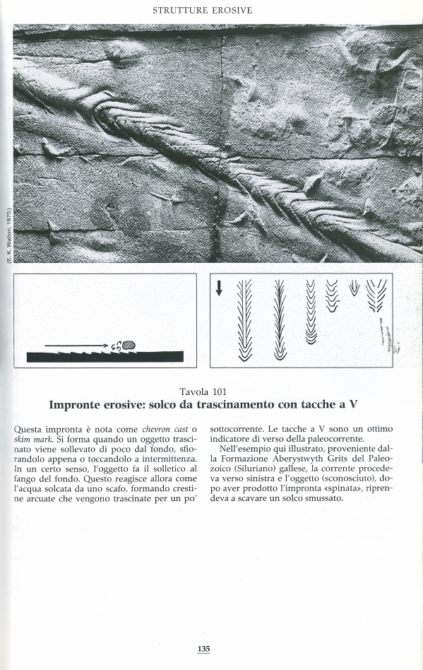

## Cosa c'è di pertinente in questa?

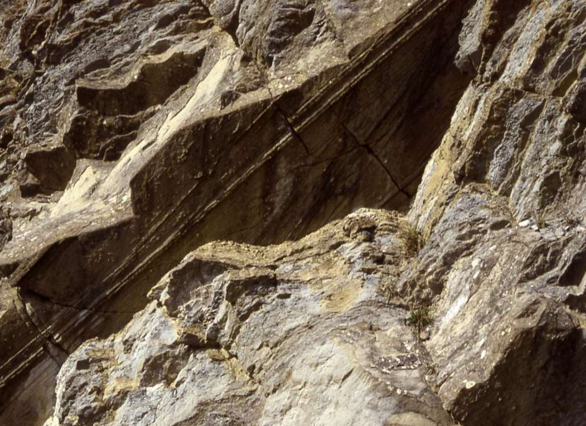

## Cosa c'è di pertinente in questa?

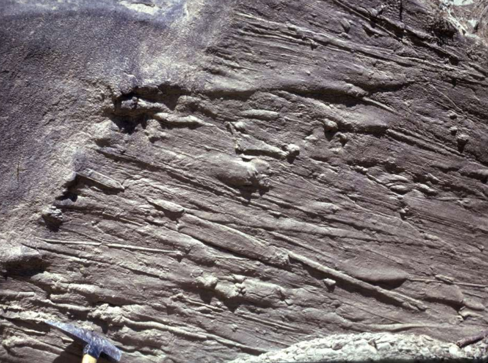

## Convoluzioni 1

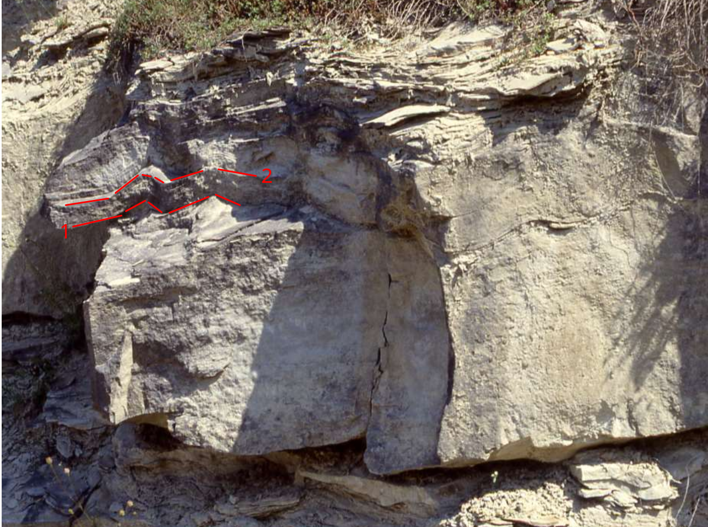

## Forse convoluzioni?

## Laminazione piano parallela

Tra le linee spezzate rosse 1 e 2 si osserva l'apertura di una laminazione piano parallela. Subito sopra si ha un sottilissimo intervallo $b$ della sequenza di Bouma e poi l'intervallo $c$ (ma dove sono $b$ e $c$)?

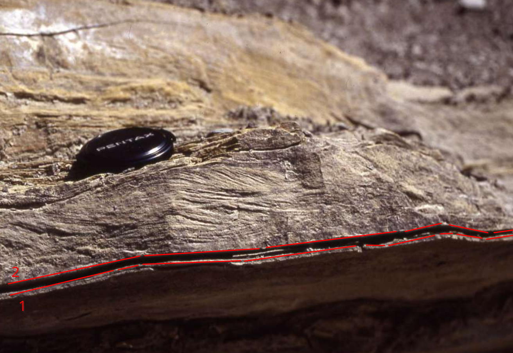

## Strutture da fuga d'acqua

All'interno dei rettangoli rossi si osservano strutture convolute dovute a fughe d'acqua.

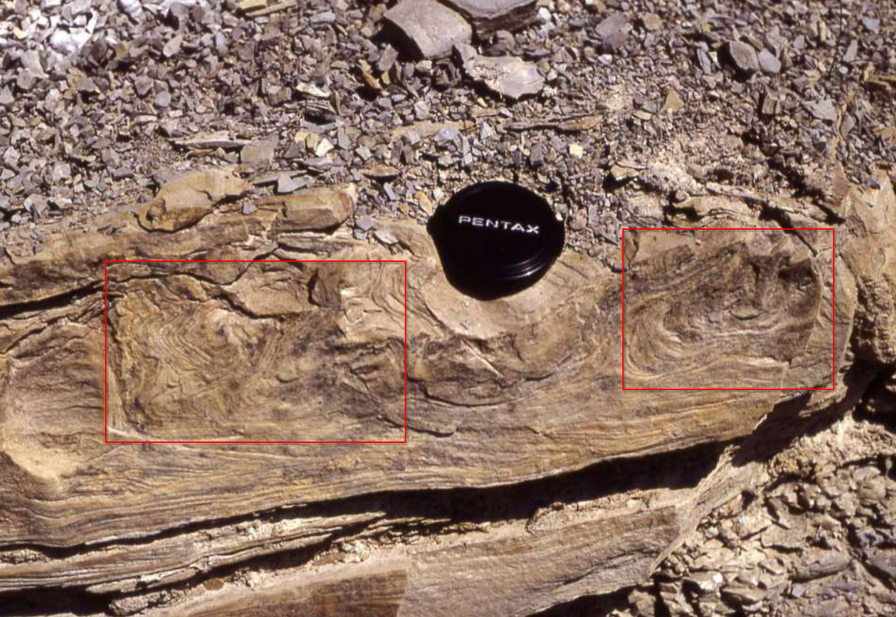

## Forse strutture da fuga d'acqua?

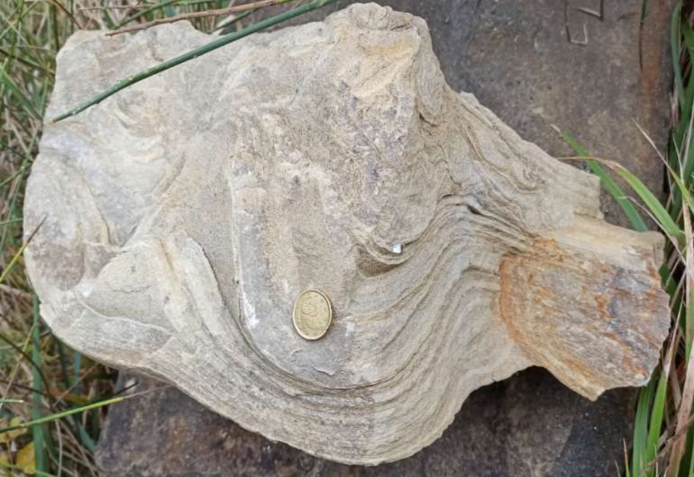

