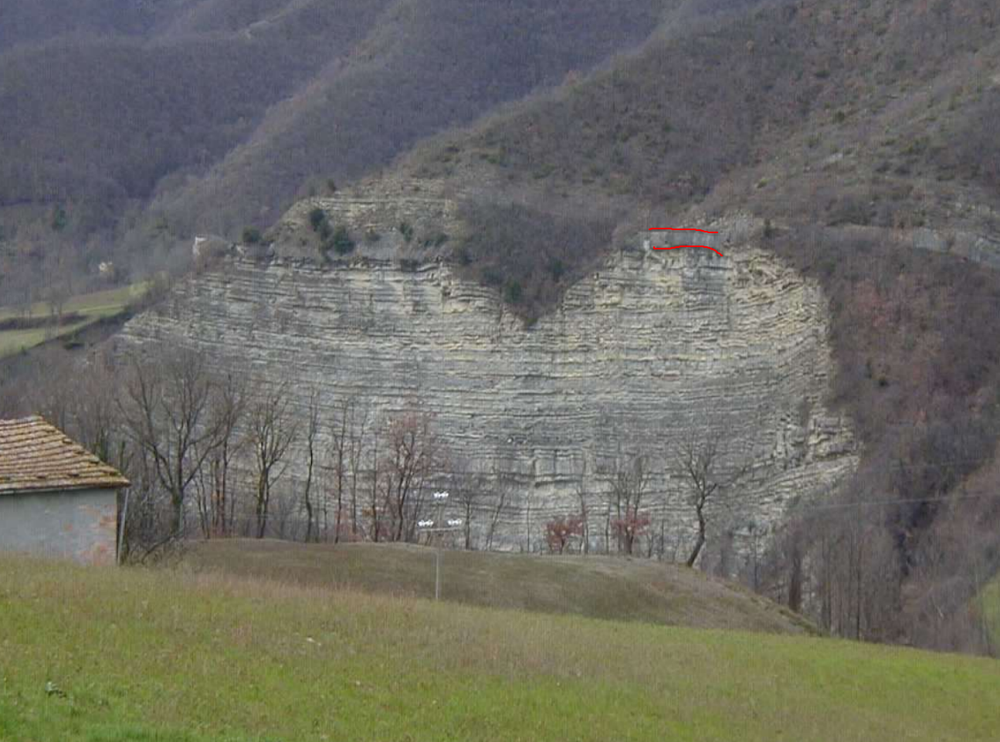
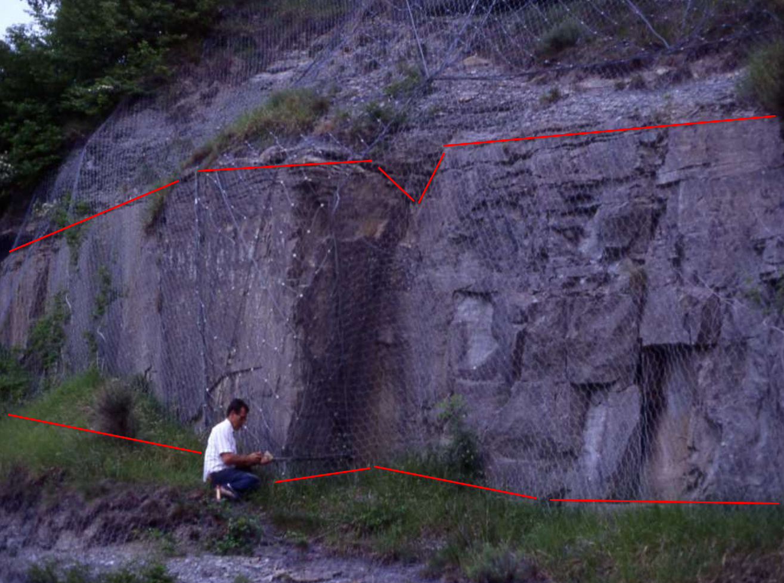

Nella figura seguente i segni rossi individuano lo "strato Contessa".

Nella figura seguente tra 1 e 2 si osserva il letto arenaceo della sequenza di Bouma, tra 2 e 3 la parte a granulometria più fine.
Sopra a 3 inizia una altra sequenza di Bouma.

Nella figura seguente si osserva lo strato Contessa a Gubbio (compreso tra le due linee spezzate di colore rosso).

