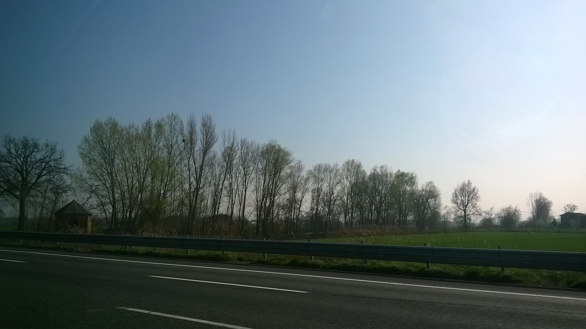
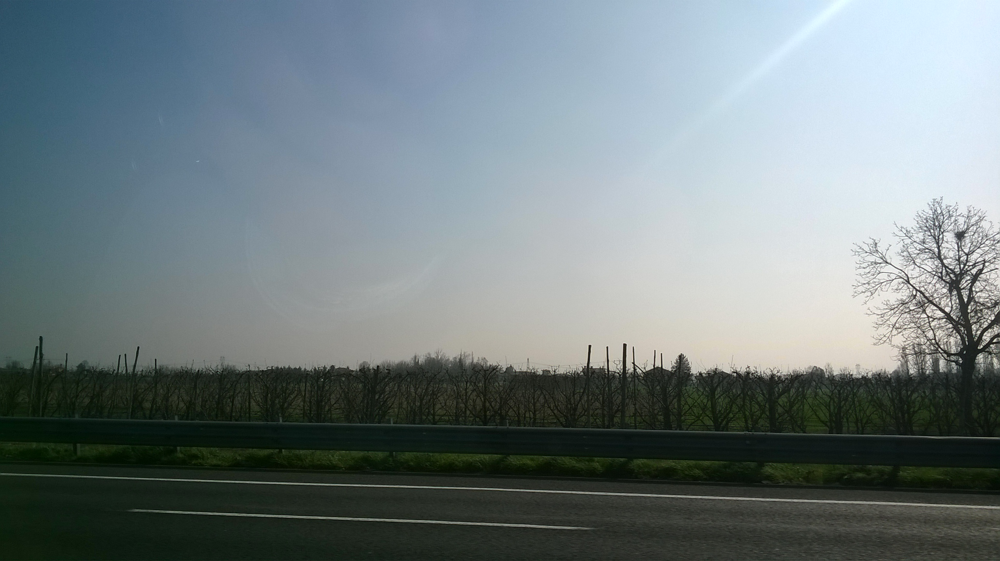
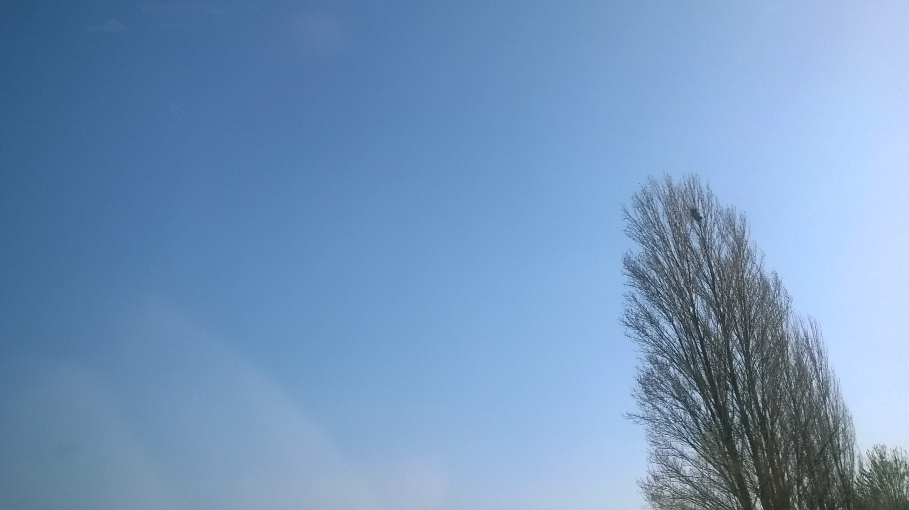
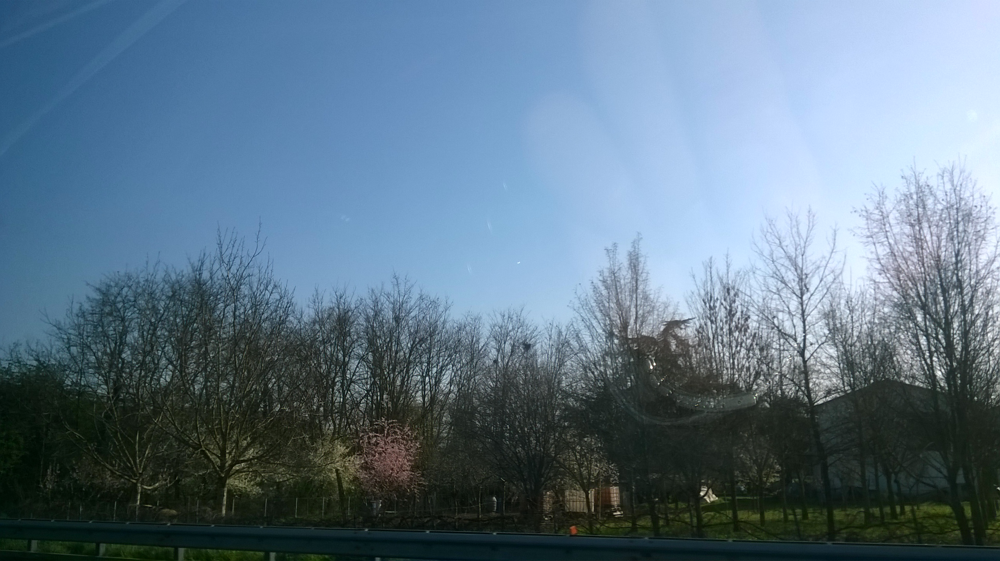

2017-03-16

See [*Observations of bird nests on trees along the A1 and A14 Italian highways*](http://www.inaturalist.org/journal/alessandro_gentilini/8940-observations-of-272-bird-nests-on-trees-along-the-a1-and-a14-italian-highways).

# Observations of 272 bird nests on trees along the A1 and A14 Italian highways
On 16 March 2017, during the afternoon, I observed at least 272 nests on trees along the A1 and A14 highways. These days spotting the nests is easy due to the absence of foliage.

The start point of observations is approximately 45°00'57.4"N 9°47'00.0"E on A1 highway (near Piacenza) and the end point of observations is approximately 44°22'56.9"N 11°44'12.0"E on A14 higway (near Imola).

All the trees was to the South of the highway; the minimum distance between highway and trees is approximately 7÷10 meters while the maximum distance was limited by my sight (I think all the trees was at distance less than 150÷200 meters).

Heights of nests above the ground range between approximately 2 meters to 15 meters.

On some branches near nests I observed [*Pica pica*](http://www.inaturalist.org/taxa/144106-Pica-pica) (Gazza Ladra in Italian).

175 nests were counted at 44° 35' 22.9" North, 10° 57' 7.3" East, see the following image:

181 nests were counted at 44° 34' 9" North, 11° 1' 20.5" East, see the following image:

227 nests were counted at 44° 31' 52.8" North, 11° 19' 21.4" East, see the following image:

272 nests were counted at 44° 23' 23" North, 11° 43' 1" East, see the following image:

