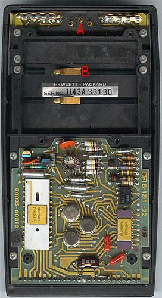
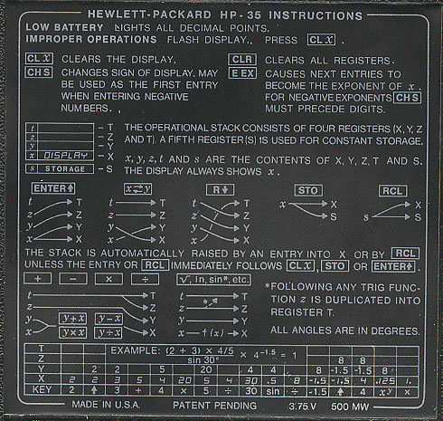
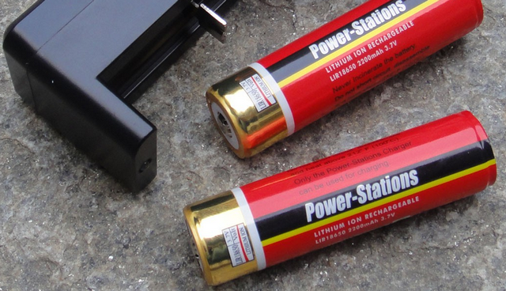

# Power supply for HP-35 handheld calculator

## How to identify the GND contact
I tested with a multimeter the continuity between the central
pin (labelled with `A` in the following picture) and the upper contact
(labelled with `B`): the multimeter beeped and so `A` is connected with `B`.

According to Figure 1 in ["Making New Battery Packs for the HP-35 Calculator"](http://homepage.divms.uiowa.edu/~jones/hp/battery/) by Douglas W. Jones, `A` is `GND` and so `B` is `GND` too.

(Picture is at https://www.keesvandersanden.nl/calculators/hp35_inside.php)

## What power supply do I use?

(Picture is at https://www.keesvandersanden.nl/calculators/hp35_inside.php, labels are mine)

The back label, at the bottom, says "3.75V"; I have available a rechargeable battery LIR18650 which I use with a Fenix flashlight, its label says "3.7V", I have measured it and I get 3.75V so it was good for the HP-35.
I connected a battery  with two crocodile clips and it worked!

