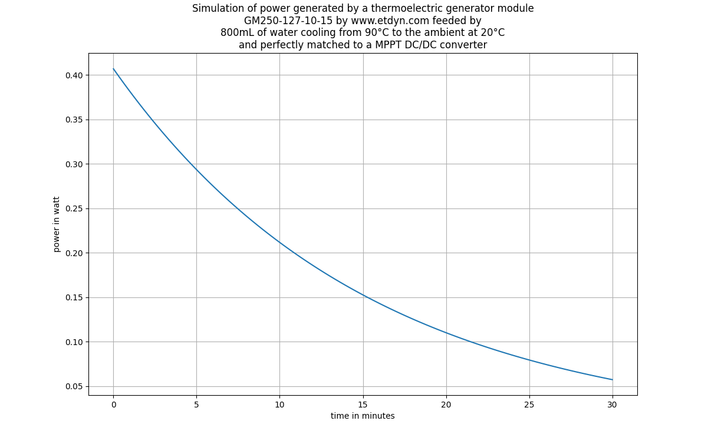

# Calore 
## Quanto calore mantiene un termos?

https://plus.google.com/u/0/+AlessandroGentilini/posts/AhRHpPCTg37
## Quanta potenza si può estrarre dall'acqua calda che si raffredda?
[Simulation code](pasta.py) contains assumptions.

